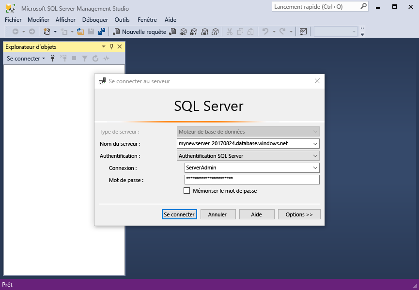

# <a name="design-your-first-azure-sql-database"></a><span data-ttu-id="f18f1-103">Concevoir votre première base de données SQL Azure</span><span class="sxs-lookup"><span data-stu-id="f18f1-103">Design your first Azure SQL database</span></span>

<span data-ttu-id="f18f1-104">Azure SQL Database est une solution DBaaS relationnelle gérée dans Microsoft Cloud (« Azure »).</span><span class="sxs-lookup"><span data-stu-id="f18f1-104">Azure SQL Database is a relational database-as-a service (DBaaS) in the Microsoft Cloud ("Azure").</span></span> <span data-ttu-id="f18f1-105">Dans ce didacticiel, vous allez apprendre à utiliser le portail Azure et [SQL Server Management Studio](https://msdn.microsoft.com/library/ms174173.aspx) (SSMS) pour :</span><span class="sxs-lookup"><span data-stu-id="f18f1-105">In this tutorial, you learn how to use the Azure portal and [SQL Server Management Studio](https://msdn.microsoft.com/library/ms174173.aspx) (SSMS) to:</span></span> 

> [!div class="checklist"]
> * <span data-ttu-id="f18f1-106">Créer une base de données dans le portail Azure</span><span class="sxs-lookup"><span data-stu-id="f18f1-106">Create a database in the Azure portal</span></span>
> * <span data-ttu-id="f18f1-107">Configurer une règle de pare-feu au niveau du serveur dans le portail Azure</span><span class="sxs-lookup"><span data-stu-id="f18f1-107">Set up a server-level firewall rule in the Azure portal</span></span>
> * <span data-ttu-id="f18f1-108">Connexion à la base de données avec SSMS</span><span class="sxs-lookup"><span data-stu-id="f18f1-108">Connect to the database with SSMS</span></span>
> * <span data-ttu-id="f18f1-109">Créer des tables avec SSMS</span><span class="sxs-lookup"><span data-stu-id="f18f1-109">Create tables with SSMS</span></span>
> * <span data-ttu-id="f18f1-110">Charger en masse des données avec BCP</span><span class="sxs-lookup"><span data-stu-id="f18f1-110">Bulk load data with BCP</span></span>
> * <span data-ttu-id="f18f1-111">Interroger ces données avec SSMS</span><span class="sxs-lookup"><span data-stu-id="f18f1-111">Query that data with SSMS</span></span>
> * <span data-ttu-id="f18f1-112">Restaurer la base de données à un [point de restauration dans le temps](sql-database-recovery-using-backups.md#point-in-time-restore) antérieur dans le portail Azure</span><span class="sxs-lookup"><span data-stu-id="f18f1-112">Restore the database to a previous [point in time restore](sql-database-recovery-using-backups.md#point-in-time-restore) in the Azure portal</span></span>

<span data-ttu-id="f18f1-113">Si vous ne disposez pas d’abonnement Azure, créez un [compte gratuit](https://azure.microsoft.com/free/) avant de commencer.</span><span class="sxs-lookup"><span data-stu-id="f18f1-113">If you don't have an Azure subscription, [create a free account](https://azure.microsoft.com/free/) before you begin.</span></span>

## <a name="prerequisites"></a><span data-ttu-id="f18f1-114">Composants requis</span><span class="sxs-lookup"><span data-stu-id="f18f1-114">Prerequisites</span></span>

<span data-ttu-id="f18f1-115">Pour suivre ce didacticiel, vérifiez que les éléments suivants sont installés :</span><span class="sxs-lookup"><span data-stu-id="f18f1-115">To complete this tutorial, make sure you have installed:</span></span>
- <span data-ttu-id="f18f1-116">La dernière version de [SSMS](https://msdn.microsoft.com/library/ms174173.aspx) (SQL Server Management Studio).</span><span class="sxs-lookup"><span data-stu-id="f18f1-116">The newest version of [SQL Server Management Studio](https://msdn.microsoft.com/library/ms174173.aspx) (SSMS).</span></span>
- <span data-ttu-id="f18f1-117">La dernière version de [BCP et SQLCMD](https://www.microsoft.com/download/details.aspx?id=36433).</span><span class="sxs-lookup"><span data-stu-id="f18f1-117">The newest version of [BCP and SQLCMD](https://www.microsoft.com/download/details.aspx?id=36433).</span></span>

## <a name="log-in-to-the-azure-portal"></a><span data-ttu-id="f18f1-118">Connectez-vous au portail Azure.</span><span class="sxs-lookup"><span data-stu-id="f18f1-118">Log in to the Azure portal</span></span>

<span data-ttu-id="f18f1-119">Connectez-vous au [portail Azure](https://portal.azure.com/).</span><span class="sxs-lookup"><span data-stu-id="f18f1-119">Log in to the [Azure portal](https://portal.azure.com/).</span></span>

## <a name="create-a-blank-sql-database"></a><span data-ttu-id="f18f1-120">Créer une base de données SQL vide</span><span class="sxs-lookup"><span data-stu-id="f18f1-120">Create a blank SQL database</span></span>

<span data-ttu-id="f18f1-121">Une base de données SQL Azure est créée avec un ensemble défini de [ressources de calcul et de stockage](sql-database-service-tiers.md).</span><span class="sxs-lookup"><span data-stu-id="f18f1-121">An Azure SQL database is created with a defined set of [compute and storage resources](sql-database-service-tiers.md).</span></span> <span data-ttu-id="f18f1-122">La base de données est créée dans un [groupe de ressources Azure](../azure-resource-manager/resource-group-overview.md) et dans un [serveur logique Azure SQL Database](sql-database-features.md).</span><span class="sxs-lookup"><span data-stu-id="f18f1-122">The database is created within an [Azure resource group](../azure-resource-manager/resource-group-overview.md) and in an [Azure SQL Database logical server](sql-database-features.md).</span></span> 

<span data-ttu-id="f18f1-123">Pour créer une base de données SQL vide, suivez la procédure suivante.</span><span class="sxs-lookup"><span data-stu-id="f18f1-123">Follow these steps to create a blank SQL database.</span></span> 

1. <span data-ttu-id="f18f1-124">Cliquez sur le bouton **Nouveau** dans le coin supérieur gauche du portail Azure.</span><span class="sxs-lookup"><span data-stu-id="f18f1-124">Click the **New** button found on the upper left-hand corner of the Azure portal.</span></span>

2. <span data-ttu-id="f18f1-125">Sélectionnez **Bases de données** dans la page **Nouveau**, puis **Base de données SQL** dans la page **Bases de données**.</span><span class="sxs-lookup"><span data-stu-id="f18f1-125">Select **Databases** from the **New** page, and select **SQL Database** from the **Databases** page.</span></span> 

   

3. <span data-ttu-id="f18f1-127">Remplissez le formulaire de base de données SQL avec les informations suivantes, comme indiqué dans l’illustration précédente :</span><span class="sxs-lookup"><span data-stu-id="f18f1-127">Fill out the SQL Database form with the following information, as shown on the preceding image:</span></span>   

   | <span data-ttu-id="f18f1-128">Paramètre</span><span class="sxs-lookup"><span data-stu-id="f18f1-128">Setting</span></span>       | <span data-ttu-id="f18f1-129">Valeur suggérée</span><span class="sxs-lookup"><span data-stu-id="f18f1-129">Suggested value</span></span> | <span data-ttu-id="f18f1-130">Description</span><span class="sxs-lookup"><span data-stu-id="f18f1-130">Description</span></span> | 
   | ------------ | ------------------ | ------------------------------------------------- | 
   | <span data-ttu-id="f18f1-131">**Nom de la base de données**</span><span class="sxs-lookup"><span data-stu-id="f18f1-131">**Database name**</span></span> | <span data-ttu-id="f18f1-132">mySampleDatabase</span><span class="sxs-lookup"><span data-stu-id="f18f1-132">mySampleDatabase</span></span> | <span data-ttu-id="f18f1-133">Pour les noms de base de données valides, consultez [Database Identifiers](https://docs.microsoft.com/sql/relational-databases/databases/database-identifiers) (Identificateurs de base de données).</span><span class="sxs-lookup"><span data-stu-id="f18f1-133">For valid database names, see [Database Identifiers](https://docs.microsoft.com/sql/relational-databases/databases/database-identifiers).</span></span> | 
   | <span data-ttu-id="f18f1-134">**Abonnement**</span><span class="sxs-lookup"><span data-stu-id="f18f1-134">**Subscription**</span></span> | <span data-ttu-id="f18f1-135">Votre abonnement</span><span class="sxs-lookup"><span data-stu-id="f18f1-135">Your subscription</span></span>  | <span data-ttu-id="f18f1-136">Pour plus d’informations sur vos abonnements, consultez [Abonnements](https://account.windowsazure.com/Subscriptions).</span><span class="sxs-lookup"><span data-stu-id="f18f1-136">For details about your subscriptions, see [Subscriptions](https://account.windowsazure.com/Subscriptions).</span></span> |
   | <span data-ttu-id="f18f1-137">**Groupe de ressources**</span><span class="sxs-lookup"><span data-stu-id="f18f1-137">**Resource group**</span></span> | <span data-ttu-id="f18f1-138">myResourceGroup</span><span class="sxs-lookup"><span data-stu-id="f18f1-138">myResourceGroup</span></span> | <span data-ttu-id="f18f1-139">Pour les noms de groupe de ressources valides, consultez [Naming conventions](https://docs.microsoft.com/azure/architecture/best-practices/naming-conventions) (Conventions d’affectation de nom).</span><span class="sxs-lookup"><span data-stu-id="f18f1-139">For valid resource group names, see [Naming rules and restrictions](https://docs.microsoft.com/azure/architecture/best-practices/naming-conventions).</span></span> |
   | <span data-ttu-id="f18f1-140">**Sélectionner une source**</span><span class="sxs-lookup"><span data-stu-id="f18f1-140">**Select source**</span></span> | <span data-ttu-id="f18f1-141">Base de données vide</span><span class="sxs-lookup"><span data-stu-id="f18f1-141">Blank database</span></span> | <span data-ttu-id="f18f1-142">Indique qu’une base de données vide doit être créée.</span><span class="sxs-lookup"><span data-stu-id="f18f1-142">Specifies that a blank database should be created.</span></span> |

4. <span data-ttu-id="f18f1-143">Cliquez sur **Serveur** pour créer et configurer un serveur pour votre nouvelle base de données.</span><span class="sxs-lookup"><span data-stu-id="f18f1-143">Click **Server** to create and configure a new server for your new database.</span></span> <span data-ttu-id="f18f1-144">Remplissez le **formulaire de nouveau serveur** avec les informations suivantes :</span><span class="sxs-lookup"><span data-stu-id="f18f1-144">Fill out the **New server form** with the following information:</span></span> 

   | <span data-ttu-id="f18f1-145">Paramètre</span><span class="sxs-lookup"><span data-stu-id="f18f1-145">Setting</span></span>       | <span data-ttu-id="f18f1-146">Valeur suggérée</span><span class="sxs-lookup"><span data-stu-id="f18f1-146">Suggested value</span></span> | <span data-ttu-id="f18f1-147">Description</span><span class="sxs-lookup"><span data-stu-id="f18f1-147">Description</span></span> | 
   | ------------ | ------------------ | ------------------------------------------------- | 
   | <span data-ttu-id="f18f1-148">**Nom du serveur**</span><span class="sxs-lookup"><span data-stu-id="f18f1-148">**Server name**</span></span> | <span data-ttu-id="f18f1-149">Nom globalement unique</span><span class="sxs-lookup"><span data-stu-id="f18f1-149">Any globally unique name</span></span> | <span data-ttu-id="f18f1-150">Pour les noms de serveur valides, consultez [Naming conventions](https://docs.microsoft.com/azure/architecture/best-practices/naming-conventions) (Conventions d’affectation de nom).</span><span class="sxs-lookup"><span data-stu-id="f18f1-150">For valid server names, see [Naming rules and restrictions](https://docs.microsoft.com/azure/architecture/best-practices/naming-conventions).</span></span> | 
   | <span data-ttu-id="f18f1-151">**Connexion d’administrateur du serveur**</span><span class="sxs-lookup"><span data-stu-id="f18f1-151">**Server admin login**</span></span> | <span data-ttu-id="f18f1-152">Nom valide</span><span class="sxs-lookup"><span data-stu-id="f18f1-152">Any valid name</span></span> | <span data-ttu-id="f18f1-153">Pour les noms de connexion valides, consultez [Database Identifiers](https://docs.microsoft.com/sql/relational-databases/databases/database-identifiers) (Identificateurs de base de données).</span><span class="sxs-lookup"><span data-stu-id="f18f1-153">For valid login names, see [Database Identifiers](https://docs.microsoft.com/sql/relational-databases/databases/database-identifiers).</span></span>|
   | <span data-ttu-id="f18f1-154">**Mot de passe**</span><span class="sxs-lookup"><span data-stu-id="f18f1-154">**Password**</span></span> | <span data-ttu-id="f18f1-155">Mot de passe valide</span><span class="sxs-lookup"><span data-stu-id="f18f1-155">Any valid password</span></span> | <span data-ttu-id="f18f1-156">Votre mot de passe doit comporter au moins 8 caractères et contenir des caractères appartenant à trois des catégories suivantes : caractères en majuscules, caractères en minuscules, chiffres et caractères non alphanumériques.</span><span class="sxs-lookup"><span data-stu-id="f18f1-156">Your password must have at least 8 characters and must contain characters from three of the following categories: upper case characters, lower case characters, numbers, and non-alphanumeric characters.</span></span> |
   | <span data-ttu-id="f18f1-157">**Emplacement**</span><span class="sxs-lookup"><span data-stu-id="f18f1-157">**Location**</span></span> | <span data-ttu-id="f18f1-158">Emplacement valide</span><span class="sxs-lookup"><span data-stu-id="f18f1-158">Any valid location</span></span> | <span data-ttu-id="f18f1-159">Pour plus d’informations sur les régions, consultez [Régions Azure](https://azure.microsoft.com/regions/).</span><span class="sxs-lookup"><span data-stu-id="f18f1-159">For information about regions, see [Azure Regions](https://azure.microsoft.com/regions/).</span></span> |

   

5. <span data-ttu-id="f18f1-161">Cliquez sur **Sélectionner**.</span><span class="sxs-lookup"><span data-stu-id="f18f1-161">Click **Select**.</span></span>

6. <span data-ttu-id="f18f1-162">Cliquez sur **Niveau tarifaire** pour spécifier le niveau de service et le niveau de performances pour votre nouvelle base de données.</span><span class="sxs-lookup"><span data-stu-id="f18f1-162">Click **Pricing tier** to specify the service tier and performance level for your new database.</span></span> <span data-ttu-id="f18f1-163">Pour ce didacticiel, sélectionnez **20 DTU** et **250** Go de stockage.</span><span class="sxs-lookup"><span data-stu-id="f18f1-163">For this tutorial, select **20 DTUs** and **250** GB of storage.</span></span>

   

7. <span data-ttu-id="f18f1-165">Cliquez sur **Apply**.</span><span class="sxs-lookup"><span data-stu-id="f18f1-165">Click **Apply**.</span></span>  

8. <span data-ttu-id="f18f1-166">Sélectionnez un **classement** pour la base de données vide (pour ce didacticiel, utilisez la valeur par défaut).</span><span class="sxs-lookup"><span data-stu-id="f18f1-166">Select a **collation** for the blank database (for this tutorial, use the default value).</span></span> <span data-ttu-id="f18f1-167">Pour en savoir plus sur les classements, voir [Classements](https://docs.microsoft.com/sql/t-sql/statements/collations)</span><span class="sxs-lookup"><span data-stu-id="f18f1-167">For more information about collations, see [Collations](https://docs.microsoft.com/sql/t-sql/statements/collations)</span></span>

9. <span data-ttu-id="f18f1-168">Cliquez sur **Créer** pour approvisionner la base de données.</span><span class="sxs-lookup"><span data-stu-id="f18f1-168">Click **Create** to provision the database.</span></span> <span data-ttu-id="f18f1-169">L’approvisionnement prend environ une minute et demie.</span><span class="sxs-lookup"><span data-stu-id="f18f1-169">Provisioning takes about a minute and a half to complete.</span></span> 

10. <span data-ttu-id="f18f1-170">Dans la barre d’outils, cliquez sur **Notifications** pour surveiller le processus de déploiement.</span><span class="sxs-lookup"><span data-stu-id="f18f1-170">On the toolbar, click **Notifications** to monitor the deployment process.</span></span>

   

## <a name="create-a-server-level-firewall-rule"></a><span data-ttu-id="f18f1-172">créer une règle de pare-feu au niveau du serveur ;</span><span class="sxs-lookup"><span data-stu-id="f18f1-172">Create a server-level firewall rule</span></span>

<span data-ttu-id="f18f1-173">Le service SQL Database crée un pare-feu au niveau du serveur qui empêche les applications et les outils externes de se connecter au serveur ou à toute base de données sur le serveur, sauf si une règle de pare-feu est créée pour ouvrir le pare-feu à des adresses IP spécifiques.</span><span class="sxs-lookup"><span data-stu-id="f18f1-173">The SQL Database service creates a firewall at the server-level that prevents external applications and tools from connecting to the server or any databases on the server unless a firewall rule is created to open the firewall for specific IP addresses.</span></span> <span data-ttu-id="f18f1-174">Suivez ces étapes pour créer une [règle de pare-feu au niveau du serveur de base de données SQL](sql-database-firewall-configure.md) pour l’adresse IP de votre client afin de permettre la connectivité externe via le pare-feu de base de données SQL pour votre adresse IP uniquement.</span><span class="sxs-lookup"><span data-stu-id="f18f1-174">Follow these steps to create a [SQL Database server-level firewall rule](sql-database-firewall-configure.md) for your client's IP address and enable external connectivity through the SQL Database firewall for your IP address only.</span></span> 

> [!NOTE]
> <span data-ttu-id="f18f1-175">SQL Database communique par le biais du port 1433.</span><span class="sxs-lookup"><span data-stu-id="f18f1-175">SQL Database communicates over port 1433.</span></span> <span data-ttu-id="f18f1-176">Si vous essayez de vous connecter à partir d’un réseau d’entreprise, le trafic sortant sur le port 1433 peut ne pas être autorisé par le pare-feu de votre réseau.</span><span class="sxs-lookup"><span data-stu-id="f18f1-176">If you are trying to connect from within a corporate network, outbound traffic over port 1433 may not be allowed by your network's firewall.</span></span> <span data-ttu-id="f18f1-177">Dans ce cas, vous ne pouvez pas vous connecter à votre serveur Azure SQL Database, sauf si votre service informatique ouvre le port 1433.</span><span class="sxs-lookup"><span data-stu-id="f18f1-177">If so, you cannot connect to your Azure SQL Database server unless your IT department opens port 1433.</span></span>
>

1. <span data-ttu-id="f18f1-178">Une fois le déploiement terminé, cliquez sur **Bases de données SQL** dans le menu de gauche, puis cliquez sur **mySampleDatabase** sur la page **Bases de données SQL**.</span><span class="sxs-lookup"><span data-stu-id="f18f1-178">After the deployment completes, click **SQL databases** from the left-hand menu and then click **mySampleDatabase** on the **SQL databases** page.</span></span> <span data-ttu-id="f18f1-179">La page de présentation de votre base de données s’ouvre, affiche le nom de serveur complet (tel que **mynewserver20170313.database.windows.net**) et fournit des options pour poursuivre la configuration.</span><span class="sxs-lookup"><span data-stu-id="f18f1-179">The overview page for your database opens, showing you the fully qualified server name (such as **mynewserver20170313.database.windows.net**) and provides options for further configuration.</span></span> <span data-ttu-id="f18f1-180">Copiez ce nom de serveur complet pour une utilisation ultérieure.</span><span class="sxs-lookup"><span data-stu-id="f18f1-180">Copy this fully qualified server name for use later.</span></span>

   > [!IMPORTANT]
   > <span data-ttu-id="f18f1-181">Vous avez besoin du nom complet du serveur pour vous connecter à votre serveur et à ses bases de données dans les guides de démarrage rapide suivants.</span><span class="sxs-lookup"><span data-stu-id="f18f1-181">You need this fully qualified server name to connect to your server and its databases in subsequent quick starts.</span></span>
   > 

    

2. <span data-ttu-id="f18f1-183">Cliquez sur **Définir le pare-feu du serveur** dans la barre d’outils, comme illustré sur l’image précédente.</span><span class="sxs-lookup"><span data-stu-id="f18f1-183">Click **Set server firewall** on the toolbar as shown in the previous image.</span></span> <span data-ttu-id="f18f1-184">La page **Paramètres de pare-feu** du serveur de base de données SQL s’ouvre.</span><span class="sxs-lookup"><span data-stu-id="f18f1-184">The **Firewall settings** page for the SQL Database server opens.</span></span> 

    


3. <span data-ttu-id="f18f1-186">Dans la barre d’outils, cliquez sur **Ajouter une adresse IP cliente** afin d’ajouter votre adresse IP actuelle à une nouvelle règle de pare-feu.</span><span class="sxs-lookup"><span data-stu-id="f18f1-186">Click **Add client IP** on the toolbar to add your current IP address to a new firewall rule.</span></span> <span data-ttu-id="f18f1-187">Une règle de pare-feu peut ouvrir le port 1433 pour une seule adresse IP ou une plage d’adresses IP.</span><span class="sxs-lookup"><span data-stu-id="f18f1-187">A firewall rule can open port 1433 for a single IP address or a range of IP addresses.</span></span>

4. <span data-ttu-id="f18f1-188">Cliquez sur **Save**.</span><span class="sxs-lookup"><span data-stu-id="f18f1-188">Click **Save**.</span></span> <span data-ttu-id="f18f1-189">Une règle de pare-feu au niveau du serveur est créée pour votre adresse IP actuelle et ouvre le port 1433 sur le serveur logique.</span><span class="sxs-lookup"><span data-stu-id="f18f1-189">A server-level firewall rule is created for your current IP address opening port 1433 on the logical server.</span></span>

    

4. <span data-ttu-id="f18f1-191">Cliquez sur **OK**, puis fermez la page **Paramètres de pare-feu**.</span><span class="sxs-lookup"><span data-stu-id="f18f1-191">Click **OK** and then close the **Firewall settings** page.</span></span>

<span data-ttu-id="f18f1-192">Vous pouvez maintenant vous connecter au serveur SQL Database et à ses bases de données à l’aide de SQL Server Management Studio ou de tout autre outil de votre choix à partir de cette adresse IP à l’aide du compte Administrateur de serveur créé au préalable.</span><span class="sxs-lookup"><span data-stu-id="f18f1-192">You can now connect to the SQL Database server and its databases using SQL Server Management Studio or another tool of your choice from this IP address using the server admin account created previously.</span></span>

> [!IMPORTANT]
> <span data-ttu-id="f18f1-193">Par défaut, l’accès via le pare-feu SQL Database est activé pour tous les services Azure.</span><span class="sxs-lookup"><span data-stu-id="f18f1-193">By default, access through the SQL Database firewall is enabled for all Azure services.</span></span> <span data-ttu-id="f18f1-194">Cliquez sur **ÉTEINT** sur cette page pour le désactiver pour tous les services Azure.</span><span class="sxs-lookup"><span data-stu-id="f18f1-194">Click **OFF** on this page to disable for all Azure services.</span></span>

## <a name="sql-server-connection-information"></a><span data-ttu-id="f18f1-195">Informations de connexion SQL Server</span><span class="sxs-lookup"><span data-stu-id="f18f1-195">SQL server connection information</span></span>

<span data-ttu-id="f18f1-196">Obtenez le nom de serveur complet de votre serveur Azure SQL Database dans le portail Azure.</span><span class="sxs-lookup"><span data-stu-id="f18f1-196">Get the fully qualified server name for your Azure SQL Database server in the Azure portal.</span></span> <span data-ttu-id="f18f1-197">Utilisez le nom de serveur complet pour vous connecter à votre serveur avec SQL Server Management Studio.</span><span class="sxs-lookup"><span data-stu-id="f18f1-197">You use the fully qualified server name to connect to your server using SQL Server Management Studio.</span></span>

1. <span data-ttu-id="f18f1-198">Connectez-vous au [portail Azure](https://portal.azure.com/).</span><span class="sxs-lookup"><span data-stu-id="f18f1-198">Log in to the [Azure portal](https://portal.azure.com/).</span></span>
2. <span data-ttu-id="f18f1-199">Sélectionnez **Bases de données SQL** dans le menu de gauche, puis cliquez sur votre base de données dans la page **Bases de données SQL**.</span><span class="sxs-lookup"><span data-stu-id="f18f1-199">Select **SQL Databases** from the left-hand menu, and click your database on the **SQL databases** page.</span></span> 
3. <span data-ttu-id="f18f1-200">Dans le volet **Essentials** de la page du portail Azure pour votre base de données, recherchez et copiez le **nom du serveur**.</span><span class="sxs-lookup"><span data-stu-id="f18f1-200">In the **Essentials** pane in the Azure portal page for your database, locate and then copy the **Server name**.</span></span>

   

## <a name="connect-to-the-database-with-ssms"></a><span data-ttu-id="f18f1-202">Connexion à la base de données avec SSMS</span><span class="sxs-lookup"><span data-stu-id="f18f1-202">Connect to the database with SSMS</span></span>

<span data-ttu-id="f18f1-203">Utilisez [SQL Server Management Studio](https://docs.microsoft.com/sql/ssms/sql-server-management-studio-ssms) pour établir une connexion à votre serveur Azure SQL Database.</span><span class="sxs-lookup"><span data-stu-id="f18f1-203">Use [SQL Server Management Studio](https://docs.microsoft.com/sql/ssms/sql-server-management-studio-ssms) to establish a connection to your Azure SQL Database server.</span></span>

1. <span data-ttu-id="f18f1-204">Ouvrez SQL Server Management Studio.</span><span class="sxs-lookup"><span data-stu-id="f18f1-204">Open SQL Server Management Studio.</span></span>

2. <span data-ttu-id="f18f1-205">Dans la fenêtre **Se connecter au serveur**, entrez les valeurs suivantes :</span><span class="sxs-lookup"><span data-stu-id="f18f1-205">In the **Connect to Server** dialog box, enter the following information:</span></span>

   | <span data-ttu-id="f18f1-206">Paramètre</span><span class="sxs-lookup"><span data-stu-id="f18f1-206">Setting</span></span>       | <span data-ttu-id="f18f1-207">Valeur suggérée</span><span class="sxs-lookup"><span data-stu-id="f18f1-207">Suggested value</span></span> | <span data-ttu-id="f18f1-208">Description</span><span class="sxs-lookup"><span data-stu-id="f18f1-208">Description</span></span> | 
   | ------------ | ------------------ | ------------------------------------------------- | 
   | <span data-ttu-id="f18f1-209">Type de serveur</span><span class="sxs-lookup"><span data-stu-id="f18f1-209">Server type</span></span> | <span data-ttu-id="f18f1-210">Moteur de base de données</span><span class="sxs-lookup"><span data-stu-id="f18f1-210">Database engine</span></span> | <span data-ttu-id="f18f1-211">Cette valeur est obligatoire</span><span class="sxs-lookup"><span data-stu-id="f18f1-211">This value is required</span></span> |
   | <span data-ttu-id="f18f1-212">Nom du serveur</span><span class="sxs-lookup"><span data-stu-id="f18f1-212">Server name</span></span> | <span data-ttu-id="f18f1-213">Nom complet du serveur</span><span class="sxs-lookup"><span data-stu-id="f18f1-213">The fully qualified server name</span></span> | <span data-ttu-id="f18f1-214">Le nom doit être similaire à ce qui suit : **mynewserver20170313.database.windows.net**.</span><span class="sxs-lookup"><span data-stu-id="f18f1-214">The name should be something like this: **mynewserver20170313.database.windows.net**.</span></span> |
   | <span data-ttu-id="f18f1-215">Authentification</span><span class="sxs-lookup"><span data-stu-id="f18f1-215">Authentication</span></span> | <span data-ttu-id="f18f1-216">l’authentification SQL Server</span><span class="sxs-lookup"><span data-stu-id="f18f1-216">SQL Server Authentication</span></span> | <span data-ttu-id="f18f1-217">L’authentification SQL est le seul type d’authentification que nous avons configuré dans ce didacticiel.</span><span class="sxs-lookup"><span data-stu-id="f18f1-217">SQL Authentication is the only authentication type that we have configured in this tutorial.</span></span> |
   | <span data-ttu-id="f18f1-218">Connexion</span><span class="sxs-lookup"><span data-stu-id="f18f1-218">Login</span></span> | <span data-ttu-id="f18f1-219">Compte d’administrateur de serveur</span><span class="sxs-lookup"><span data-stu-id="f18f1-219">The server admin account</span></span> | <span data-ttu-id="f18f1-220">Il s’agit du compte que vous avez spécifié lorsque vous avez créé le serveur.</span><span class="sxs-lookup"><span data-stu-id="f18f1-220">This is the account that you specified when you created the server.</span></span> |
   | <span data-ttu-id="f18f1-221">Mot de passe</span><span class="sxs-lookup"><span data-stu-id="f18f1-221">Password</span></span> | <span data-ttu-id="f18f1-222">Mot de passe de votre compte d’administrateur de serveur</span><span class="sxs-lookup"><span data-stu-id="f18f1-222">The password for your server admin account</span></span> | <span data-ttu-id="f18f1-223">Il s’agit du mot de passe que vous avez spécifié lorsque vous avez créé le serveur.</span><span class="sxs-lookup"><span data-stu-id="f18f1-223">This is the password that you specified when you created the server.</span></span> |

   

3. <span data-ttu-id="f18f1-225">Cliquez sur **Options** dans la boîte de dialogue **Se connecter au serveur**.</span><span class="sxs-lookup"><span data-stu-id="f18f1-225">Click **Options** in the **Connect to server** dialog box.</span></span> <span data-ttu-id="f18f1-226">Dans la section **Se connecter à la base de données**, entrez **mySampleDatabase** pour vous connecter à cette base de données.</span><span class="sxs-lookup"><span data-stu-id="f18f1-226">In the **Connect to database** section, enter **mySampleDatabase** to connect to this database.</span></span>

     

4. <span data-ttu-id="f18f1-228">Cliquez sur **Connecter**.</span><span class="sxs-lookup"><span data-stu-id="f18f1-228">Click **Connect**.</span></span> <span data-ttu-id="f18f1-229">La fenêtre Explorateur d’objets s’ouvre dans SSMS.</span><span class="sxs-lookup"><span data-stu-id="f18f1-229">The Object Explorer window opens in SSMS.</span></span> 

5. <span data-ttu-id="f18f1-230">Dans l’Explorateur d’objets, développez **Bases de données**, puis **mySampleDatabase** pour afficher les objets dans la base de données exemple.</span><span class="sxs-lookup"><span data-stu-id="f18f1-230">In Object Explorer, expand **Databases** and then expand **mySampleDatabase** to view the objects in the sample database.</span></span>

     

## <a name="create-tables-in-the-database"></a><span data-ttu-id="f18f1-232">Créer des tables dans la base de données</span><span class="sxs-lookup"><span data-stu-id="f18f1-232">Create tables in the database</span></span> 

<span data-ttu-id="f18f1-233">Créez un schéma de base de données avec quatre tables qui modélisent un système de gestion des étudiants pour les universités à l’aide de [Transact-SQL](https://docs.microsoft.com/sql/t-sql/language-reference) :</span><span class="sxs-lookup"><span data-stu-id="f18f1-233">Create a database schema with four tables that model a student management system for universities using [Transact-SQL](https://docs.microsoft.com/sql/t-sql/language-reference):</span></span>

- <span data-ttu-id="f18f1-234">Personne</span><span class="sxs-lookup"><span data-stu-id="f18f1-234">Person</span></span>
- <span data-ttu-id="f18f1-235">Cours</span><span class="sxs-lookup"><span data-stu-id="f18f1-235">Course</span></span>
- <span data-ttu-id="f18f1-236">Étudiant</span><span class="sxs-lookup"><span data-stu-id="f18f1-236">Student</span></span>
- <span data-ttu-id="f18f1-237">Attribuez à ce modèle un système de gestion des étudiants pour les universités</span><span class="sxs-lookup"><span data-stu-id="f18f1-237">Credit that model a student management system for universities</span></span>

<span data-ttu-id="f18f1-238">Le diagramme suivant montre comment ces tables sont liées entre elles.</span><span class="sxs-lookup"><span data-stu-id="f18f1-238">The following diagram shows how these tables are related to each other.</span></span> <span data-ttu-id="f18f1-239">Certaines de ces tables référencent des colonnes d’autres tables.</span><span class="sxs-lookup"><span data-stu-id="f18f1-239">Some of these tables reference columns in other tables.</span></span> <span data-ttu-id="f18f1-240">Par exemple, la table Étudiant référence la colonne **PersonId** de la table **Personne**.</span><span class="sxs-lookup"><span data-stu-id="f18f1-240">For example, the Student table references the **PersonId** column of the **Person** table.</span></span> <span data-ttu-id="f18f1-241">Étudiez le diagramme pour comprendre comment les tables présentées dans ce didacticiel sont liées entre elles.</span><span class="sxs-lookup"><span data-stu-id="f18f1-241">Study the diagram to understand how the tables in this tutorial are related to one another.</span></span> <span data-ttu-id="f18f1-242">Pour découvrir comment créer des tables de base de données efficaces, consultez [Créer des tables de base de données efficaces](https://msdn.microsoft.com/library/cc505842.aspx).</span><span class="sxs-lookup"><span data-stu-id="f18f1-242">For an in-depth look at how to create effective database tables, see [Create effective database tables](https://msdn.microsoft.com/library/cc505842.aspx).</span></span> <span data-ttu-id="f18f1-243">Pour plus d’informations sur le choix des types de données, consultez [Types de données](https://docs.microsoft.com/sql/t-sql/data-types/data-types-transact-sql).</span><span class="sxs-lookup"><span data-stu-id="f18f1-243">For information about choosing data types, see [Data types](https://docs.microsoft.com/sql/t-sql/data-types/data-types-transact-sql).</span></span>

> [!NOTE]
> <span data-ttu-id="f18f1-244">Vous pouvez également utiliser le [concepteur de tables dans SQL Server Management Studio](https://msdn.microsoft.com/library/hh272695.aspx) pour créer et concevoir vos tables.</span><span class="sxs-lookup"><span data-stu-id="f18f1-244">You can also use the [table designer in SQL Server Management Studio](https://msdn.microsoft.com/library/hh272695.aspx) to create and design your tables.</span></span> 


1. <span data-ttu-id="f18f1-246">Dans l’Explorateur d’objets, cliquez avec le bouton droit sur **mySampleDatabase**, puis cliquez sur **Nouvelle requête**.</span><span class="sxs-lookup"><span data-stu-id="f18f1-246">In Object Explorer, right-click **mySampleDatabase** and click **New Query**.</span></span> <span data-ttu-id="f18f1-247">Une fenêtre de requête vide connectée à votre base de données s’ouvre.</span><span class="sxs-lookup"><span data-stu-id="f18f1-247">A blank query window opens that is connected to your database.</span></span>

2. <span data-ttu-id="f18f1-248">Dans la fenêtre de requête, exécutez la requête suivante pour créer quatre tables dans votre base de données :</span><span class="sxs-lookup"><span data-stu-id="f18f1-248">In the query window, execute the following query to create four tables in your database:</span></span> 

   ```sql 
   -- Create Person table

   CREATE TABLE Person
   (
   PersonId   INT IDENTITY PRIMARY KEY,
   FirstName   NVARCHAR(128) NOT NULL,
   MiddelInitial NVARCHAR(10),
   LastName   NVARCHAR(128) NOT NULL,
   DateOfBirth   DATE NOT NULL
   )
   
   -- Create Student table
 
   CREATE TABLE Student
   (
   StudentId INT IDENTITY PRIMARY KEY,
   PersonId  INT REFERENCES Person (PersonId),
   Email   NVARCHAR(256)
   )
   
   -- Create Course table
 
   CREATE TABLE Course
   (
   CourseId  INT IDENTITY PRIMARY KEY,
   Name   NVARCHAR(50) NOT NULL,
   Teacher   NVARCHAR(256) NOT NULL
   ) 

   -- Create Credit table
 
   CREATE TABLE Credit
   (
   StudentId   INT REFERENCES Student (StudentId),
   CourseId   INT REFERENCES Course (CourseId),
   Grade   DECIMAL(5,2) CHECK (Grade <= 100.00),
   Attempt   TINYINT,
   CONSTRAINT  [UQ_studentgrades] UNIQUE CLUSTERED
   (
   StudentId, CourseId, Grade, Attempt
   )
   )
   ```

   

3. <span data-ttu-id="f18f1-250">Développez le nœud « tables » dans l’Explorateur d’objets SQL Server Management Studio pour afficher les tables que vous avez créées.</span><span class="sxs-lookup"><span data-stu-id="f18f1-250">Expand the 'tables' node in the SQL Server Management Studio Object explorer to see the tables you created.</span></span>

   

## <a name="load-data-into-the-tables"></a><span data-ttu-id="f18f1-252">Charger des données dans les tables</span><span class="sxs-lookup"><span data-stu-id="f18f1-252">Load data into the tables</span></span>

1. <span data-ttu-id="f18f1-253">Créez un dossier nommé **SampleTableData** dans le dossier Téléchargements pour y stocker les exemples de données pour votre base de données.</span><span class="sxs-lookup"><span data-stu-id="f18f1-253">Create a folder called **SampleTableData** in your Downloads folder to store sample data for your database.</span></span> 

2. <span data-ttu-id="f18f1-254">Cliquez sur les liens suivants et enregistrez-les dans le dossier **SampleTableData**.</span><span class="sxs-lookup"><span data-stu-id="f18f1-254">Right-click the following links and save them into the **SampleTableData** folder.</span></span> 

   - [<span data-ttu-id="f18f1-255">SampleCourseData</span><span class="sxs-lookup"><span data-stu-id="f18f1-255">SampleCourseData</span></span>](https://sqldbtutorial.blob.core.windows.net/tutorials/SampleCourseData)
   - [<span data-ttu-id="f18f1-256">SamplePersonData</span><span class="sxs-lookup"><span data-stu-id="f18f1-256">SamplePersonData</span></span>](https://sqldbtutorial.blob.core.windows.net/tutorials/SamplePersonData)
   - [<span data-ttu-id="f18f1-257">SampleStudentData</span><span class="sxs-lookup"><span data-stu-id="f18f1-257">SampleStudentData</span></span>](https://sqldbtutorial.blob.core.windows.net/tutorials/SampleStudentData)
   - [<span data-ttu-id="f18f1-258">SampleCreditData</span><span class="sxs-lookup"><span data-stu-id="f18f1-258">SampleCreditData</span></span>](https://sqldbtutorial.blob.core.windows.net/tutorials/SampleCreditData)

3. <span data-ttu-id="f18f1-259">Ouvrez une fenêtre d’invite de commandes et accédez au dossier SampleTableData.</span><span class="sxs-lookup"><span data-stu-id="f18f1-259">Open a command prompt window and navigate to the SampleTableData folder.</span></span>

4. <span data-ttu-id="f18f1-260">Exécutez les commande suivantes pour insérer des exemples de données dans les tables, en remplaçant les valeurs de **ServerName**, **DatabaseName**, **UserName** et **Password** avec les valeurs pour votre environnement.</span><span class="sxs-lookup"><span data-stu-id="f18f1-260">Execute the following commands to insert sample data into the tables replacing the values for **ServerName**, **DatabaseName**, **UserName**, and **Password** with the values for your environment.</span></span>
  
   ```bcp
   bcp Course in SampleCourseData -S <ServerName>.database.windows.net -d <DatabaseName> -U <Username> -P <password> -q -c -t ","
   bcp Person in SamplePersonData -S <ServerName>.database.windows.net -d <DatabaseName> -U <Username> -P <password> -q -c -t ","
   bcp Student in SampleStudentData -S <ServerName>.database.windows.net -d <DatabaseName> -U <Username> -P <password> -q -c -t ","
   bcp Credit in SampleCreditData -S <ServerName>.database.windows.net -d <DatabaseName> -U <Username> -P <password> -q -c -t ","
   ```

<span data-ttu-id="f18f1-261">Vous avez maintenant chargé des exemples de données dans les tables que vous avez créées précédemment.</span><span class="sxs-lookup"><span data-stu-id="f18f1-261">You have now loaded sample data into the tables you created earlier.</span></span>

## <a name="query-data"></a><span data-ttu-id="f18f1-262">Données de requête</span><span class="sxs-lookup"><span data-stu-id="f18f1-262">Query data</span></span>

<span data-ttu-id="f18f1-263">Exécutez les requêtes suivantes pour récupérer des informations à partir des tables de base de données.</span><span class="sxs-lookup"><span data-stu-id="f18f1-263">Execute the following queries to retrieve information from the database tables.</span></span> <span data-ttu-id="f18f1-264">Consultez [Écriture des requêtes SQL](https://technet.microsoft.com/library/bb264565.aspx) pour en savoir plus sur l’écriture des requêtes SQL.</span><span class="sxs-lookup"><span data-stu-id="f18f1-264">See [Writing SQL Queries](https://technet.microsoft.com/library/bb264565.aspx) to learn more about writing SQL queries.</span></span> <span data-ttu-id="f18f1-265">La première requête réunit les quatre tables pour rechercher tous les étudiants inscrits au cours de « Dominick Pope » pour lequel ils ont une note supérieure à 75 %.</span><span class="sxs-lookup"><span data-stu-id="f18f1-265">The first query joins all four tables to find all the students taught by 'Dominick Pope' who have a grade higher than 75% in his class.</span></span> <span data-ttu-id="f18f1-266">La deuxième requête réunit les quatre tables et recherche tous les cours que « Noe Coleman » a déjà suivis.</span><span class="sxs-lookup"><span data-stu-id="f18f1-266">The second query joins all four tables and finds all courses in which 'Noe Coleman' has ever enrolled.</span></span>

1. <span data-ttu-id="f18f1-267">Dans une fenêtre de requête SQL Server Management Studio, exécutez la requête suivante :</span><span class="sxs-lookup"><span data-stu-id="f18f1-267">In a SQL Server Management Studio query window, execute the following query:</span></span>

   ```sql 
   -- Find the students taught by Dominick Pope who have a grade higher than 75%

   SELECT  person.FirstName,
   person.LastName,
   course.Name,
   credit.Grade
   FROM  Person AS person
   INNER JOIN Student AS student ON person.PersonId = student.PersonId
   INNER JOIN Credit AS credit ON student.StudentId = credit.StudentId
   INNER JOIN Course AS course ON credit.CourseId = course.courseId
   WHERE course.Teacher = 'Dominick Pope' 
   AND Grade > 75
   ```

2. <span data-ttu-id="f18f1-268">Dans une fenêtre de requête SQL Server Management Studio, exécutez la requête suivante :</span><span class="sxs-lookup"><span data-stu-id="f18f1-268">In a SQL Server Management Studio query window, execute following query:</span></span>

   ```sql
   -- Find all the courses in which Noe Coleman has ever enrolled

   SELECT  course.Name,
   course.Teacher,
   credit.Grade
   FROM  Course AS course
   INNER JOIN Credit AS credit ON credit.CourseId = course.CourseId
   INNER JOIN Student AS student ON student.StudentId = credit.StudentId
   INNER JOIN Person AS person ON person.PersonId = student.PersonId
   WHERE person.FirstName = 'Noe'
   AND person.LastName = 'Coleman'
   ```

## <a name="restore-a-database-to-a-previous-point-in-time"></a><span data-ttu-id="f18f1-269">Restaurer une version antérieure d’une base de données</span><span class="sxs-lookup"><span data-stu-id="f18f1-269">Restore a database to a previous point in time</span></span>

<span data-ttu-id="f18f1-270">Imaginez que vous avez supprimé une table par inadvertance.</span><span class="sxs-lookup"><span data-stu-id="f18f1-270">Imagine you have accidentally deleted a table.</span></span> <span data-ttu-id="f18f1-271">Il s’agit de quelque chose que vous ne pouvez pas récupérer facilement.</span><span class="sxs-lookup"><span data-stu-id="f18f1-271">This is something you cannot easily recover from.</span></span> <span data-ttu-id="f18f1-272">Azure SQL Database vous permet de revenir à n’importe quel moment des 35 derniers jours et de restaurer ce moment pour obtenir une nouvelle base de données.</span><span class="sxs-lookup"><span data-stu-id="f18f1-272">Azure SQL Database allows you to go back to any point in time in the last up to 35 days and restore this point in time to a new database.</span></span> <span data-ttu-id="f18f1-273">Vous pouvez utiliser cette base de données pour récupérer vos données supprimées.</span><span class="sxs-lookup"><span data-stu-id="f18f1-273">You can you this database to recover your deleted data.</span></span> <span data-ttu-id="f18f1-274">Les étapes suivantes restaurent la base de données à un point situé avant l’ajout des tables.</span><span class="sxs-lookup"><span data-stu-id="f18f1-274">The following steps restore the sample database to a point before the tables were added.</span></span>

1. <span data-ttu-id="f18f1-275">Sur la page SQL Database de votre base de données, cliquez sur **Restaurer** dans la barre d’outils.</span><span class="sxs-lookup"><span data-stu-id="f18f1-275">On the SQL Database page for your database, click **Restore** on the toolbar.</span></span> <span data-ttu-id="f18f1-276">La page **Restauration** s’ouvre.</span><span class="sxs-lookup"><span data-stu-id="f18f1-276">The **Restore** page opens.</span></span>

   

2. <span data-ttu-id="f18f1-278">Remplissez le formulaire **Restaurer** avec les informations requises :</span><span class="sxs-lookup"><span data-stu-id="f18f1-278">Fill out the **Restore** form with the required information:</span></span>
    * <span data-ttu-id="f18f1-279">Nom de la base de données : entrez un nom pour la base de données</span><span class="sxs-lookup"><span data-stu-id="f18f1-279">Database name: Provide a database name</span></span> 
    * <span data-ttu-id="f18f1-280">Point dans le temps : Sélectionnez l’onglet **Point dans le temps** dans le formulaire Restauration</span><span class="sxs-lookup"><span data-stu-id="f18f1-280">Point-in-time: Select the **Point-in-time** tab on the Restore form</span></span> 
    * <span data-ttu-id="f18f1-281">Point de restauration : Sélectionnez une heure avant la modification de la base de données</span><span class="sxs-lookup"><span data-stu-id="f18f1-281">Restore point: Select a time that occurs before the database was changed</span></span>
    * <span data-ttu-id="f18f1-282">Serveur cible : Vous ne pouvez pas modifier cette valeur lors de la restauration d’une base de données</span><span class="sxs-lookup"><span data-stu-id="f18f1-282">Target server: You cannot change this value when restoring a database</span></span> 
    * <span data-ttu-id="f18f1-283">Pool de base de données élastique : sélectionnez **Aucun**</span><span class="sxs-lookup"><span data-stu-id="f18f1-283">Elastic database pool: Select **None**</span></span>  
    * <span data-ttu-id="f18f1-284">Niveau tarifaire : sélectionnez **20 DTU** et **250 Go** de stockage.</span><span class="sxs-lookup"><span data-stu-id="f18f1-284">Pricing tier: Select **20 DTUs** and **250 GB** of storage.</span></span>

   

3. <span data-ttu-id="f18f1-286">Cliquez sur **OK** pour restaurer la base de données [à un point dans le temps](sql-database-recovery-using-backups.md#point-in-time-restore) avant l’ajout des tables.</span><span class="sxs-lookup"><span data-stu-id="f18f1-286">Click **OK** to restore the database to [restore to a point in time](sql-database-recovery-using-backups.md#point-in-time-restore) before the tables were added.</span></span> <span data-ttu-id="f18f1-287">La restauration d’une base de données vers un autre point dans le temps crée une base de données en double sur le même serveur que la base de données d’origine en date du point dans le temps que vous spécifiez, pour autant qu’il s’inscrive dans la période de rétention pour votre [niveau de service](sql-database-service-tiers.md).</span><span class="sxs-lookup"><span data-stu-id="f18f1-287">Restoring a database to a different point in time creates a duplicate database in the same server as the original database as of the point in time you specify, as long as it is within the retention period for your [service tier](sql-database-service-tiers.md).</span></span>

## <a name="next-steps"></a><span data-ttu-id="f18f1-288">Étapes suivantes</span><span class="sxs-lookup"><span data-stu-id="f18f1-288">Next Steps</span></span> 
<span data-ttu-id="f18f1-289">Dans ce didacticiel, vous avez appris à exécuter des tâches de base de données classiques telles que la création d’une base de données et de tables, le chargement et l’interrogation de données, ainsi que la restauration de la base de données à un point antérieur dans le temps.</span><span class="sxs-lookup"><span data-stu-id="f18f1-289">In this tutorial, you learned basic database tasks such as create a database and tables, load and query data, and restore the database to a previous point in time.</span></span> <span data-ttu-id="f18f1-290">Vous avez appris à effectuer les actions suivantes :</span><span class="sxs-lookup"><span data-stu-id="f18f1-290">You learned how to:</span></span>
> [!div class="checklist"]
> * <span data-ttu-id="f18f1-291">Créer une base de données</span><span class="sxs-lookup"><span data-stu-id="f18f1-291">Create a database</span></span>
> * <span data-ttu-id="f18f1-292">Configurer une règle de pare-feu</span><span class="sxs-lookup"><span data-stu-id="f18f1-292">Set up a firewall rule</span></span>
> * <span data-ttu-id="f18f1-293">Vous connecter à la base de données avec [SQL Server Management Studio](https://msdn.microsoft.com/library/ms174173.aspx) (SSMS)</span><span class="sxs-lookup"><span data-stu-id="f18f1-293">Connect to the database with [SQL Server Management Studio](https://msdn.microsoft.com/library/ms174173.aspx) (SSMS)</span></span>
> * <span data-ttu-id="f18f1-294">créez des tables</span><span class="sxs-lookup"><span data-stu-id="f18f1-294">Create tables</span></span>
> * <span data-ttu-id="f18f1-295">Charger des données en bloc</span><span class="sxs-lookup"><span data-stu-id="f18f1-295">Bulk load data</span></span>
> * <span data-ttu-id="f18f1-296">Interroger ces données</span><span class="sxs-lookup"><span data-stu-id="f18f1-296">Query that data</span></span>
> * <span data-ttu-id="f18f1-297">Restaurer la base de données à un point antérieur dans le temps à l’aide des fonctionnalités de [restauration à un point dans le temps](sql-database-recovery-using-backups.md#point-in-time-restore) de SQL Database</span><span class="sxs-lookup"><span data-stu-id="f18f1-297">Restore the database to a previous point in time using SQL Database [point in time restore](sql-database-recovery-using-backups.md#point-in-time-restore) capabilities</span></span>

<span data-ttu-id="f18f1-298">Passez au didacticiel suivant pour en savoir plus sur la conception d’une base de données à l’aide de Visual Studio et C#.</span><span class="sxs-lookup"><span data-stu-id="f18f1-298">Advance to the next tutorial to learn about designing a database using Visual Studio and C#.</span></span>

> [!div class="nextstepaction"]
>[<span data-ttu-id="f18f1-299">Concevoir une base de données SQL Azure et se connecter avec C# et ADO.NET</span><span class="sxs-lookup"><span data-stu-id="f18f1-299">Design an Azure SQL database and connect with C# and ADO.NET</span></span>](sql-database-design-first-database-csharp.md)
