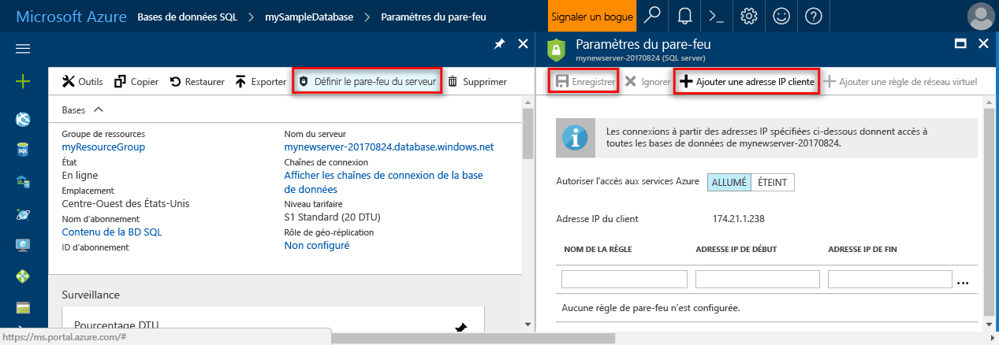

# <a name="azure-sql-database-server-level-and-database-level-firewall-rules"></a>Règles de pare-feu au niveau du serveur et de la base de données d’Azure SQL Database 

Microsoft Azure SQL Database fournit un service de base de données relationnelle pour Azure et d’autres applications basées sur Internet. toohelp protéger vos données, les pare-feu empêchent le serveur de base de données de tous les accès tooyour jusqu'à ce que vous spécifiez les ordinateurs sur lesquels l’autorisation. les pare-feu Hello accorde toodatabases d’accès basé sur hello adresse IP de chaque demande d’origine.

## <a name="overview"></a>Vue d'ensemble

Au départ, tous les Transact-SQL accès tooyour Azure SQL server est bloqué par le pare-feu hello. toobegin à l’aide de votre serveur SQL Azure, vous devez spécifier une ou plusieurs règles de pare-feu de niveau serveur qui permettent l’accès tooyour SQL Azure. Utilisez toospecify de règles de pare-feu hello quelle adresse IP comprise entre hello Internet sont autorisées, et si des applications Azure peuvent essayer de serveur SQL Azure de tooyour tooconnect.

grant tooselectively toojust accès une des bases de données hello dans votre serveur SQL Azure, vous devez créer une règle de niveau base de données pour la base de données requis hello. Spécifiez une plage d’adresses IP pour la règle de pare-feu de base de données hello dépasse hello spécifiée dans la règle de pare-feu de niveau serveur hello de plage d’adresses IP et vérifiez que l’adresse IP de hello du client de hello est comprise dans la plage hello spécifiée dans la règle de niveau base de données hello.

Les tentatives de connexion à partir de hello Internet et Azure doit traverser le pare-feu hello avant de pouvoir atteindre votre serveur SQL Azure ou une base de données SQL, comme indiqué dans hello suivant schéma :

   ![Diagramme décrivant la configuration de pare-feu.][1]

* **Les règles de pare-feu de niveau serveur :** ces règles permettent les clients tooaccess l’intégralité du serveur SQL Azure, autrement dit, toutes les bases de données hello dans hello même serveur logique. Ces règles sont stockées dans hello **master** base de données. Les règles de pare-feu de niveau serveur peuvent être configurées à l’aide du portail de hello ou à l’aide d’instructions Transact-SQL. toocreate règles de pare-feu de niveau serveur à l’aide de hello portail Azure ou PowerShell, vous devez être propriétaire de l’abonnement hello ou un collaborateur de l’abonnement. toocreate une règle de pare-feu de niveau serveur à l’aide de Transact-SQL, vous devez vous connecter instance de base de données SQL toohello en tant que connexion du principal au niveau du serveur hello ou un administrateur d’Azure Active Directory hello (ce qui signifie qu’une règle de pare-feu de niveau serveur doit tout d’abord être créée. par un utilisateur disposant des autorisations au niveau de Azure).
* **Règles de pare-feu de niveau de base de données :** ces règles permettent les clients tooaccess certains (sécurisé) des bases de données au sein de hello même serveur logique. Vous pouvez créer ces règles pour chaque base de données (y compris hello **master** database0) et elles sont stockées dans les bases de données individuelles hello. Règles de pare-feu de niveau base de données peuvent uniquement être configurés à l’aide d’instructions Transact-SQL et uniquement après avoir configuré hello premier pare-feu au niveau du serveur. Si vous spécifiez une plage d’adresses IP dans la règle de pare-feu de niveau base de données hello plage hello externe spécifiée dans la règle de pare-feu de niveau serveur hello, seuls les clients qui ont des adresses IP dans la plage de niveau de base de données hello peuvent accéder à base de données hello. Vous pouvez avoir un maximum de 128 règles de pare-feu au niveau de la base de données par base de données. Les règles de pare-feu au niveau de la base données pour les bases de données MASTER et utilisateur peuvent uniquement être créées et gérées via Transact-SQL. Pour plus d’informations sur la configuration des règles de pare-feu de niveau base de données, consultez l’exemple de hello plus loin dans ce article et consultez [sp_set_database_firewall_rule (bases de données de SQL Azure)](https://msdn.microsoft.com/library/dn270010.aspx).

**Recommandation :** Microsoft recommande d’utiliser des règles de pare-feu de niveau base de données chaque fois que possible tooenhance sécurité et toomake votre base de données plus portable. Utiliser les règles de pare-feu de niveau serveur pour les administrateurs et lorsque vous disposez de plusieurs bases de données qui ont hello mêmes exigences d’accès et que vous ne souhaitez pas temps toospend configuration individuellement de chaque base de données.

> [!Note]
> Pour plus d’informations sur les bases de données portables dans le contexte de hello de continuité des activités, consultez [exigences d’authentification pour la récupération d’urgence](sql-database-geo-replication-security-config.md).
>

### <a name="connecting-from-hello-internet"></a>Connexion à partir de hello Internet

Lorsqu’un ordinateur tente de serveur de base de données tooconnect tooyour de hello Internet, pare-feu de hello vérifie d’abord hello adresse IP de demande hello par rapport aux règles de pare-feu de niveau base de données hello, pour une base de données hello que la demande de connexion de hello d’origine :

* Si l’adresse IP de hello de demande de hello est dans une des plages de hello spécifiées dans les règles de pare-feu de niveau base de données de hello, connexion de hello est accordée toohello de base de données SQL qui contient la règle de hello.
* Si l’adresse IP de hello de demande de hello n’est pas dans une des plages de hello spécifiées dans la règle de pare-feu de niveau base de données hello, les règles de pare-feu de niveau serveur hello sont vérifiées. Si l’adresse IP de hello de demande de hello est dans une des plages de hello spécifiées dans les règles de pare-feu de niveau serveur hello, connexion de hello est accordée. Les règles de pare-feu de niveau serveur s’appliquent les bases de données SQL tooall sur hello Azure SQL server.  
* Si l’adresse IP de hello de demande de hello n’est pas dans les plages de hello spécifiées dans un des hello au niveau de la base de données ou règles de pare-feu de niveau serveur, demande de connexion hello échoue.

> [!NOTE]
> tooaccess base de données SQL Azure à partir de votre ordinateur local, assurez-vous que le pare-feu hello sur votre réseau et l’ordinateur local autorise les communications sortantes sur le port TCP 1433.
> 

### <a name="connecting-from-azure"></a>Connexion à partir d’Azure
applications tooallow tooconnect Azure tooyour Azure SQL server, les connexions Azure doivent être activées. Lorsqu’une application à partir de Azure essaie de serveur de base de données tooconnect tooyour, le pare-feu hello vérifie que les connexions Azure sont autorisées. Un paramètre de pare-feu avec début et de fin too0.0.0.0 égal d’adresse indique que ces connexions sont autorisées. Si la tentative de connexion hello n’est pas autorisée, demande de hello n’atteint pas le serveur de base de données SQL Azure hello.

> [!IMPORTANT]
> Cette option configure hello pare-feu tooallow toutes les connexions à partir de connexions, y comprises Azure à partir d’abonnements hello d’autres clients. Lorsque cette option, assurez-vous que votre connexion et limitent les autorisations utilisateur tooonly d’accès aux utilisateurs autorisés.
> 

## <a name="creating-and-managing-firewall-rules"></a>Création et gestion des règles de pare-feu
premier paramètre de pare-feu de niveau serveur Hello peut être créé à l’aide de hello [portail Azure](https://portal.azure.com/) ou par programmation à l’aide [Azure PowerShell](https://msdn.microsoft.com/library/azure/dn546724.aspx), [CLI d’Azure](/cli/azure/sql/server/firewall-rule#create), ou hello [API REST](https://msdn.microsoft.com/library/azure/dn505712.aspx). Les règles de pare-feu au niveau du serveur suivantes peuvent être créées et gérées à l’aide de ces méthodes, et par le biais de Transact-SQL. 

> [!IMPORTANT]
> Les règles de pare-feu au niveau de la base de données ne peuvent être créées et gérées qu’avec Transact-SQL. 
>

tooimprove des performances, les règles sont temporairement mis en cache au niveau de base de données hello de pare-feu de niveau serveur. cache de hello toorefresh, consultez [DBCC FLUSHAUTHCACHE](https://msdn.microsoft.com/library/mt627793.aspx). 

> [!TIP]
> Vous pouvez utiliser [l’audit de base de données SQL](sql-database-auditing.md) modifications de pare-feu au niveau du serveur et au niveau de la base de données tooaudit.
>

### <a name="azure-portal"></a>Portail Azure

tooset une règle de pare-feu de niveau serveur Bonjour portail Azure, vous pouvez visiter page Vue d’ensemble de toohello pour votre page de vue d’ensemble de base de données ou hello SQL Azure pour votre serveur logique de base de données Azure.

> [!TIP]
> Pour obtenir un didacticiel, consultez [créer une base de données à l’aide de hello Azure portal](sql-database-get-started-portal.md).
>

**À partir de la page de présentation de la base de données**

1. tooset une règle de pare-feu de niveau serveur à partir de la page de vue d’ensemble de base de données hello, cliquez sur **définir serveur pare-feu** barre d’outils hello comme indiqué dans hello suivant image : hello **des paramètres de pare-feu** page hello SQL Serveur de base de données s’ouvre.

       

2. Cliquez sur **ajouter l’adresse IP du client** sur hello barre d’outils tooadd hello adresse IP de hello ordinateur, vous utilisez actuellement, puis sur **enregistrer**. Une règle de pare-feu au niveau du serveur est créée pour votre adresse IP actuelle.

       

**À partir de la page de présentation du serveur**

nom de serveur complet Hello page Vue d’ensemble de votre serveur ouvre, affichant vous hello entièrement (tel que **mynewserver20170403.database.windows.net**) et fournit des options de configuration supplémentaire.

1. tooset une règle au niveau du serveur à partir de la page Vue d’ensemble du serveur, cliquez sur **pare-feu** dans le menu de gauche hello sous Paramètres, comme montré dans hello suivant image : 

     

2. Cliquez sur **ajouter l’adresse IP du client** sur hello barre d’outils tooadd hello adresse IP de hello ordinateur, vous utilisez actuellement, puis sur **enregistrer**. Une règle de pare-feu au niveau du serveur est créée pour votre adresse IP actuelle.

     

### <a name="transact-sql"></a>Transact-SQL
| Vue de catalogue ou procédure stockée | Niveau | Description |
| --- | --- | --- |
| [sys.firewall_rules](https://msdn.microsoft.com/library/dn269980.aspx) |Serveur |Affiche les règles de pare-feu de niveau serveur actuelles hello |
| [sp_set_firewall_rule](https://msdn.microsoft.com/library/dn270017.aspx) |Serveur |Crée ou met à jour les règles de pare-feu au niveau du serveur |
| [sp_delete_firewall_rule](https://msdn.microsoft.com/library/dn270024.aspx) |Serveur |Supprime des règles de pare-feu au niveau du serveur |
| [sys.database_firewall_rules](https://msdn.microsoft.com/library/dn269982.aspx) |Base de données |Affiche les règles de pare-feu de niveau base de données en cours de hello |
| [sp_set_database_firewall_rule](https://msdn.microsoft.com/library/dn270010.aspx) |Base de données |Crée ou met à jour les règles de pare-feu de niveau base de données de hello |
| [sp_delete_database_firewall_rule](https://msdn.microsoft.com/library/dn270030.aspx) |Bases de données |Supprime les règles de pare-feu au niveau de la base de données |


Hello exemples suivants passez en revue les règles existantes hello, activez une plage d’adresses IP sur le serveur hello Contoso et supprime une règle de pare-feu :
   
```sql
SELECT * FROM sys.firewall_rules ORDER BY name;
```
  
Ensuite, ajoutez une règle de pare-feu.
   
```sql
EXECUTE sp_set_firewall_rule @name = N'ContosoFirewallRule',
   @start_ip_address = '192.168.1.1', @end_ip_address = '192.168.1.10'
```

toodelete une règle de pare-feu de niveau serveur, exécutez la procédure de sp_delete_firewall_rule stockées de hello. Hello exemple suivant supprime règle hello contosofirewallrule :
   
```sql
EXECUTE sp_delete_firewall_rule @name = N'ContosoFirewallRule'
```   

### <a name="azure-powershell"></a>Azure PowerShell
| Applet de commande | Niveau | Description |
| --- | --- | --- |
| [Get-AzureSqlDatabaseServerFirewallRule](https://msdn.microsoft.com/library/azure/dn546731.aspx) |Serveur |Retourne les règles de pare-feu de niveau serveur actuelles hello |
| [New-AzureSqlDatabaseServerFirewallRule](https://msdn.microsoft.com/library/azure/dn546724.aspx) |Serveur |Crée une règle de pare-feu au niveau du serveur |
| [Set-AzureSqlDatabaseServerFirewallRule](https://msdn.microsoft.com/library/azure/dn546739.aspx) |Serveur |Propriétés de hello mises à jour d’une règle de pare-feu de niveau serveur existante |
| [Remove-AzureSqlDatabaseServerFirewallRule](https://msdn.microsoft.com/library/azure/dn546727.aspx) |Serveur |Supprime des règles de pare-feu au niveau du serveur |


Bonjour à l’exemple suivant définit une règle de pare-feu de niveau serveur à l’aide de PowerShell :

```powershell
New-AzureRmSqlServerFirewallRule -ResourceGroupName "myResourceGroup" `
    -ServerName $servername `
    -FirewallRuleName "AllowSome" -StartIpAddress "0.0.0.0" -EndIpAddress "0.0.0.0"
```

> [!TIP]
> Pour obtenir des exemples de PowerShell dans le contexte de hello d’un démarrage rapide, consultez [créer base de données - PowerShell](sql-database-get-started-powershell.md) et [créer une base de données et de configurer une règle de pare-feu à l’aide de PowerShell](scripts/sql-database-create-and-configure-database-powershell.md)
>

### <a name="azure-cli"></a>Interface de ligne de commande Azure
| Applet de commande | Niveau | Description |
| --- | --- | --- |
| [az sql server firewall create](/cli/azure/sql/server/firewall-rule#create) | Crée un tooall dans pare-feu règle tooallow accès aux bases de données SQL sur le serveur hello à partir de la plage d’adresses IP hello entré.|
| [az sql server firewall delete](/cli/azure/sql/server/firewall-rule#delete)| Supprime une règle de pare-feu.|
| [az sql server firewall list](/cli/azure/sql/server/firewall-rule#list)| Répertorie les règles de pare-feu hello.|
| [az sql server firewall rule show](/cli/azure/sql/server/firewall-rule#show)| Affiche les détails de hello d’une règle de pare-feu.|
| [ax sql server firewall rule update](/cli/azure/sql/server/firewall-rule#update)| Met à jour une règle de pare-feu.

Bonjour à l’exemple suivant définit une règle de pare-feu de niveau serveur à l’aide de hello CLI d’Azure : 

```azurecli-interactive
az sql server firewall-rule create --resource-group myResourceGroup --server $servername \
    -n AllowYourIp --start-ip-address 0.0.0.0 --end-ip-address 0.0.0.0
```

> [!TIP]
> Pour obtenir un exemple de CLI d’Azure dans le contexte de hello d’un démarrage rapide, consultez [créer DDB - CLI d’Azure](sql-database-get-started-cli.md) et [créer une base de données et de configurer une règle de pare-feu à l’aide de hello CLI d’Azure](scripts/sql-database-create-and-configure-database-cli.md)
>

### <a name="rest-api"></a>API REST
| API | Niveau | Description |
| --- | --- | --- |
| [Répertorier les règles de pare-feu](https://msdn.microsoft.com/library/azure/dn505715.aspx) |Serveur |Affiche les règles de pare-feu de niveau serveur actuelles hello |
| [Créer une règle de pare-feu](https://msdn.microsoft.com/library/azure/dn505712.aspx) |Serveur |Crée ou met à jour les règles de pare-feu au niveau du serveur |
| [Obtenir une règle de pare-feu](https://msdn.microsoft.com/library/azure/dn505707.aspx) |Serveur |Propriétés de hello mises à jour d’une règle de pare-feu de niveau serveur existante |
| [Supprimer une règle de pare-feu](https://msdn.microsoft.com/library/azure/dn505706.aspx) |Serveur |Supprime des règles de pare-feu au niveau du serveur |

## <a name="server-level-firewall-rule-versus-a-database-level-firewall-rule"></a>Règle de pare-feu au niveau du serveur par rapport à une règle de pare-feu au niveau de la base de données
Q : Les utilisateurs d’une base de données doivent-ils être totalement isolés d’une autre base de données ?   
  Si oui, accordez l’accès à l’aide de règles de pare-feu au niveau de la base de données. Cela évite à l’aide de règles de pare-feu de niveau serveur, qui autorisent l’accès via le pare-feu hello tooall bases de données, ce qui réduit la profondeur de hello de vos défenses.   
 
Q : Les utilisateurs à l’adresse IP d’hello besoin d’accès tooall de bases de données ?   
  Utilisez des pare-feu de niveau serveur règles tooreduce hello le nombre de fois où que vous devez configurer des règles de pare-feu.   

Q : Hello personne ou une équipe de configuration des règles de pare-feu hello uniquement puissent y accéder via hello portail Azure, PowerShell ou hello API REST ?   
  Vous devez utiliser des règles de pare-feu au niveau du serveur. Les règles de pare-feu au niveau de la base de données ne peuvent être configurées qu’avec Transact-SQL.  

Q : Hello personne ou une équipe de configuration des règles de pare-feu hello est interdit d’ayant l’autorisation de niveau supérieur au niveau de base de données hello ?   
  Utilisez des règles de pare-feu au niveau du serveur. La configuration de règles de pare-feu de niveau base de données à l’aide de Transact-SQL, requiert au moins `CONTROL DATABASE` autorisation au niveau de base de données hello.  

Q : Est hello personne ou une équipe de configuration ou de l’audit des règles de pare-feu hello, centraliser la gestion des règles de pare-feu pour un grand nombre (peut-être par 100) des bases de données ?   
  Cette sélection dépend de vos besoins et de votre environnement. Les règles de pare-feu de niveau serveur peuvent être tooconfigure plus facile, mais de script peut configurer des règles à hello au niveau de la base de données. Même si vous utilisez les règles de pare-feu de niveau serveur, vous devrez peut-être les règles de pare-feu de base de données tooaudit hello, toosee si les utilisateurs avec `CONTROL` sur base de données hello ont créé les règles de pare-feu de niveau base de données.   

Q : Puis-je utiliser à la fois des règles de pare-feu au niveau du serveur et des règles de pare-feu au niveau de la base de données ?   
  Oui. Certains utilisateurs, par exemple les administrateurs, peuvent avoir besoin des règles de pare-feu au niveau du serveur. D’autres utilisateurs, tels que les utilisateurs d’une application de base de données, peuvent avoir besoin de règles de pare-feu au niveau de la base de données.   

## <a name="troubleshooting-hello-database-firewall"></a>Dépannage du pare-feu de base de données hello
Tenez compte des hello lors de l’accès toohello service de base de données SQL Microsoft Azure ne se comporte pas comme prévu les points suivants :

* **Configuration du pare-feu local :** avant que votre ordinateur peut accéder à base de données SQL Azure, vous devrez peut-être toocreate une exception de pare-feu sur votre ordinateur pour le port TCP 1433. Si vous effectuez des connexions à l’intérieur des limites de cloud computing Azure hello, vous avez peut-être tooopen des ports supplémentaires. Pour plus d’informations, consultez hello **base de données SQL : en dehors de Visual Studio à l’intérieur de** section de [Ports au-delà de 1433 pour ADO.NET 4.5 et de la base de données SQL](sql-database-develop-direct-route-ports-adonet-v12.md).
* **Traduction d’adresses réseau (NAT) :** tooNAT échéance, adresse IP de hello utilisé par votre tooAzure de tooconnect ordinateur base de données SQL peut être différente de l’adresse IP de hello indiqué dans les paramètres de configuration IP de votre ordinateur. adresse IP de tooview hello est de votre ordinateur à l’aide de tooconnect tooAzure, connectez-vous au portail de toohello et accédez toohello **configurer** onglet sur serveur hello qui héberge votre base de données. Sous hello **adresses IP autorisées** section hello **adresse IP du Client actuel** s’affiche. Cliquez sur **ajouter** toohello **adresses IP autorisées** tooallow ce serveur tooaccess hello.
* **Liste verte de modifications toohello n'ont pas encore entrées en vigueur :** il peut y avoir autant qu’un délai de cinq minutes pour modifie l’effet de tootake toohello base de données SQL Azure pare-feu configuration.
* **la connexion Hello n’est pas autorisée ou un mot de passe incorrect a été utilisée :** si une connexion n’a pas d’autorisations sur le serveur de base de données SQL Azure hello ou hello mot de passe est incorrect, le serveur de base de données SQL Azure hello connexion toohello est refusé. Création d’un paramètre de pare-feu fournit uniquement les clients avec un tooattempt opportunité connexion tooyour serveur ; chaque client doit fournir les informations d’identification de sécurité nécessaires hello. Pour plus d’informations sur la préparation des connexions, consultez Gestion des bases de données, des connexions et des utilisateurs dans Azure SQL Database.
* **Adresse IP dynamique :** si vous avez une connexion Internet avec adressage IP dynamique et que vous rencontrez des problèmes de mise en route à travers le pare-feu hello, vous pouvez tenter de hello suivant solutions :
  
  * Demandez à votre fournisseur de Service Internet (ISP) pour la plage d’adresses IP hello affecté tooyour les ordinateurs clients de ce serveur de base de données SQL Azure hello accès et puis ajoutez plage d’adresses IP hello comme une règle de pare-feu.
  * Obtenir l’adressage IP statique à la place pour vos ordinateurs clients et ajoutez des adresses IP hello en tant que règles de pare-feu.

## <a name="next-steps"></a>Étapes suivantes

- Pour obtenir un démarrage rapide sur la création d’une base de données et d’une règle de pare-feu au niveau du serveur, consultez [Créer une base de données Azure SQL Database](sql-database-get-started-portal.md).
- Pour obtenir de connexion de base de données SQL Azure de tooan à partir de la source ouverte ou des applications tierces, consultez [tooSQL base de données des exemples de code de démarrage rapide de Client](https://msdn.microsoft.com/library/azure/ee336282.aspx).
- Pour plus d’informations sur les ports supplémentaires que vous pouvez être amené à tooopen, consultez hello **base de données SQL : en dehors de Visual Studio à l’intérieur de** section [Ports au-delà de 1433 pour ADO.NET 4.5 et de la base de données SQL](sql-database-develop-direct-route-ports-adonet-v12.md)
- Pour obtenir une vue d’ensemble de la sécurité Azure SQL Database, consultez [Sécurisation de votre base de données](sql-database-security-overview.md)

<!--Image references-->
[1]: ./media/sql-database-firewall-configure/sqldb-firewall-1.png
