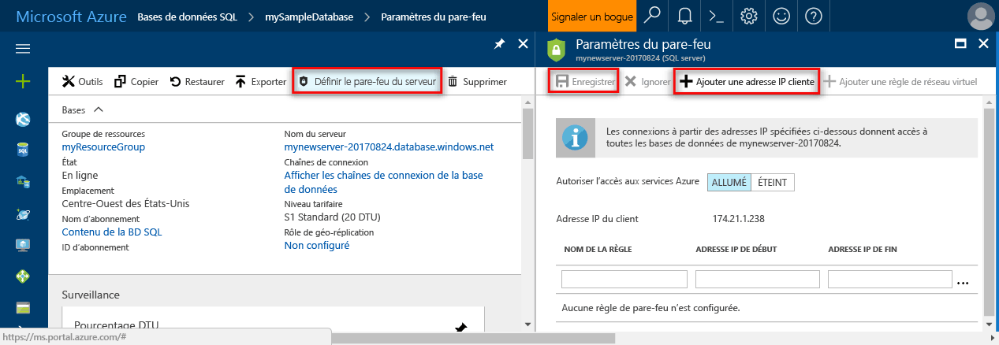

# <a name="create-an-azure-sql-database-in-hello-azure-portal"></a>Créer une base de données SQL Azure Bonjour portail Azure

Ce didacticiel de démarrage rapide Guide comment toocreate SQL de base de données dans Azure. Base de données SQL Azure est un « de base de données-as-a-Service » de l’offre qui vous permet de toorun et l’échelle haute disponibilités SQL Server bases de données dans le cloud de hello. Ce guide de démarrage rapide vous montre comment tooget démarrer en créant une base de données SQL à l’aide de hello portail Azure.

Si vous n’avez pas d’abonnement Azure, créez un compte [gratuit](https://azure.microsoft.com/free/) avant de commencer.

## <a name="log-in-toohello-azure-portal"></a>Ouvrez une session dans toohello portail Azure

Connectez-vous à toohello [portail Azure](https://portal.azure.com/).

## <a name="create-a-sql-database"></a>Créer une base de données SQL

Une base de données SQL Azure est créée avec un ensemble défini de [ressources de calcul et de stockage](sql-database-service-tiers.md). base de données Hello est créé dans un [groupe de ressources Azure](../azure-resource-manager/resource-group-overview.md) et dans un [serveur logique de base de données SQL Azure](sql-database-features.md). 

Suivez ces étapes toocreate une base de données SQL contenant les données d’exemple Adventure Works LT hello. 

1. Cliquez sur hello **nouveau** bouton se trouve sur le coin supérieur gauche hello Hello portail Azure.

2. Sélectionnez **bases de données** de hello **nouveau** page, puis sélectionnez **base de données SQL** de hello **bases de données** page.

   

3. Rempliront hello de base de données SQL avec hello suivant d’informations, comme indiqué dans le hello précédant l’image :   

   | Paramètre       | Valeur suggérée | Description | 
   | ------------ | ------------------ | ------------------------------------------------- | 
   | **Nom de la base de données** | mySampleDatabase | Pour les noms de base de données valides, consultez [Database Identifiers](https://docs.microsoft.com/en-us/sql/relational-databases/databases/database-identifiers) (Identificateurs de base de données). | 
   | **Abonnement** | Votre abonnement  | Pour plus d’informations sur vos abonnements, consultez [Abonnements](https://account.windowsazure.com/Subscriptions). |
   | **Groupe de ressources**  | myResourceGroup | Pour les noms de groupe de ressources valides, consultez [Naming conventions](https://docs.microsoft.com/azure/architecture/best-practices/naming-conventions) (Conventions d’affectation de nom). |
   | **Source** | Exemple (AdventureWorksLT) | Charge de hello AdventureWorksLT schéma et les données dans votre nouvelle base de données |

   > [!IMPORTANT]
   > Vous devez sélectionner la base de données exemple hello sur ce formulaire, car il est utilisé dans le reste de hello de ce guide de démarrage rapide.
   > 

4. Sous **Server**, cliquez sur **configurer les paramètres requis** et remplissez hello écran SQL server (serveur logique) avec hello suivant d’informations, comme indiqué dans le hello suivant image :   

   | Paramètre       | Valeur suggérée | Description | 
   | ------------ | ------------------ | ------------------------------------------------- | 
   | **Nom du serveur** | Nom globalement unique | Pour les noms de serveur valides, consultez [Naming conventions](https://docs.microsoft.com/azure/architecture/best-practices/naming-conventions) (Conventions d’affectation de nom). | 
   | **Connexion d’administrateur du serveur** | Nom valide | Pour les noms de connexion valides, consultez [Database Identifiers](https://docs.microsoft.com/en-us/sql/relational-databases/databases/database-identifiers) (Identificateurs de base de données). |
   | **Mot de passe** | Mot de passe valide | Votre mot de passe doit comporter au moins 8 caractères et contenir des caractères appartenant à trois des hello suivant des catégories : caractères majuscules, minuscules, chiffres et caractères non alphanumériques et. |
   | **Abonnement** | Votre abonnement | Pour plus d’informations sur vos abonnements, consultez [Abonnements](https://account.windowsazure.com/Subscriptions). |
   | **Groupe de ressources** | myResourceGroup | Pour les noms de groupe de ressources valides, consultez [Naming conventions](https://docs.microsoft.com/azure/architecture/best-practices/naming-conventions) (Conventions d’affectation de nom). |
   | **Emplacement** | Emplacement valide | Pour plus d’informations sur les régions, consultez [Régions Azure](https://azure.microsoft.com/regions/). |

   > [!IMPORTANT]
   > connexion administrateur de serveur Hello et un mot de passe que vous spécifiez ici sont requis toolog dans toohello server et ses bases de données plus loin dans ce guide de démarrage rapide. Retenez ou enregistrez ces informations pour une utilisation ultérieure. 
   >  

   

5. Lorsque vous avez terminé d’écran de hello, cliquez sur **sélectionnez**.

6. Cliquez sur **niveau tarifaire** toospecify hello performances et la couche de niveau de service pour votre nouvelle base de données. Utilisez hello curseur tooselect **20 dtu** et **250** Go de stockage. Pour plus d’informations sur les DTU, consultez la page [Qu’est-ce qu’un DTU ?](sql-database-what-is-a-dtu.md).

   

7. Après avoir quantité hello sélectionné de dtu, cliquez sur **appliquer**.  

8. Maintenant que vous avez terminé le formulaire de base de données SQL hello, cliquez sur **créer** base de données tooprovision hello. L’approvisionnement prend quelques minutes. 

9. Dans la barre d’outils de hello, cliquez sur **Notifications** processus de déploiement toomonitor hello.

   

## <a name="create-a-server-level-firewall-rule"></a>créer une règle de pare-feu au niveau du serveur ;

Hello service de base de données SQL crée un pare-feu à hello au niveau du serveur qui empêche des applications externes et des outils de se connecter toohello server ou des bases de données sur le serveur de hello, sauf si une règle de pare-feu est créée le pare-feu tooopen hello pour des adresses IP spécifiques. Suivez ces étapes toocreate un [règle de pare-feu de niveau serveur de base de données SQL](sql-database-firewall-configure.md) pour l’adressage IP de votre client et activer la connectivité externe via le pare-feu de base de données SQL hello pour votre adresse IP uniquement. 

> [!NOTE]
> SQL Database communique par le biais du port 1433. Si vous essayez de tooconnect à partir d’un réseau d’entreprise, le trafic sortant sur le port 1433 ne peut pas être autorisé par le pare-feu de votre réseau. Dans ce cas, serveur de base de données SQL Azure tooyour ne peut pas se connecter à moins que votre service informatique s’ouvre le port 1433.
>

1. Une fois le déploiement de hello terminé, cliquez sur **bases de données SQL** de menu à gauche hello, puis cliquez sur **mySampleDatabase** sur hello **bases de données SQL** page. nom de serveur complet Hello page Vue d’ensemble de votre base de données ouvre, affichant vous hello entièrement (tel que **mynewserver20170313.database.windows.net**) et fournit des options de configuration supplémentaire. Copiez ce nom de serveur complet pour une utilisation ultérieure.

   > [!IMPORTANT]
   > Vous avez besoin de ce serveur complet nom tooconnect tooyour ses bases de données et dans les Démarrages rapides suivants.
   > 

    

2. Cliquez sur **définir serveur pare-feu** barre d’outils hello comme indiqué dans l’image précédente de hello. Hello **des paramètres de pare-feu** page serveur de base de données SQL hello s’ouvre. 

    

3. Cliquez sur **ajouter l’adresse IP du client** sur tooadd de barre d’outils hello votre adresse IP actuelle d’adresses tooa nouvelle règle de pare-feu. Une règle de pare-feu peut ouvrir le port 1433 pour une seule adresse IP ou une plage d’adresses IP.

4. Cliquez sur **Enregistrer**. Une règle de pare-feu de niveau serveur est créée pour votre adresse IP actuelle, ouvrir le port 1433 sur le serveur logique de hello.

    

4. Cliquez sur **OK** , puis fermez hello **des paramètres de pare-feu** page.

Vous pouvez désormais connecter le serveur de base de données SQL toohello et ses bases de données à l’aide de SQL Server Management Studio ou un autre outil de votre choix à partir de cette adresse IP à l’aide du compte d’administrateur de serveur hello créé précédemment.

> [!IMPORTANT]
> Par défaut, l’accès via le pare-feu de base de données SQL hello est activé pour tous les services Azure. Cliquez sur **OFF** sur toodisable de cette page pour tous les services Azure.
>

## <a name="query-hello-sql-database"></a>Base de données de requête hello SQL

Maintenant que vous avez créé une base de données d’exemple dans Azure, nous allons utiliser outil de requête intégrées hello dans hello Azure tooconfirm portail que vous pouvez vous connecter à toohello de base de données et interroger des données hello. 

1. Dans la page de base de données SQL hello pour votre base de données, cliquez sur **outils** sur la barre d’outils hello. Hello **outils** ouvrir la page.

    

2. Cliquez sur **l’éditeur de requête (version préliminaire)**, cliquez sur hello **afficher un aperçu des termes du contrat de** case à cocher, puis cliquez sur **OK**. page de l’éditeur de requête Hello s’ouvre.

3. Cliquez sur **connexion** , puis, lorsque vous y êtes invité, sélectionnez **l’authentification SQL server** , puis indiquez le compte de connexion administrateur de serveur hello et mot de passe que vous avez créé précédemment.

    

4. Cliquez sur **OK** toolog dans.

5. Une fois que vous êtes authentifié, tapez ce qui suit hello de requête dans le volet de l’éditeur de requête hello.

   ```sql
   SELECT TOP 20 pc.Name as CategoryName, p.name as ProductName
   FROM SalesLT.ProductCategory pc
   JOIN SalesLT.Product p
   ON pc.productcategoryid = p.productcategoryid;
   ```

6. Cliquez sur **exécuter** puis passez en revue les résultats de requête hello Bonjour **résultats** volet.

   

7. Fermer hello **l’éditeur de requête** page et hello **outils** page.

## <a name="clean-up-resources"></a>Supprimer des ressources

Si vous n’avez pas besoin ces ressources pour un autre/didacticiel de démarrage rapide (consultez [étapes](#next-steps)), vous pouvez les supprimer de manière hello suivante :


1. À partir du menu de gauche hello Bonjour portail Azure, cliquez sur **groupes de ressources** puis cliquez sur **myResourceGroup**. 
2. Dans la page de votre groupe de ressources, cliquez sur **supprimer**, type **myResourceGroup** dans hello de zone de texte, puis cliquez sur **supprimer**.

## <a name="next-steps"></a>Étapes suivantes

Maintenant que vous disposez d’une base de données, vous pouvez vous connecter et interroger à l’aide de vos outils préférés. En savoir plus en choisissant votre outil ci-dessous :

- [SQL Server Management Studio](sql-database-connect-query-ssms.md)
- [Visual Studio Code](sql-database-connect-query-vscode.md)
- [.NET](sql-database-connect-query-dotnet.md)
- [PHP](sql-database-connect-query-php.md)
- [Node.JS](sql-database-connect-query-nodejs.md)
- [Java](sql-database-connect-query-java.md)
- [Python](sql-database-connect-query-python.md)
- [Ruby](sql-database-connect-query-ruby.md)
