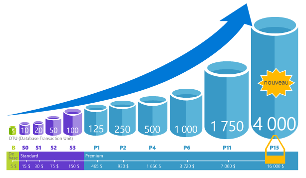
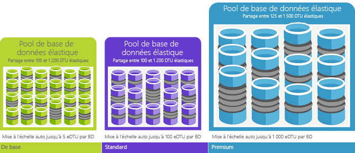
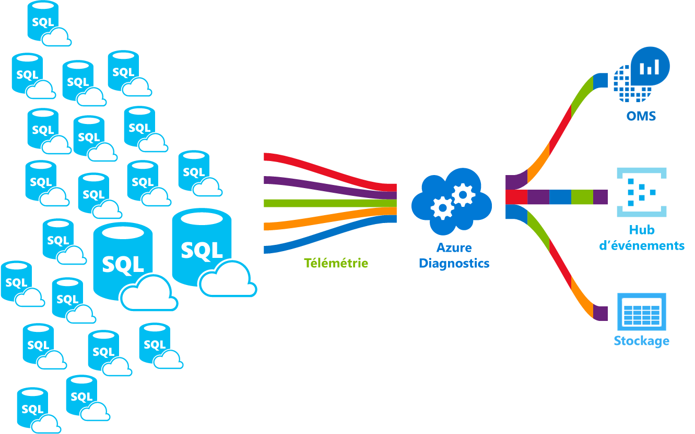

# Qu’est le service de base de données SQL Azure hello ? 

SQL Database est une base de données relationnelle à usage général de Microsoft Azure qui prend en charge des structures telles que les données relationnelles, JSON, les données spatiales et XML. Cette solution offre des [performances évolutives dynamiques](sql-database-service-tiers.md) et fournit des options telles que les [index columnstore](https://docs.microsoft.com/sql/relational-databases/indexes/columnstore-indexes-overview) pour la génération de rapport et l’analyse extrême, et [OLTP en mémoire](sql-database-in-memory.md) pour le traitement transactionnel extrême. Microsoft gère tous les correctifs et mise à jour de la base de code SQL hello en toute transparence et élimine toute la gestion de hello sous-jacent d’infrastructure. 

Base de données SQL porte le même sa base de code hello [moteur de base de données Microsoft SQL Server](https://docs.microsoft.com/sql/sql-server/sql-server-technical-documentation). Avec la stratégie de Microsoft cloud en premier, les fonctions les plus récents de hello de SQL Server sont tooSQL première version de base de données, puis tooSQL serveur lui-même. Cette approche vous offre de hello dernières fonctionnalités de SQL Server avec aucune surcharge pour la mise à jour corrective ou la mise à niveau - et avec ces nouvelles fonctionnalités testées sur des millions de bases de données. Pour plus d’informations sur les nouvelles fonctionnalités annoncées, voir :

- **[Feuille de route Azure de base de données SQL](https://azure.microsoft.com/roadmap/?category=databases)**: un toofind place les nouveautés et les nouveautés à venir suivante. 
- **[Blog de Microsoft Azure SQL Database](https://azure.microsoft.com/blog/topics/database)** : l’endroit où les membres de l’équipe produit SQL Server publient des billets de blog sur les nouveautés et les fonctionnalités de SQL Database. 

SQL Database offre des performances prévisibles à plusieurs niveaux de service qui permettent une évolutivité dynamique avec aucun temps mort, une optimisation intelligente intégrée, une évolutivité et une disponibilité globales, ainsi que des options avancées de sécurité, et tout cela sans (presque) aucune tâche d’administration. Ces fonctionnalités vous permettent de toofocus sur le développement d’applications rapide et accélérer votre toomarket de temps, au lieu d’allouer beaucoup de temps et ressources toomanaging virtual machines et l’infrastructure. Hello service est actuellement en 38 données de la base de données SQL tourne autour de Bonjour, avec plusieurs centres de données en ligne régulièrement, qui vous permet de toorun votre base de données dans un centre de données près de chez vous.

> [!NOTE]
> Visitez le [Centre de gestion de la confidentialité Azure](https://azure.microsoft.com/support/trust-center/security/) pour plus d’informations sur la sécurité de la plateforme Azure.
>

## Pools et performances évolutives

Avec SQL Database, chaque base de données est isolée de l’autre et portable, chacune avec son propre [niveau de service](sql-database-service-tiers.md) et donc sa garantie de performances. Base de données SQL fournit différents niveaux de performance pour des besoins différents et permet de toobe bureaux toomaximize hello utilisation des ressources et réduire le coût des bases de données.

### Ajustez les performances et la mise à l'échelle sans interruption de service

Base de données SQL offre quatre niveaux de service des charges de travail de base de données toosupport tooheavyweight léger : Basic, Standard, Premium et Premium RS. Vous pouvez générer votre première application sur une petite base de données unique à un faible coût par mois, puis modifier son niveau de service manuellement ou par programmation n’importe quel moment toomeet hello les besoins de votre solution. Vous pouvez ajuster les performances sans temps mort tooyour application tooyour clients. Permet une évolutivité dynamique tootransparently de votre base de données répondre toorapidly la modification des besoins en ressources et vous permet de tooonly vous payez pour les ressources de hello que vous avez besoin lorsque vous en avez besoin.

   

### Utilisation des ressources toomaximize pools élastiques

Pour de nombreuses entreprises et les applications, qui est en mesure de toocreate des bases de données uniques et accès performances vers le haut ou vers le bas à la demande est suffisant, surtout si les modèles d’utilisation sont relativement prévisibles. Mais si vous avez des modèles d’utilisation imprévisibles, il peut la rendre toomanage dur coûts et votre modèle d’entreprise. [Pools élastiques](sql-database-elastic-pool.md) est conçu toosolve ce problème. concept de Hello est simple. Vous allouez le pool de tooa de ressources de performances au lieu d’une base de données individuel et payez pour hello collective de ressources de performances du pool de hello plutôt que pour les performances de la base de données unique. 

   

Avec les pools élastiques, vous n’avez pas besoin toofocus sur la numérotation des performances de la base de données haut et bas lorsque la demande de ressources varie. Hello regroupées des bases de données consomment des ressources de performances hello du pool élastique de hello en fonction des besoins. Pool de bases de données consomment mais ne dépassent les limites de hello du pool de hello, votre coût reste prévisible, même si l’utilisation de base de données n’est pas. Quel est le plus, vous pouvez [ajouter et supprimer le pool de bases de données toohello](sql-database-elastic-pool-manage-portal.md), mise à l’échelle votre application à partir d’un certain nombre de toothousands de bases de données, au sein d’un budget que vous contrôlez. Vous pouvez également au minimum de contrôle hello et ressources maximales de toodatabases disponible dans tooensure de pool hello qu’aucune base de données dans le pool de hello n’utilise tous hello des ressources et que chaque base de données a une quantité minimale de garantie de ressources. toolearn savoir plus sur les modèles de conception pour les applications SaaS à l’aide de pools élastiques, consultez [des modèles de conception pour les Applications SaaS mutualisée avec la base de données SQL](sql-database-design-patterns-multi-tenancy-saas-applications.md).

### Fusionner les bases de données uniques avec les bases de données regroupées

Quelle que soit la méthode utilisée (bases de données uniques ou pools élastiques), rien n’est irréversible. Vous pouvez fusionner les bases de données uniques avec les pools élastiques et modifier les niveaux de service hello de bases de données uniques et les pools élastiques rapidement et facilement tooadapt tooyour situation. La puissance de hello et la portée de Azure, vous pouvez mix et match autres Azure services avec toomeet de base de données SQL besoins, le lecteur de coût et l’efficacité des ressources de conception de votre application unique et déverrouiller les nouvelles opportunités commerciales.

### Fonctionnalités étendues de surveillance et d’alerte

Mais comment vous comparez des performances relatives de hello de bases de données uniques et les pools élastiques ? Comment savoir hello bouton droit sur-arrêt lorsque vous composez le haut et bas ? Vous utilisez hello [l’analyse des performances intégrés](sql-database-performance.md) et [d’alerte](sql-database-insights-alerts-portal.md) outils, combinés avec des évaluations de performances hello en fonction de [unités de Transaction de base de données (Udbd) pour les bases de données uniques et les dtu élastiques (Edtu) pour les pools élastiques](sql-database-what-is-a-dtu.md). À l’aide de ces outils, vous pouvez rapidement évaluer impact hello de mise à l’échelle vers le haut ou vers le bas en fonction de votre actuel ou les besoins de performances. Voir [Options et performances de la base de données SQL : comprendre ce qui est disponible dans chaque niveau de service](sql-database-service-tiers.md) pour plus d’informations.

En outre, SQL Database peut [émettre des mesures et des journaux de diagnostic](sql-database-metrics-diag-logging.md) pour faciliter la surveillance. Vous pouvez configurer l’utilisation des ressources de base de données SQL toostore, aux employés et les sessions et connectivité dans une de ces ressources Azure :

- **Stockage Azure** : pour archiver des quantités importantes de données de télémétrie à un petit prix
- **Hub d’événements Azure** : pour intégrer des données de télémétrie SQL Database à votre solution de surveillance personnalisée ou à vos pipelines très actifs
- **Azure Log Analytics** : pour une solution de surveillance intégrée avec des fonctionnalités de génération de rapports, d’alerte et d’atténuation

    

## Fonctionnalités de disponibilité

Avec un temps de disponibilité de 99,99 %, l’excellent contrat de niveau de service [(SLA)](http://azure.microsoft.com/support/legal/sla/)d’Azure, soutenu par un réseau mondial de centres de données gérés par Microsoft, permet d’exécuter votre application 24 heures sur 24, 7 jours sur 7. En outre, SQL Database fournit des fonctionnalités intégrées de [continuité d’activité et d’évolutivité globale](sql-database-business-continuity.md), notamment :

- **[Sauvegardes automatiques](sql-database-automated-backups.md)** : SQL Database effectue automatiquement des sauvegardes complètes, différentielles et de fichier journal.
- **[Restaurations de point-à-temps](sql-database-recovery-using-backups.md)**: base de données SQL prend en charge le point de récupération tooany dans le temps au sein de la période de rétention des sauvegardes automatiques hello.
- **[Géo-réplication Active](sql-database-geo-replication-overview.md)**: base de données SQL permet de vous tooconfigure de base de données secondaire accessible en lecture toofour de bases de données soit Bonjour identiques ou distribuée globalement les centres de données Azure.  Par exemple, si vous avez une application SaaS avec une base de données de catalogue qui a un volume élevé de transactions simultanées d’en lecture seule, tooenable de géo-réplication active utilisation global lu de montée en puissance et supprimer des goulots d’étranglement sur hello principal en raison de charges de travail tooread. 
- **[Groupes de basculement](sql-database-geo-replication-overview.md)**: base de données SQL vous permet de tooenable haute disponibilité et équilibrage de charge à l’échelle mondiale, y compris la géo-réplication transparente et le basculement de grands ensembles de bases de données et les pools élastiques. Les groupes de basculement et la géo-réplication active active la création d’applications de SaaS globalement distribuées avec une administration minimale de surcharge quitter toutes les analyse complexe hello, routage et basculement d’orchestration tooSQL de base de données.

## Intelligence intégrée

Avec la base de données SQL, vous obtenez une intelligence intégrée qui vous permet de réduire considérablement les coûts de hello en cours d’exécution et la gestion des bases de données et optimise les performances et sécurité de votre application. Exécute des millions de client les charges de travail 24 heures sur 24, base de données SQL collecte et traite une quantité importante de données de télémétrie, tout en respectant également pleinement la confidentialité des clients coulisses hello. Différents algorithmes Évaluez en permanence les données de télémétrie hello afin que service de hello pouvez en savoir plus et s’adapter à votre application. En fonction de cette analyse, service de hello s’affiche avec des performances amélioration de la charge de travail de recommandations sur mesure tooyour spécifique. 

### Réglage automatique des performances

Base de données SQL fournit la vision de hello des requêtes que vous avez besoin de toomonitor. La base de données SQL en apprend plus sur les modèles de votre base de données et permet de vous tooadapt votre charge de travail tooyour du schéma de base de données. SQL Database propose des solutions pour améliorer les performances par le biais de [SQL Database Advisor](sql-database-advisor.md), où vous pouvez passer en revue les actions de réglage et les appliquer. Toutefois, la surveillance permanente de la base de données est une tâche difficile et fastidieuse, en particulier lors du traitement de plusieurs bases de données. Gérer un très grand nombre de bases de données peut être impossible toodo efficacement même avec tous les outils disponibles et les rapports qui fournissent des base de données SQL et le portail Azure. Au lieu de surveillance et de paramétrage de votre base de données manuellement, vous pouvez envisager de délégation des hello surveillance et de paramétrage tooSQL des actions de base de données à l’aide de la fonctionnalité de réglage automatique. Base de données SQL appliquer les recommandations, les tests et vérifie chacun de ses performances de hello actions tooensure paramétrage conserve améliorer automatiquement. De cette manière, base de données SQL s’adapte automatiquement la charge de travail tooyour de manière contrôlée et sans échec. Le paramétrage automatique signifie que hello performances de votre base de données est soigneusement analysées et avant et après chaque action de paramétrage et si n’améliorent pas les performances de hello, hello paramétrage action est rétabli.

Aujourd'hui, plusieurs de ses partenaires en cours d’exécution [les applications SaaS mutualisées](sql-database-design-patterns-multi-tenancy-saas-applications.md) au-dessus de la base de données SQL reposent sur toomake que leurs applications ont toujours des performances stables et prévisibles de réglage des performances automatique. Pour ces derniers, cette fonctionnalité réduit considérablement les risques de hello de disposer d’un incident de performance milieu hello de nuit, hello. En outre, étant donné que la partie de leurs clients utilise également SQL Server, ils utilisent hello mêmes recommandations en matière d’indexation fournie par base de données SQL toohelp leurs clients SQL Server.

Deux aspects de réglage automatique sont disponibles dans SQL Database :

- **[Gestion automatique des index](sql-database-automatic-tuning.md#automatic-index-management)** : identifie les index qui doivent être ajoutés à votre base de données et ceux qui doivent être supprimés.
- **[Correction du plan automatique](sql-database-automatic-tuning.md#automatic-plan-choice-correction)** : identifie les plans problématiques et résout les problèmes de performances du plan SQL (déployé prochainement, déjà disponible dans SQL Server 2017).

### Traitement adaptatif des requêtes

Nous ajoutons également hello [le traitement des requêtes adaptive](/sql/relational-databases/performance/adaptive-query-processing) famille de tooSQL de fonctionnalités de base de données, y compris l’exécution entrelacée de fonctions table à instructions multiples, accordez des commentaires de la mémoire en mode de traitement par lots et les jointures adaptative de mode de traitement par lots . Chacune de ces fonctionnalités de traitement des requêtes adaptive applique « en savoir plus et adapter » des techniques similaires, aider les problèmes d’optimisation adresse performances problèmes connexes toohistorically requête devenues davantage.

### Détection intelligente des menaces

 [Détection des menaces SQL](sql-database-threat-detection.md) tire parti de [l’audit de base de données SQL](sql-database-auditing.md) toocontinuously Moniteur SQL Azure des bases de données pour les données sensibles de tooaccess potentiellement nuisibles. Détection des menaces SQL fournit une nouvelle couche de sécurité, ce qui permet aux clients toodetect et de répond toopotential menaces qu’ils se produisent en fournissant des alertes de sécurité sur les activités anormales. Les utilisateurs reçoivent une alerte en cas d’activités de base de données suspectes, de vulnérabilités potentielles, d’attaques par injection de code SQL et de modèles d’accès anormaux à la base de données. Menace SQL alertes de détection de fournissent des détails d’activité suspecte et recommandent la mesure sur la façon de tooinvestigate et d’atténuer les menaces de hello. Les utilisateurs peuvent Explorer hello d’événements suspects toodetermine si résultats hello des événements à partir d’une tentative de tooaccess, violation, ou exploiter les données dans la base de données hello. La détection des menaces rend tooaddress simple potentiels menaces toohello base de données sans nécessité de hello toobe un expert en sécurité ou gérer des systèmes de surveillance de la sécurité avancée.

## Sécurité et conformité avancées

Base de données SQL fournit une gamme de [des fonctionnalités intégrées de sécurité et conformité](sql-database-security-overview.md) toohelp votre application répondre à diverses exigences de conformité et de sécurité. 

### Audit de sécurité et de conformité

[L’audit de base de données SQL](sql-database-auditing.md) effectue le suivi des événements de base de données et les écrit le journal d’audit de tooan dans votre compte de stockage Azure. L’audit peut vous aider à respecter une conformité réglementaire, à comprendre l’activité de la base de données et à découvrir des discordances et anomalies susceptibles d’indiquer des problèmes pour l’entreprise ou des violations de la sécurité.

### Chiffrement des données au repos

Base de données SQL [chiffrement transparent des données](https://docs.microsoft.com/sql/relational-databases/security/encryption/transparent-data-encryption-with-azure-sql-database) améliore la protection contre les menaces hello d’activités malveillantes en effectuant le chiffrement en temps réel et déchiffrement de base de données hello, les sauvegardes associées, et les fichiers journaux des transactions au repos sans nécessiter de modifications toohello application. Depuis mai 2017, toutes les nouvelles bases de données SQL Azure sont automatiquement protégées à l’aide de la fonctionnalité TDE. Chiffrement transparent des données sont SQL éprouvées de technologie de chiffrement au repos requis par les nombreux tooprotect de normes de conformité contre le vol d’un support de stockage. Clients peuvent gérer les clés de chiffrement TDE hello et autres secrets de manière sécurisée et conforme à l’aide d’Azure Key Vault.

### Chiffrement des données en mouvement

Base de données SQL est hello seule base de données système toooffer protection des données sensibles en vol, au repos et pendant le traitement des requêtes avec [Always Encrypted](https://docs.microsoft.com/sql/relational-databases/security/encryption/always-encrypted-database-engine). Always Encrypted est une première qui offre des données d’une protection contre les divulgations de vol hello de données critiques. Par exemple, avec Always Encrypted, numéros de carte de crédit des clients sont stockées chiffrées dans la base de données hello toujours, même pendant le traitement des requêtes, autorisant le déchiffrement au point hello d’utilisation par le personnel autorisé ou applications qui doivent tooprocess que les données.

### Masquage des données dynamiques

[Masquage dynamique des données de base de données SQL](sql-database-dynamic-data-masking-get-started.md) limite l’exposition des données sensibles en les masquant aux utilisateurs privilèges toonon. Masquage dynamique des données permet d’empêcher les données toosensitive de tout accès non autorisé en activant les clients toodesignate combien de tooreveal des données sensibles hello avec un impact minimal sur la couche d’application hello. Il s’agit d’une fonctionnalité basée sur des stratégies de sécurité qui masque les données sensibles hello hello jeu de résultats d’une requête sur des champs de base de données désignée données hello hello de base de données ne sont pas modifiées.

### Sécurité au niveau des lignes

[Sécurité au niveau des lignes](https://docs.microsoft.com/sql/relational-databases/security/row-level-security) permet aux clients toocontrol accès toorows dans une table de base de données basée sur les caractéristiques de hello d’utilisateur hello exécutant une requête (tel que par le groupe d’appartenance ou contexte d’exécution). Sécurité au niveau de la ligne (lignes) simplifie la conception de hello et codage de sécurité dans votre application. Elle vous permet de tooimplement des restrictions sur l’accès aux lignes de données. Par exemple, s’assurer que les employés peuvent accéder uniquement aux lignes de données qui sont pertinentes tootheir service ou restreindre données tooonly hello données tootheir pertinentes du fournisseur d’accès d’un client.

### Intégration d’Azure Active Directory et authentification multifacteur

Permet de base de données SQL vous toocentrally gérer les identités d’utilisateur de base de données et d’autres services Microsoft avec [intégration d’Azure Active Directory](sql-database-aad-authentication.md). Cette fonctionnalité simplifie la gestion des autorisations et améliore la sécurité. Azure Active Directory prend en charge [l’authentification multifacteur](sql-database-ssms-mfa-authentication.md) (MFA) tooincrease application sécurité des données et un seul processus de sant la prise en charge.

### Certification de conformité

SQL Database participe à des audits réguliers et a été certifié par rapport à plusieurs normes de conformité. Pour plus d’informations, consultez hello [Microsoft Azure Trust Center](https://azure.microsoft.com/support/trust-center/), où vous trouverez la liste la plus récente de hello [les certifications de conformité de la base de données SQL](https://azure.microsoft.com/support/trust-center/services/).

## Outils simples d’utilisation

SQL Database simplifie la création et la gestion des applications et vous fait gagner en productivité. Base de données SQL vous permet de toofocus sur ce que vous faites le mieux : créer de superbes applications. Dans SQL Database, vous pouvez gérer et développer des applications à l’aide des outils et des compétences dont vous disposez déjà.

- **[Bonjour Azure portal](https://portal.azure.com/)**: une application web pour la gestion de tous les services Azure 
- **[SQL Server Management Studio](https://docs.microsoft.com/sql/ssms/download-sql-server-management-studio-ssms)**: une application client télécharger gratuitement pour gérer une infrastructure SQL, à partir de SQL Server tooSQL de base de données
- **[SQL Server Data Tools dans Visual Studio](https://docs.microsoft.com/sql/ssdt/download-sql-server-data-tools-ssdt)** : application client téléchargeable gratuitement, dédiée au développement de bases de données relationnelles SQL Server, de bases de données SQL Azure, de packages Integration Services, de modèles de données Analysis Services et de rapports Reporting Services.
- **[Code Visual Studio](https://code.visualstudio.com/docs)**: un libre, téléchargeable et open source, l’éditeur de code pour Windows et Linux qui prend en charge les extensions, y compris hello macOS [mssql extension](https://aka.ms/mssql-marketplace) pour l’interrogation de Microsoft SQL Server, Base de données SQL Azure et SQL Data Warehouse.

Base de données SQL prend en charge la génération d’applications avec Python, Java, Node.js, PHP, Ruby et .NET sur hello MacOS, Linux et Windows. Prend en charge de la base de données SQL hello même [bibliothèques de connexions de](sql-database-libraries.md) que SQL Server.

## Collaborer avec l’équipe d’ingénierie hello SQL Server

- [DBA Stack Exchange](https://dba.stackexchange.com/questions/tagged/sql-server) : posez vos questions sur l’administration de bases de données
- [Stack Overflow](http://stackoverflow.com/questions/tagged/sql-server) : posez vos questions sur le développement
- [Forums MSDN](https://social.msdn.microsoft.com/Forums/en-US/home?category=sqlserver) : posez vos questions techniques
- [Microsoft Connect](https://connect.microsoft.com/SQLServer/Feedback) : signalez des bogues et demandez une fonctionnalité
- [Reddit](https://www.reddit.com/r/SQLServer/) : échangez au sujet de SQL Server

## Étapes suivantes

- Consultez hello [page de tarification](https://azure.microsoft.com/pricing/details/sql-database/) pour la base de données unique et des coûts de pools élastiques et les calculatrices de.

- Consultez que ces rapide démarre tooget que vous avez démarré :

  - [Créer une base de données SQL dans hello portail Azure](sql-database-get-started-portal.md)  
  - [Créer une base de données SQL avec hello CLI d’Azure](sql-database-get-started-cli.md)
  - [Créer une base de données SQL à l’aide de PowerShell](sql-database-get-started-powershell.md)

- Pour accéder à des exemples Azure CLI et PowerShell, consultez :
  - [Exemples d’interface de ligne de commande Azure pour SQL Database](sql-database-cli-samples.md)
  - [Exemples Azure PowerShell pour SQL Database](sql-database-powershell-samples.md)
