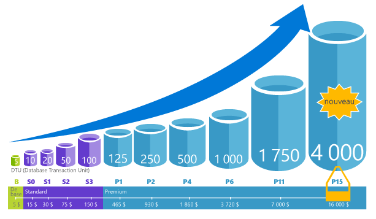

# Explication des unités de transaction de base de données (DTU) et des unités de transaction de base de données élastique (eDTU)Explaining Database Transaction Units (DTUs) and elastic Database Transaction Units (eDTUs)
Cet article explique les unités de Transaction de base de données (Udbd) et les unités de Transaction de base de données élastique (Edtu) et que se passe-t-il quand vous atteignez hello maximale dtu ou Edtu.This article explains Database Transaction Units (DTUs) and elastic Database Transaction Units (eDTUs) and what happens when you hit hello maximum DTUs or eDTUs.  

## Définition des unités de transaction de base de données (DTU)What are Database Transaction Units (DTUs)
Pour une seule base de données SQL Azure à un niveau de performances spécifiques au sein d’un [niveau de service](sql-database-service-tiers.md#single-database-service-tiers-and-performance-levels), Microsoft garantit un certain niveau de ressources pour cette base de données (indépendamment de toute autre base de données Bonjour Azure cloud) et en fournissant un prévoir le niveau de performances.For a single Azure SQL database at a specific performance level within a [service tier](sql-database-service-tiers.md#single-database-service-tiers-and-performance-levels), Microsoft guarantees a certain level of resources for that database (independent of any other database in hello Azure cloud) and providing a predictable level of performance. Cette quantité de ressources est calculée en nombre de DTU (Database Transaction Unit) qui mesure à la fois l’UC, la mémoire et les E/S (E/S de données et du journal des transactions).This amount of resources is calculated as a number of Database Transaction Units or DTUs, and is a blended measure of CPU, memory, I/O (data and transaction log I/O). ratio Hello dans la liste de ces ressources a été déterminé à l’origine par un [charge de travail OLTP banc d’essai](sql-database-benchmark-overview.md) conçu toobe typique des charges de travail OLTP réels.hello ratio amongst these resources was originally determined by an [OLTP benchmark workload](sql-database-benchmark-overview.md) designed toobe typical of real-world OLTP workloads. Lorsque votre charge de travail dépasse la quantité de hello de ces ressources, le débit est limité résultant de la baisse des performances et des délais d’attente.When your workload exceeds hello amount of any of these resources, your throughput is throttled - resulting in slower performance and timeouts. ressources Hello utilisés par votre charge de travail n’affectent pas les bases de données SQL hello pour ressources disponibles tooother Bonjour Azure cloud et ressources hello utilisé par les autres charges de travail n’affectent pas la base de données SQL hello ressources tooyour disponibles.hello resources used by your workload do not impact hello resources available tooother SQL databases in hello Azure cloud, and hello resource used by other workloads do not impact hello resources available tooyour SQL database.

Les dtu sont particulièrement utiles pour la quantité relative de hello compréhension des ressources entre les bases de données SQL Azure à différents niveaux de performance et les niveaux de service.DTUs are most useful for understanding hello relative amount of resources between Azure SQL Databases at different performance levels and service tiers. Par exemple, doublant hello dtu en augmentant le niveau de performance hello d’une base de données équivaut ensemble de hello toodoubling de base de données resource toothat disponibles.For example, doubling hello DTUs by increasing hello performance level of a database equates toodoubling hello set of resource available toothat database. Par exemple, une base de données Premium P11 comprenant 1 750 DTU fournit une puissance de calcul DTU 350 fois plus importante qu’une base de données de base comprenant 5 DTU.For example, a Premium P11 database with 1750 DTUs provides 350x more DTU compute power than a Basic database with 5 DTUs.  

toogain permettent de mieux prévoir dans la consommation des ressources (DTU) hello de votre charge de travail, utilisez [base de données de SQL Azure Query Performance Insight](sql-database-query-performance.md) à :toogain deeper insight into hello resource (DTU) consumption of your workload, use [Azure SQL Database Query Performance Insight](sql-database-query-performance.md) to:

- Identifier les requêtes principales hello par le nombre d’UC ou durée/de l’exécution qui peut potentiellement être paramétrée pour améliorer les performances.Identify hello top queries by CPU/Duration/Execution count that can potentially be tuned for improved performance. Par exemple, une requête utilisant beaucoup d’e/s peut bénéficier d’une utilisation hello de [techniques d’optimisation en mémoire](sql-database-in-memory.md) toomake améliorer l’utilisation de la mémoire disponible de hello un certain niveau service niveau et les performances.For example, an I/O intensive query might benefit from hello use of [in-memory optimization techniques](sql-database-in-memory.md) toomake better use of hello available memory at a certain service tier and performance level.
- Explorez les détails hello d’une requête, afficher son texte et son historique d’utilisation des ressources.Drill down into hello details of a query, view its text and history of resource utilization.
- Accéder aux recommandations de réglage des performances qui indiquent les actions effectuées par [SQL Database Advisor](sql-database-advisor.md).Access performance tuning recommendations that show actions performed by [SQL Database Advisor](sql-database-advisor.md).

Vous pouvez [modifier les niveaux de service](sql-database-service-tiers.md) à tout moment à l’application de tooyour un temps mort minimal (généralement moyenne sous les quatre secondes).You can [change service tiers](sql-database-service-tiers.md) at any time with minimal downtime tooyour application (generally averaging under four seconds). Pour de nombreuses entreprises et les applications, qui est en mesure de toocreate de bases de données et composer des performances vers le haut ou vers le bas à la demande est suffisant, surtout si les modèles d’utilisation sont relativement prévisibles.For many businesses and apps, being able toocreate databases and dial performance up or down on demand is enough, especially if usage patterns are relatively predictable. Mais si vous avez des modèles d’utilisation imprévisibles, il peut la rendre toomanage dur coûts et votre modèle d’entreprise.But if you have unpredictable usage patterns, it can make it hard toomanage costs and your business model. Pour ce scénario, vous utilisez un pool élastique avec un certain nombre d’Edtu qui est partagées entre plusieurs bases de données dans le pool de hello.For this scenario, you use an elastic pool with a certain number of eDTUs that are shared among multiple database in hello pool.

## Définition des unités de transaction de base de données élastique (DTU)What are elastic Database Transaction Units (eDTUs)
Plutôt que de fournir un ensemble dédié de ressources (dtu) tooa de base de données SQL qui est toujours disponible, indépendamment de si ne nécessaire pas, vous pouvez placer les bases de données dans un [pool élastique](sql-database-elastic-pool.md) sur un serveur de base de données SQL qui partage un pool de ressources Parmi les bases de données.Rather than provide a dedicated set of resources (DTUs) tooa SQL Database that is always available regardless of whether needed not, you can place databases into an [elastic pool](sql-database-elastic-pool.md) on a SQL Database server that shares a pool of resources among those database. ressources Hello partagé dans un pool élastique est mesurée en unités de Transaction de base de données ou en Edtu élastique.hello shared resources in an elastic pool measured by elastic Database Transaction Units or eDTUs. Pools élastiques fournissent une solution économique simple toomanage des objectifs de performances hello pour plusieurs bases de données différents et les modèles d’utilisation imprévisibles.Elastic pools provide a simple cost effective solution toomanage hello performance goals for multiple databases that have widely varying and unpredictable usage patterns. Dans un pool élastique, vous pouvez garantir que sans une base de données utilise toutes les ressources de hello dans le pool de hello et une quantité minimale de ressources est toujours disponible tooa base de données dans un pool élastique.In an elastic pool, you can guarantee that no one database uses all of hello resources in hello pool and also that a minimum amount of resources is always available tooa database in an elastic pool. Pour plus d’informations,consultez [Pools élastiques](sql-database-elastic-pool.md).See  [elastic pools](sql-database-elastic-pool.md) for more information.

Un pool bénéficie d’un nombre défini d’eDTU, pour un prix donné.A pool is given a set number of eDTUs, for a set price. Dans un pool élastique de hello, bases de données individuelles sont données hello flexibilité tooauto à l’échelle dans les limites de hello configuré.Within hello elastic pool, individual databases are given hello flexibility tooauto-scale within hello configured boundaries. Sous une charge importante, une base de données peut consommer plus à la demande de toomeet Edtu tandis que les bases de données sous des charges claires en consommant moins, point toohello que les bases de données sans charge ne consomment aucun Edtu.Under heavy load, a database can consume more eDTUs toomeet demand while databases under light loads consume less, up toohello point that databases under no load consume no eDTUs. En configurant les ressources pour le pool entier de hello, plutôt que par la base de données, des tâches de gestion sont simplifiées et vous avez un budget prévisible pour le pool de hello.By provisioning resources for hello entire pool, rather than per database, management tasks are simplified and you have a predictable budget for hello pool.

Edtu supplémentaires peut être ajoutées tooan le pool existant sans interruption de la base de données et sans aucun impact sur les bases de données hello dans le pool de hello.Additional eDTUs can be added tooan existing pool with no database downtime and with no impact on hello databases in hello pool. De même, si les eDTU supplémentaires ne sont plus nécessaires, elles peuvent être supprimées à partir d’un pool existant à tout moment.Similarly, if extra eDTUs are no longer needed, they can be removed from an existing pool at any point in time. Vous pouvez ajouter ou soustraire du pool de bases de données toohello, ou le montant de limite de hello d’edtu qu’une base de données peut utiliser sous une charge importante tooreserve Edtu pour les autres bases de données.You can add or subtract databases toohello pool, or limit hello amount of eDTUs a database can use under heavy load tooreserve eDTUs for other databases. Si une base de données est prévisible utilisent des ressources, vous pouvez le déplacer en dehors du pool de hello et configurez-le en tant qu’une seule base de données avec une quantité prévisible de ressources nécessaires.If a database is predictably under-utilizing resources, you can move it out of hello pool and configure it as a single database with predictable amount of resources it requires.

## Comment puis-je déterminer le nombre hello de dtu requises par ma charge de travail ?How can I determine hello number of DTUs needed by my workload?
Si vous cherchez toomigrate existant localement ou tooAzure de charge de travail de machine virtuelle SQL Server de la base de données SQL, vous pouvez utiliser hello [DTU calculatrice](http://dtucalculator.azurewebsites.net/) nombre de hello tooapproximate de dtu si nécessaire.If you are looking toomigrate an existing on-premises or SQL Server virtual machine workload tooAzure SQL Database, you can use hello [DTU Calculator](http://dtucalculator.azurewebsites.net/) tooapproximate hello number of DTUs needed. Pour une charge de travail de base de données SQL Azure existante, vous pouvez utiliser [SQL de base de données Query Performance Insight](sql-database-query-performance.md) toounderstand votre base de données resource consommation (dtu) tooget permettent de mieux prévoir sur la manière dont toooptimize votre charge de travail.For an existing Azure SQL Database workload, you can use [SQL Database Query Performance Insight](sql-database-query-performance.md) toounderstand your database resource consumption (DTUs) tooget deeper insight into how toooptimize your workload. Vous pouvez également utiliser hello [sys.dm_db_ des statistiques des ressources](https://msdn.microsoft.com/library/dn800981.aspx) DMV tooget hello ressource informations sur la consommation de hello dernière heure.You can also use hello [sys.dm_db_ resource_stats](https://msdn.microsoft.com/library/dn800981.aspx) DMV tooget hello resource consumption information for hello last one hour. Vous pouvez également hello affichage catalogue [sys.resource_stats](http://msdn.microsoft.com/library/dn269979.aspx) peut également être interrogé tooget hello mêmes données pour hello 14 derniers jours, bien qu’à une fidélité inférieure des moyennes de cinq minutes.Alternatively, hello catalog view [sys.resource_stats](http://msdn.microsoft.com/library/dn269979.aspx) can also be queried tooget hello same data for hello last 14 days, although at a lower fidelity of five-minute averages.

## Comment savoir si je peux tirer parti d’un pool élastique de ressources ?How do I know if I could benefit from an elastic pool of resources?
Les pools sont idéaux dans le cas de nombreuses bases de données avec des modèles d’utilisation spécifiques.Pools are suited for a large number of databases with specific utilization patterns. Pour une base de données indiquée, ce modèle se caractérise par une faible utilisation moyenne avec des pics d'utilisation relativement rares.For a given database, this pattern is characterized by low average utilization with relatively infrequent utilization spikes. Base de données SQL prend la valeur hello historiques l’utilisation des ressources de bases de données dans un serveur de base de données SQL existant automatiquement et recommande la configuration du pool approprié hello Bonjour portail Azure.SQL Database automatically evaluates hello historical resource usage of databases in an existing SQL Database server and recommends hello appropriate pool configuration in hello Azure portal. Pour plus d’informations, consultez l’article [Quand utiliser un pool élastique ?](sql-database-elastic-pool.md).For more information, see [when should an elastic pool be used?](sql-database-elastic-pool.md)

## Que se passe-t-il lorsque j’atteins le nombre maximal de DTU ?What happens when I hit my maximum DTUs
Calibrées selon les niveaux de performance et tooprovide régi hello nécessaires ressources toorun vos charges de travail de base de données toohello des limites maximum autorisé pour votre niveau de niveau et la performance de service sélectionné.Performance levels are calibrated and governed tooprovide hello needed resources toorun your database workload up toohello max limits allowed for your selected service tier/performance level. Si votre charge de travail atteint les limites de hello dans une des limites d’e/s de données/processeur/e/s de journal, continuer de ressources de hello tooreceive niveau hello maximale autorisée, mais vous ne les latences toosee probablement augmenté de vos requêtes.If your workload is hitting hello limits in one of CPU/Data IO/Log IO limits, you continue tooreceive hello resources at hello maximum allowed level, but you are likely toosee increased latencies for your queries. Ces limites n’entraînent pas toutes les erreurs, mais plutôt un ralentissement de la charge de travail hello, sauf si le problème de ralentissement hello est ainsi que les requêtes démarrent minutage. Si vous atteignez les limites maximales autorisées de sessions/demandes utilisateur simultanées (threads de travail), vous voyez des erreurs explicites.These limits do not result in any errors, but rather a slowdown in hello workload, unless hello slowdown becomes so severe that queries start timing out. If you are hitting limits of maximum allowed concurrent user sessions/requests (worker threads), you see explicit errors. Pour plus d’informations sur la limite des ressources autres que le processus, la mémoire, les E/S de données et les E/S du journal des transactions, consultez [Limites de ressources de base de données SQL Azure](sql-database-resource-limits.md) .See [Azure SQL Database resource limits](sql-database-resource-limits.md) for information on limit on resources other than CPU, memory, data I/O, and transaction log I/O.

## Étapes suivantesNext steps
* Consultez [niveau de Service](sql-database-service-tiers.md) pour plus d’informations sur les dtu hello et d’Edtu disponible pour les bases de données uniques et pour les pools élastiques.See [Service tier](sql-database-service-tiers.md) for information on hello DTUs and eDTUs available for single databases and for elastic pools.
* Pour plus d’informations sur la limite des ressources autres que le processus, la mémoire, les E/S de données et les E/S du journal des transactions, consultez [Limites de ressources de base de données SQL Azure](sql-database-resource-limits.md) .See [Azure SQL Database resource limits](sql-database-resource-limits.md) for information on limit on resources other than CPU, memory, data I/O, and transaction log I/O.
* Consultez [SQL de base de données Query Performance Insight](sql-database-query-performance.md) toounderstand votre consommation (dtu).See [SQL Database Query Performance Insight](sql-database-query-performance.md) toounderstand your (DTUs) consumption.
* Consultez [vue d’ensemble du test d’évaluation de base de données SQL](sql-database-benchmark-overview.md) toounderstand méthodologie hello de charge de travail de test d’évaluation hello OLTP utilisé hello toodetermine DTU blend.See [SQL Database benchmark overview](sql-database-benchmark-overview.md) toounderstand hello methodology behind hello OLTP benchmark workload used toodetermine hello DTU blend.
