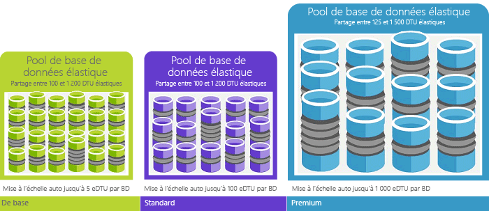

# Explication des unités de transaction de base de données (DTU) et des unités de transaction de base de données élastique (eDTU)
Cet article explique les unités de Transaction de base de données (Udbd) et les unités de Transaction de base de données élastique (Edtu) et que se passe-t-il quand vous atteignez hello maximale dtu ou Edtu.  

## Définition des unités de transaction de base de données (DTU)
Pour une seule base de données SQL Azure à un niveau de performances spécifiques au sein d’un [niveau de service](sql-database-service-tiers.md#single-database-service-tiers-and-performance-levels), Microsoft garantit un certain niveau de ressources pour cette base de données (indépendamment de toute autre base de données Bonjour Azure cloud) et en fournissant un prévoir le niveau de performances. Cette quantité de ressources est calculée en nombre de DTU (Database Transaction Unit) qui mesure à la fois l’UC, la mémoire et les E/S (E/S de données et du journal des transactions). ratio Hello dans la liste de ces ressources a été déterminé à l’origine par un [charge de travail OLTP banc d’essai](sql-database-benchmark-overview.md) conçu toobe typique des charges de travail OLTP réels. Lorsque votre charge de travail dépasse la quantité de hello de ces ressources, le débit est limité résultant de la baisse des performances et des délais d’attente. ressources Hello utilisés par votre charge de travail n’affectent pas les bases de données SQL hello pour ressources disponibles tooother Bonjour Azure cloud et ressources hello utilisé par les autres charges de travail n’affectent pas la base de données SQL hello ressources tooyour disponibles.

Les dtu sont particulièrement utiles pour la quantité relative de hello compréhension des ressources entre les bases de données SQL Azure à différents niveaux de performance et les niveaux de service. Par exemple, doublant hello dtu en augmentant le niveau de performance hello d’une base de données équivaut ensemble de hello toodoubling de base de données resource toothat disponibles. Par exemple, une base de données Premium P11 comprenant 1 750 DTU fournit une puissance de calcul DTU 350 fois plus importante qu’une base de données de base comprenant 5 DTU.  

toogain permettent de mieux prévoir dans la consommation des ressources (DTU) hello de votre charge de travail, utilisez [base de données de SQL Azure Query Performance Insight](sql-database-query-performance.md) à :

- Identifier les requêtes principales hello par le nombre d’UC ou durée/de l’exécution qui peut potentiellement être paramétrée pour améliorer les performances. Par exemple, une requête utilisant beaucoup d’e/s peut bénéficier d’une utilisation hello de [techniques d’optimisation en mémoire](sql-database-in-memory.md) toomake améliorer l’utilisation de la mémoire disponible de hello un certain niveau service niveau et les performances.
- Explorez les détails hello d’une requête, afficher son texte et son historique d’utilisation des ressources.
- Accéder aux recommandations de réglage des performances qui indiquent les actions effectuées par [SQL Database Advisor](sql-database-advisor.md).

Vous pouvez [modifier les niveaux de service](sql-database-service-tiers.md) à tout moment à l’application de tooyour un temps mort minimal (généralement moyenne sous les quatre secondes). Pour de nombreuses entreprises et les applications, qui est en mesure de toocreate de bases de données et composer des performances vers le haut ou vers le bas à la demande est suffisant, surtout si les modèles d’utilisation sont relativement prévisibles. Mais si vous avez des modèles d’utilisation imprévisibles, il peut la rendre toomanage dur coûts et votre modèle d’entreprise. Pour ce scénario, vous utilisez un pool élastique avec un certain nombre d’Edtu qui est partagées entre plusieurs bases de données dans le pool de hello.

## Définition des unités de transaction de base de données élastique (DTU)
Plutôt que de fournir un ensemble dédié de ressources (dtu) tooa de base de données SQL qui est toujours disponible, indépendamment de si ne nécessaire pas, vous pouvez placer les bases de données dans un [pool élastique](sql-database-elastic-pool.md) sur un serveur de base de données SQL qui partage un pool de ressources Parmi les bases de données. ressources Hello partagé dans un pool élastique est mesurée en unités de Transaction de base de données ou en Edtu élastique. Pools élastiques fournissent une solution économique simple toomanage des objectifs de performances hello pour plusieurs bases de données différents et les modèles d’utilisation imprévisibles. Dans un pool élastique, vous pouvez garantir que sans une base de données utilise toutes les ressources de hello dans le pool de hello et une quantité minimale de ressources est toujours disponible tooa base de données dans un pool élastique. Pour plus d’informations,consultez [Pools élastiques](sql-database-elastic-pool.md).

Un pool bénéficie d’un nombre défini d’eDTU, pour un prix donné. Dans un pool élastique de hello, bases de données individuelles sont données hello flexibilité tooauto à l’échelle dans les limites de hello configuré. Sous une charge importante, une base de données peut consommer plus à la demande de toomeet Edtu tandis que les bases de données sous des charges claires en consommant moins, point toohello que les bases de données sans charge ne consomment aucun Edtu. En configurant les ressources pour le pool entier de hello, plutôt que par la base de données, des tâches de gestion sont simplifiées et vous avez un budget prévisible pour le pool de hello.

Edtu supplémentaires peut être ajoutées tooan le pool existant sans interruption de la base de données et sans aucun impact sur les bases de données hello dans le pool de hello. De même, si les eDTU supplémentaires ne sont plus nécessaires, elles peuvent être supprimées à partir d’un pool existant à tout moment. Vous pouvez ajouter ou soustraire du pool de bases de données toohello, ou le montant de limite de hello d’edtu qu’une base de données peut utiliser sous une charge importante tooreserve Edtu pour les autres bases de données. Si une base de données est prévisible utilisent des ressources, vous pouvez le déplacer en dehors du pool de hello et configurez-le en tant qu’une seule base de données avec une quantité prévisible de ressources nécessaires.

## Comment puis-je déterminer le nombre hello de dtu requises par ma charge de travail ?
Si vous cherchez toomigrate existant localement ou tooAzure de charge de travail de machine virtuelle SQL Server de la base de données SQL, vous pouvez utiliser hello [DTU calculatrice](http://dtucalculator.azurewebsites.net/) nombre de hello tooapproximate de dtu si nécessaire. Pour une charge de travail de base de données SQL Azure existante, vous pouvez utiliser [SQL de base de données Query Performance Insight](sql-database-query-performance.md) toounderstand votre base de données resource consommation (dtu) tooget permettent de mieux prévoir sur la manière dont toooptimize votre charge de travail. Vous pouvez également utiliser hello [sys.dm_db_ des statistiques des ressources](https://msdn.microsoft.com/library/dn800981.aspx) DMV tooget hello ressource informations sur la consommation de hello dernière heure. Vous pouvez également hello affichage catalogue [sys.resource_stats](http://msdn.microsoft.com/library/dn269979.aspx) peut également être interrogé tooget hello mêmes données pour hello 14 derniers jours, bien qu’à une fidélité inférieure des moyennes de cinq minutes.

## Comment savoir si je peux tirer parti d’un pool élastique de ressources ?
Les pools sont idéaux dans le cas de nombreuses bases de données avec des modèles d’utilisation spécifiques. Pour une base de données indiquée, ce modèle se caractérise par une faible utilisation moyenne avec des pics d'utilisation relativement rares. Base de données SQL prend la valeur hello historiques l’utilisation des ressources de bases de données dans un serveur de base de données SQL existant automatiquement et recommande la configuration du pool approprié hello Bonjour portail Azure. Pour plus d’informations, consultez l’article [Quand utiliser un pool élastique ?](sql-database-elastic-pool.md).

## Que se passe-t-il lorsque j’atteins le nombre maximal de DTU ?
Calibrées selon les niveaux de performance et tooprovide régi hello nécessaires ressources toorun vos charges de travail de base de données toohello des limites maximum autorisé pour votre niveau de niveau et la performance de service sélectionné. Si votre charge de travail atteint les limites de hello dans une des limites d’e/s de données/processeur/e/s de journal, continuer de ressources de hello tooreceive niveau hello maximale autorisée, mais vous ne les latences toosee probablement augmenté de vos requêtes. Ces limites n’entraînent pas toutes les erreurs, mais plutôt un ralentissement de la charge de travail hello, sauf si le problème de ralentissement hello est ainsi que les requêtes démarrent minutage. Si vous atteignez les limites maximales autorisées de sessions/demandes utilisateur simultanées (threads de travail), vous voyez des erreurs explicites. Pour plus d’informations sur la limite des ressources autres que le processus, la mémoire, les E/S de données et les E/S du journal des transactions, consultez [Limites de ressources de base de données SQL Azure](sql-database-resource-limits.md) .

## Étapes suivantes
* Consultez [niveau de Service](sql-database-service-tiers.md) pour plus d’informations sur les dtu hello et d’Edtu disponible pour les bases de données uniques et pour les pools élastiques.
* Pour plus d’informations sur la limite des ressources autres que le processus, la mémoire, les E/S de données et les E/S du journal des transactions, consultez [Limites de ressources de base de données SQL Azure](sql-database-resource-limits.md) .
* Consultez [SQL de base de données Query Performance Insight](sql-database-query-performance.md) toounderstand votre consommation (dtu).
* Consultez [vue d’ensemble du test d’évaluation de base de données SQL](sql-database-benchmark-overview.md) toounderstand méthodologie hello de charge de travail de test d’évaluation hello OLTP utilisé hello toodetermine DTU blend.
