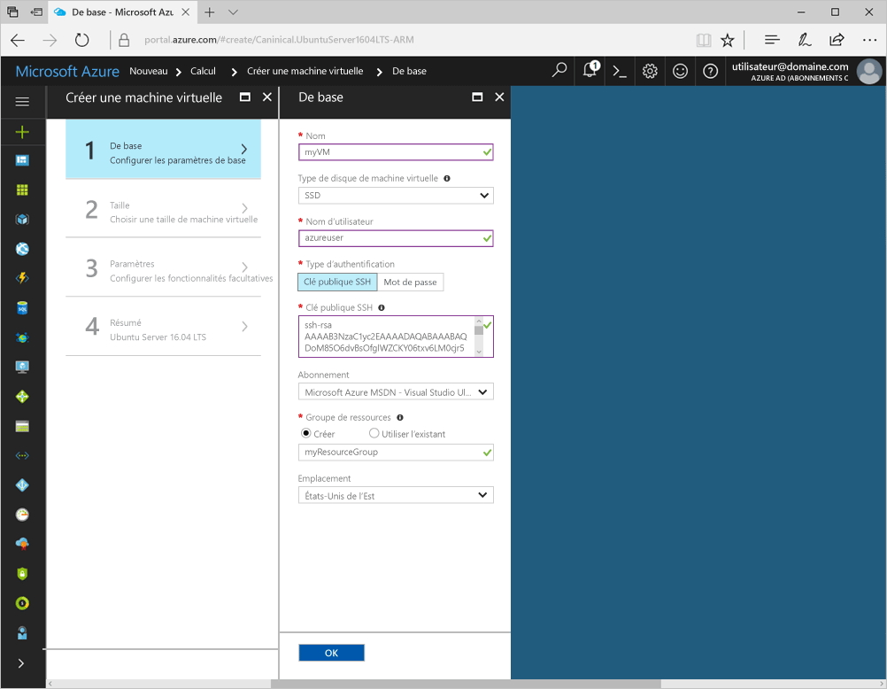
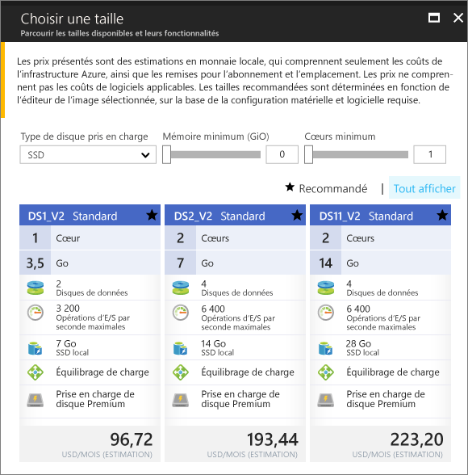
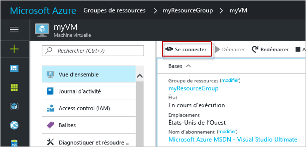

# <a name="create-a-linux-virtual-machine-with-hello-azure-portal"></a><span data-ttu-id="f6ca2-103">Créer une machine virtuelle Linux avec hello portail Azure</span><span class="sxs-lookup"><span data-stu-id="f6ca2-103">Create a Linux virtual machine with hello Azure portal</span></span>

<span data-ttu-id="f6ca2-104">Machines virtuelles peuvent être créés via hello portail Azure.</span><span class="sxs-lookup"><span data-stu-id="f6ca2-104">Azure virtual machines can be created through hello Azure portal.</span></span> <span data-ttu-id="f6ca2-105">Cette méthode fournit une interface utilisateur basée sur navigateur pour créer et configurer des machines virtuelles et toutes les ressources liées.</span><span class="sxs-lookup"><span data-stu-id="f6ca2-105">This method provides a browser-based user interface for creating and configuring virtual machines and all related resources.</span></span> <span data-ttu-id="f6ca2-106">Cette procédure de démarrage rapide via la création d’une machine virtuelle et l’installation d’un serveur Web sur hello machine virtuelle.</span><span class="sxs-lookup"><span data-stu-id="f6ca2-106">This Quickstart steps through creating a virtual machine and installing a webserver on hello VM.</span></span>

<span data-ttu-id="f6ca2-107">Si vous n’avez pas d’abonnement Azure, créez un [compte gratuit](https://azure.microsoft.com/free/?WT.mc_id=A261C142F) avant de commencer.</span><span class="sxs-lookup"><span data-stu-id="f6ca2-107">If you don't have an Azure subscription, create a [free account](https://azure.microsoft.com/free/?WT.mc_id=A261C142F) before you begin.</span></span>

## <a name="create-ssh-key-pair"></a><span data-ttu-id="f6ca2-108">Créer la paire de clés SSH</span><span class="sxs-lookup"><span data-stu-id="f6ca2-108">Create SSH key pair</span></span>

<span data-ttu-id="f6ca2-109">Vous devez une toocomplete de paire de clés SSH ce démarrage rapide.</span><span class="sxs-lookup"><span data-stu-id="f6ca2-109">You need an SSH key pair toocomplete this quick start.</span></span> <span data-ttu-id="f6ca2-110">Si vous disposez déjà d’une paire de clés SSH, vous pouvez ignorer cette étape.</span><span class="sxs-lookup"><span data-stu-id="f6ca2-110">If you have an existing SSH key pair, this step can be skipped.</span></span>

<span data-ttu-id="f6ca2-111">À partir d’une interface de l’interpréteur de commandes, exécutez la commande et suivez hello à l’écran.</span><span class="sxs-lookup"><span data-stu-id="f6ca2-111">From a Bash shell, run this command and follow hello on-screen directions.</span></span> <span data-ttu-id="f6ca2-112">sortie de la commande Hello inclut le nom du fichier de clé publique de hello hello.</span><span class="sxs-lookup"><span data-stu-id="f6ca2-112">hello command output includes hello file name of hello public key file.</span></span> <span data-ttu-id="f6ca2-113">Copier le contenu de hello du Presse-papiers de toohello hello fichier de clé publique.</span><span class="sxs-lookup"><span data-stu-id="f6ca2-113">Copy hello contents of hello public key file toohello clipboard.</span></span>

```bash
ssh-keygen -t rsa -b 2048
```

## <a name="log-in-tooazure"></a><span data-ttu-id="f6ca2-114">Connectez-vous à tooAzure</span><span class="sxs-lookup"><span data-stu-id="f6ca2-114">Log in tooAzure</span></span> 

<span data-ttu-id="f6ca2-115">Ouvrez une session dans toohello portail Azure à http://portal.azure.com.</span><span class="sxs-lookup"><span data-stu-id="f6ca2-115">Log in toohello Azure portal at http://portal.azure.com.</span></span>

## <a name="create-virtual-machine"></a><span data-ttu-id="f6ca2-116">Create virtual machine</span><span class="sxs-lookup"><span data-stu-id="f6ca2-116">Create virtual machine</span></span>

1. <span data-ttu-id="f6ca2-117">Cliquez sur hello **nouveau** bouton se trouve sur le coin supérieur gauche hello Hello portail Azure.</span><span class="sxs-lookup"><span data-stu-id="f6ca2-117">Click hello **New** button found on hello upper left-hand corner of hello Azure portal.</span></span>

2. <span data-ttu-id="f6ca2-118">Sélectionnez **Compute**, puis sélectionnez **Ubuntu Server 16.04 LTS**.</span><span class="sxs-lookup"><span data-stu-id="f6ca2-118">Select **Compute**, and then select **Ubuntu Server 16.04 LTS**.</span></span> 

3. <span data-ttu-id="f6ca2-119">Entrez les informations de machine virtuelle hello.</span><span class="sxs-lookup"><span data-stu-id="f6ca2-119">Enter hello virtual machine information.</span></span> <span data-ttu-id="f6ca2-120">Dans **Type d’authentification**, sélectionnez **Clé publique SSH**.</span><span class="sxs-lookup"><span data-stu-id="f6ca2-120">For **Authentication type**, select **SSH public key**.</span></span> <span data-ttu-id="f6ca2-121">Lorsque vous collez votre clé publique SSH, prenez soin de tooremove tout espace blanc de début ou de fin.</span><span class="sxs-lookup"><span data-stu-id="f6ca2-121">When pasting in your SSH public key, take care tooremove any leading or trailing white space.</span></span> <span data-ttu-id="f6ca2-122">Lorsque vous avez terminé, cliquez sur **OK**.</span><span class="sxs-lookup"><span data-stu-id="f6ca2-122">When complete, click **OK**.</span></span>

    

4. <span data-ttu-id="f6ca2-124">Sélectionnez une taille de hello machine virtuelle.</span><span class="sxs-lookup"><span data-stu-id="f6ca2-124">Select a size for hello VM.</span></span> <span data-ttu-id="f6ca2-125">Sélectionnez des tailles de plus, toosee **afficher toutes les** ou modifier hello **pris en charge le type de disque** filtre.</span><span class="sxs-lookup"><span data-stu-id="f6ca2-125">toosee more sizes, select **View all** or change hello **Supported disk type** filter.</span></span> 

      

5. <span data-ttu-id="f6ca2-127">Dans le panneau de paramètres hello, conserver les valeurs par défaut hello, puis cliquez sur **OK**.</span><span class="sxs-lookup"><span data-stu-id="f6ca2-127">On hello settings blade, keep hello defaults and click **OK**.</span></span>

6. <span data-ttu-id="f6ca2-128">Dans la page de résumé hello, cliquez sur **Ok** déploiement d’ordinateur virtuel toostart hello.</span><span class="sxs-lookup"><span data-stu-id="f6ca2-128">On hello summary page, click **Ok** toostart hello virtual machine deployment.</span></span>

7. <span data-ttu-id="f6ca2-129">Hello machine virtuelle sera épinglé toohello tableau de bord de portail Azure.</span><span class="sxs-lookup"><span data-stu-id="f6ca2-129">hello VM will be pinned toohello Azure portal dashboard.</span></span> <span data-ttu-id="f6ca2-130">Une fois que la fin du déploiement de hello, panneau de résumé de machine virtuelle hello s’ouvre automatiquement.</span><span class="sxs-lookup"><span data-stu-id="f6ca2-130">Once hello deployment has completed, hello VM summary blade automatically opens.</span></span>


## <a name="connect-toovirtual-machine"></a><span data-ttu-id="f6ca2-131">Connecter toovirtual machine</span><span class="sxs-lookup"><span data-stu-id="f6ca2-131">Connect toovirtual machine</span></span>

<span data-ttu-id="f6ca2-132">Créer une connexion SSH avec l’ordinateur virtuel de hello.</span><span class="sxs-lookup"><span data-stu-id="f6ca2-132">Create an SSH connection with hello virtual machine.</span></span>

1. <span data-ttu-id="f6ca2-133">Cliquez sur hello **Connect** bouton sur le panneau de machine virtuelle hello.</span><span class="sxs-lookup"><span data-stu-id="f6ca2-133">Click hello **Connect** button on hello virtual machine blade.</span></span> <span data-ttu-id="f6ca2-134">Hello connecter bouton affiche une chaîne de connexion SSH qui peut être utilisés tooconnect toohello virtual machine.</span><span class="sxs-lookup"><span data-stu-id="f6ca2-134">hello connect button displays an SSH connection string that can be used tooconnect toohello virtual machine.</span></span>

     

2. <span data-ttu-id="f6ca2-136">La commande suivante d’exécution hello toocreate une session SSH.</span><span class="sxs-lookup"><span data-stu-id="f6ca2-136">Run hello following command toocreate an SSH session.</span></span> <span data-ttu-id="f6ca2-137">Remplacer la chaîne de connexion hello avec hello que celle que vous avez copié à partir de hello portail Azure.</span><span class="sxs-lookup"><span data-stu-id="f6ca2-137">Replace hello connection string with hello one you copied from hello Azure portal.</span></span>

```bash 
ssh azureuser@40.112.21.50
```

## <a name="install-nginx"></a><span data-ttu-id="f6ca2-138">Installer NGINX</span><span class="sxs-lookup"><span data-stu-id="f6ca2-138">Install NGINX</span></span>

<span data-ttu-id="f6ca2-139">Suivante de hello utilisez bash sources de package tooupdate de script et installer le dernier package de NGINX hello.</span><span class="sxs-lookup"><span data-stu-id="f6ca2-139">Use hello following bash script tooupdate package sources and install hello latest NGINX package.</span></span> 

```bash 
#!/bin/bash

# update package source
sudo apt-get -y update

# install NGINX
sudo apt-get -y install nginx
```

<span data-ttu-id="f6ca2-140">Lorsque vous avez terminé, quittez la session SSH hello et retourner les propriétés de machine virtuelle hello Bonjour portail Azure.</span><span class="sxs-lookup"><span data-stu-id="f6ca2-140">When done, exit hello SSH session and return hello VM properties in hello Azure portal.</span></span>


## <a name="open-port-80-for-web-traffic"></a><span data-ttu-id="f6ca2-141">Ouvrez le port 80 pour le trafic web</span><span class="sxs-lookup"><span data-stu-id="f6ca2-141">Open port 80 for web traffic</span></span> 

<span data-ttu-id="f6ca2-142">Un groupe de sécurité réseau (NSG) sécurise les trafics entrant et sortant.</span><span class="sxs-lookup"><span data-stu-id="f6ca2-142">A Network security group (NSG) secures inbound and outbound traffic.</span></span> <span data-ttu-id="f6ca2-143">Lorsqu’un ordinateur virtuel est créé à partir de hello portail Azure, une règle de trafic entrant est créée sur le port 22 pour les connexions SSH.</span><span class="sxs-lookup"><span data-stu-id="f6ca2-143">When a VM is created from hello Azure portal, an inbound rule is created on port 22 for SSH connections.</span></span> <span data-ttu-id="f6ca2-144">Étant donné que cet ordinateur virtuel héberge un serveur Web, une règle de groupe de sécurité réseau doit toobe créé pour le port 80.</span><span class="sxs-lookup"><span data-stu-id="f6ca2-144">Because this VM hosts a webserver, an NSG rule needs toobe created for port 80.</span></span>

1. <span data-ttu-id="f6ca2-145">Sur l’ordinateur virtuel de hello, cliquez sur nom hello Hello **groupe de ressources**.</span><span class="sxs-lookup"><span data-stu-id="f6ca2-145">On hello virtual machine, click hello name of hello **Resource group**.</span></span>
2. <span data-ttu-id="f6ca2-146">Sélectionnez hello **groupe de sécurité réseau**.</span><span class="sxs-lookup"><span data-stu-id="f6ca2-146">Select hello **network security group**.</span></span> <span data-ttu-id="f6ca2-147">Hello groupe de sécurité réseau peut être identifié à l’aide de hello **Type** colonne.</span><span class="sxs-lookup"><span data-stu-id="f6ca2-147">hello NSG can be identified using hello **Type** column.</span></span> 
3. <span data-ttu-id="f6ca2-148">Dans le menu de gauche hello, sous Paramètres, cliquez sur **les règles de sécurité de trafic entrant**.</span><span class="sxs-lookup"><span data-stu-id="f6ca2-148">On hello left-hand menu, under settings, click **Inbound security rules**.</span></span>
4. <span data-ttu-id="f6ca2-149">Cliquez sur **Ajouter**.</span><span class="sxs-lookup"><span data-stu-id="f6ca2-149">Click on **Add**.</span></span>
5. <span data-ttu-id="f6ca2-150">Dans **Nom**, tapez **http**.</span><span class="sxs-lookup"><span data-stu-id="f6ca2-150">In **Name**, type **http**.</span></span> <span data-ttu-id="f6ca2-151">Assurez-vous que **étendue du Port** a la valeur too80 et **Action** est défini trop**autoriser**.</span><span class="sxs-lookup"><span data-stu-id="f6ca2-151">Make sure **Port range** is set too80 and **Action** is set too**Allow**.</span></span> 
6. <span data-ttu-id="f6ca2-152">Cliquez sur **OK**.</span><span class="sxs-lookup"><span data-stu-id="f6ca2-152">Click **OK**.</span></span>


## <a name="view-hello-nginx-welcome-page"></a><span data-ttu-id="f6ca2-153">Page d’accueil de vue hello NGINX</span><span class="sxs-lookup"><span data-stu-id="f6ca2-153">View hello NGINX welcome page</span></span>

<span data-ttu-id="f6ca2-154">NGINX installés et le port 80 ouvrez tooyour VM, hello webserver sont maintenant accessibles à partir de hello internet.</span><span class="sxs-lookup"><span data-stu-id="f6ca2-154">With NGINX installed, and port 80 open tooyour VM, hello webserver can now be accessed from hello internet.</span></span> <span data-ttu-id="f6ca2-155">Ouvrez un navigateur web et entrez les adresse IP publique hello Hello machine virtuelle.</span><span class="sxs-lookup"><span data-stu-id="f6ca2-155">Open a web browser, and enter hello public IP address of hello VM.</span></span> <span data-ttu-id="f6ca2-156">adresse IP publique de Hello sont accessibles sur le panneau de machine virtuelle hello Bonjour portail Azure.</span><span class="sxs-lookup"><span data-stu-id="f6ca2-156">hello public IP address can be found on hello VM blade in hello Azure portal.</span></span>

 

## <a name="clean-up-resources"></a><span data-ttu-id="f6ca2-158">Supprimer des ressources</span><span class="sxs-lookup"><span data-stu-id="f6ca2-158">Clean up resources</span></span>

<span data-ttu-id="f6ca2-159">Si n’est plus nécessaire, supprimez hello groupe de ressources, ordinateur virtuel et toutes les ressources associées.</span><span class="sxs-lookup"><span data-stu-id="f6ca2-159">When no longer needed, delete hello resource group, virtual machine, and all related resources.</span></span> <span data-ttu-id="f6ca2-160">toodo par conséquent, sélectionnez le groupe de ressources hello à partir du Panneau de machine virtuelle hello et cliquez sur **supprimer**.</span><span class="sxs-lookup"><span data-stu-id="f6ca2-160">toodo so, select hello resource group from hello virtual machine blade and click **Delete**.</span></span>

## <a name="next-steps"></a><span data-ttu-id="f6ca2-161">Étapes suivantes</span><span class="sxs-lookup"><span data-stu-id="f6ca2-161">Next steps</span></span>

<span data-ttu-id="f6ca2-162">Dans ce guide de démarrage rapide, vous avez déployé une machine virtuelle simple ainsi qu’une règle de groupe de sécurité réseau, et installé un serveur web.</span><span class="sxs-lookup"><span data-stu-id="f6ca2-162">In this quick start, you’ve deployed a simple virtual machine, a network security group rule, and installed a web server.</span></span> <span data-ttu-id="f6ca2-163">toolearn en savoir plus sur les machines virtuelles, continuer toohello didacticiel pour les machines virtuelles Linux.</span><span class="sxs-lookup"><span data-stu-id="f6ca2-163">toolearn more about Azure virtual machines, continue toohello tutorial for Linux VMs.</span></span>

> [!div class="nextstepaction"]
> [<span data-ttu-id="f6ca2-164">Didacticiels sur les machines virtuelles Azure Linux</span><span class="sxs-lookup"><span data-stu-id="f6ca2-164">Azure Linux virtual machine tutorials</span></span>](./tutorial-manage-vm.md)
