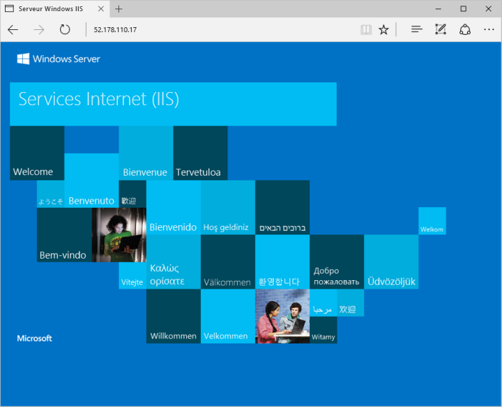

# <a name="create-a-windows-virtual-machine-with-the-azure-portal"></a><span data-ttu-id="53893-103">Créer une machine virtuelle Windows avec le portail Azure</span><span class="sxs-lookup"><span data-stu-id="53893-103">Create a Windows virtual machine with the Azure portal</span></span>

<span data-ttu-id="53893-104">Les machines virtuelles Azure peuvent être créées via le portail Azure.</span><span class="sxs-lookup"><span data-stu-id="53893-104">Azure virtual machines can be created through the Azure portal.</span></span> <span data-ttu-id="53893-105">Cette méthode fournit une interface utilisateur basée sur navigateur pour créer et configurer des machines virtuelles et toutes les ressources liées.</span><span class="sxs-lookup"><span data-stu-id="53893-105">This method provides a browser-based user interface for creating and configuring virtual machines and all related resources.</span></span> <span data-ttu-id="53893-106">Ce démarrage rapide décrit les étapes permettant de créer une machine virtuelle et d’installer un serveur web sur celle-ci.</span><span class="sxs-lookup"><span data-stu-id="53893-106">This Quickstart steps through creating a virtual machine and installing a webserver on the VM.</span></span>

<span data-ttu-id="53893-107">Si vous n’avez pas d’abonnement Azure, créez un [compte gratuit](https://azure.microsoft.com/free/?WT.mc_id=A261C142F) avant de commencer.</span><span class="sxs-lookup"><span data-stu-id="53893-107">If you don't have an Azure subscription, create a [free account](https://azure.microsoft.com/free/?WT.mc_id=A261C142F) before you begin.</span></span>

## <a name="log-in-to-azure"></a><span data-ttu-id="53893-108">Connexion à Azure</span><span class="sxs-lookup"><span data-stu-id="53893-108">Log in to Azure</span></span>

<span data-ttu-id="53893-109">Connectez-vous au Portail Azure à l’adresse http://portal.azure.com.</span><span class="sxs-lookup"><span data-stu-id="53893-109">Log in to the Azure portal at http://portal.azure.com.</span></span>

## <a name="create-virtual-machine"></a><span data-ttu-id="53893-110">Create virtual machine</span><span class="sxs-lookup"><span data-stu-id="53893-110">Create virtual machine</span></span>

1. <span data-ttu-id="53893-111">Cliquez sur le bouton **Nouveau** dans le coin supérieur gauche du portail Azure.</span><span class="sxs-lookup"><span data-stu-id="53893-111">Click the **New** button found on the upper left-hand corner of the Azure portal.</span></span>

2. <span data-ttu-id="53893-112">Sélectionnez **Compute**, puis **Windows Server 2016 Datacenter**.</span><span class="sxs-lookup"><span data-stu-id="53893-112">Select **Compute**, and then select **Windows Server 2016 Datacenter**.</span></span> 

3. <span data-ttu-id="53893-113">Saisissez les informations de la machine virtuelle.</span><span class="sxs-lookup"><span data-stu-id="53893-113">Enter the virtual machine information.</span></span> <span data-ttu-id="53893-114">Le nom d’utilisateur et le mot de passe que vous avez entrés vous serviront pour vous connecter à la machine virtuelle.</span><span class="sxs-lookup"><span data-stu-id="53893-114">The user name and password entered here is used to log in to the virtual machine.</span></span> <span data-ttu-id="53893-115">Lorsque vous avez terminé, cliquez sur **OK**.</span><span class="sxs-lookup"><span data-stu-id="53893-115">When complete, click **OK**.</span></span>

      

4. <span data-ttu-id="53893-117">Choisissez la taille de la machine virtuelle.</span><span class="sxs-lookup"><span data-stu-id="53893-117">Select a size for the VM.</span></span> <span data-ttu-id="53893-118">Pour voir plus de tailles, sélectionnez **Afficher tout** ou modifiez le filtre **Type de disque pris en charge**.</span><span class="sxs-lookup"><span data-stu-id="53893-118">To see more sizes, select **View all** or change the **Supported disk type** filter.</span></span> 

      

5. <span data-ttu-id="53893-120">Conservez les valeurs par défaut dans le panneau des paramètres et cliquez sur **OK**.</span><span class="sxs-lookup"><span data-stu-id="53893-120">On the settings blade, keep the defaults and click **OK**.</span></span>

6. <span data-ttu-id="53893-121">Sur la page Résumé, cliquez sur **OK** pour lancer le déploiement de machine virtuelle.</span><span class="sxs-lookup"><span data-stu-id="53893-121">On the summary page, click **Ok** to start the virtual machine deployment.</span></span>

7. <span data-ttu-id="53893-122">La machine virtuelle sera épinglée au tableau de bord du portail Azure.</span><span class="sxs-lookup"><span data-stu-id="53893-122">The VM will be pinned to the Azure portal dashboard.</span></span> <span data-ttu-id="53893-123">Une fois le déploiement terminé, le volet de résumé de la machine virtuelle s’ouvre automatiquement.</span><span class="sxs-lookup"><span data-stu-id="53893-123">Once the deployment has completed, the VM summary blade automatically opens.</span></span>


## <a name="connect-to-virtual-machine"></a><span data-ttu-id="53893-124">Connexion à la machine virtuelle</span><span class="sxs-lookup"><span data-stu-id="53893-124">Connect to virtual machine</span></span>

<span data-ttu-id="53893-125">Créez une connexion Bureau à distance à la machine virtuelle.</span><span class="sxs-lookup"><span data-stu-id="53893-125">Create a remote desktop connection to the virtual machine.</span></span>

1. <span data-ttu-id="53893-126">Cliquez sur le bouton **Connexion** dans les propriétés de la machine virtuelle.</span><span class="sxs-lookup"><span data-stu-id="53893-126">Click the **Connect** button on the virtual machine properties.</span></span> <span data-ttu-id="53893-127">Un fichier de protocole Remote Desktop Protocol (fichier .rdp) est créé et téléchargé.</span><span class="sxs-lookup"><span data-stu-id="53893-127">A Remote Desktop Protocol file (.rdp file) is created and downloaded.</span></span>

     

2. <span data-ttu-id="53893-129">Pour vous connecter à votre machine virtuelle, ouvrez le fichier RDP téléchargé.</span><span class="sxs-lookup"><span data-stu-id="53893-129">To connect to your VM, open the downloaded RDP file.</span></span> <span data-ttu-id="53893-130">À l’invite, cliquez sur **Se connecter**.</span><span class="sxs-lookup"><span data-stu-id="53893-130">If prompted, click **Connect**.</span></span> <span data-ttu-id="53893-131">Sur un Mac, vous avez besoin d’un client RDP similaire à ce [Client Bureau à distance](https://itunes.apple.com/us/app/microsoft-remote-desktop/id715768417?mt=12) disponible sur le Mac App Store.</span><span class="sxs-lookup"><span data-stu-id="53893-131">On a Mac, you need an RDP client such as this [Remote Desktop Client](https://itunes.apple.com/us/app/microsoft-remote-desktop/id715768417?mt=12) from the Mac App Store.</span></span>

3. <span data-ttu-id="53893-132">Entrez le nom d’utilisateur et le mot de passe spécifiés lors de la création de la machine virtuelle, puis cliquez sur **OK**.</span><span class="sxs-lookup"><span data-stu-id="53893-132">Enter the user name and password you specified when creating the virtual machine, then click **Ok**.</span></span>

4. <span data-ttu-id="53893-133">Un avertissement de certificat peut s’afficher pendant le processus de connexion.</span><span class="sxs-lookup"><span data-stu-id="53893-133">You may receive a certificate warning during the sign-in process.</span></span> <span data-ttu-id="53893-134">Cliquez sur **Oui** ou **Continuer** pour continuer le processus de connexion.</span><span class="sxs-lookup"><span data-stu-id="53893-134">Click **Yes** or **Continue** to proceed with the connection.</span></span>


## <a name="install-iis-using-powershell"></a><span data-ttu-id="53893-135">Installation de IIS à l’aide de PowerShell</span><span class="sxs-lookup"><span data-stu-id="53893-135">Install IIS using PowerShell</span></span>

<span data-ttu-id="53893-136">Sur la machine virtuelle, démarrez une session PowerShell et exécutez la commande suivante pour installer IIS.</span><span class="sxs-lookup"><span data-stu-id="53893-136">On the virtual machine, start a PowerShell session and run the following command to install IIS.</span></span>

```powershell
Install-WindowsFeature -name Web-Server -IncludeManagementTools
```

<span data-ttu-id="53893-137">Lorsque vous avez terminé, quittez la session RDP et revenez aux propriétés de la machine virtuelle dans le portail Azure.</span><span class="sxs-lookup"><span data-stu-id="53893-137">When done, exit the RDP session and return the VM properties in the Azure portal.</span></span>

## <a name="open-port-80-for-web-traffic"></a><span data-ttu-id="53893-138">Ouvrez le port 80 pour le trafic web</span><span class="sxs-lookup"><span data-stu-id="53893-138">Open port 80 for web traffic</span></span> 

<span data-ttu-id="53893-139">Un groupe de sécurité réseau (NSG) sécurise les trafics entrant et sortant.</span><span class="sxs-lookup"><span data-stu-id="53893-139">A Network security group (NSG) secures inbound and outbound traffic.</span></span> <span data-ttu-id="53893-140">Lorsqu’une machine virtuelle est créée à partir du portail Azure, une règle de trafic entrant est créée sur le port 3389 pour les connexions RDP.</span><span class="sxs-lookup"><span data-stu-id="53893-140">When a VM is created from the Azure portal, an inbound rule is created on port 3389 for RDP connections.</span></span> <span data-ttu-id="53893-141">Comme cette machine virtuelle héberge un serveur web, vous devez créer une règle NSG pour le port 80.</span><span class="sxs-lookup"><span data-stu-id="53893-141">Because this VM hosts a webserver, an NSG rule needs to be created for port 80.</span></span>

1. <span data-ttu-id="53893-142">Sur la machine virtuelle, cliquez sur le nom du **Groupe de ressources**.</span><span class="sxs-lookup"><span data-stu-id="53893-142">On the virtual machine, click the name of the **Resource group**.</span></span>
2. <span data-ttu-id="53893-143">Sélectionnez le **groupe de sécurité réseau**.</span><span class="sxs-lookup"><span data-stu-id="53893-143">Select the **network security group**.</span></span> <span data-ttu-id="53893-144">Le groupe de sécurité réseau peut être identifié à l’aide de la colonne **Type**.</span><span class="sxs-lookup"><span data-stu-id="53893-144">The NSG can be identified using the **Type** column.</span></span> 
3. <span data-ttu-id="53893-145">Dans le menu de gauche, sous Paramètres, cliquez sur **Règles de sécurité entrantes**.</span><span class="sxs-lookup"><span data-stu-id="53893-145">On the left-hand menu, under settings, click **Inbound security rules**.</span></span>
4. <span data-ttu-id="53893-146">Cliquez sur **Ajouter**.</span><span class="sxs-lookup"><span data-stu-id="53893-146">Click on **Add**.</span></span>
5. <span data-ttu-id="53893-147">Dans **Nom**, tapez **http**.</span><span class="sxs-lookup"><span data-stu-id="53893-147">In **Name**, type **http**.</span></span> <span data-ttu-id="53893-148">Assurez-vous que l’option **Plage de ports** est définie sur 80 et l’option **Action** sur **Autoriser**.</span><span class="sxs-lookup"><span data-stu-id="53893-148">Make sure **Port range** is set to 80 and **Action** is set to **Allow**.</span></span> 
6. <span data-ttu-id="53893-149">Cliquez sur **OK**.</span><span class="sxs-lookup"><span data-stu-id="53893-149">Click **OK**.</span></span>


## <a name="view-the-iis-welcome-page"></a><span data-ttu-id="53893-150">Afficher la page d’accueil IIS</span><span class="sxs-lookup"><span data-stu-id="53893-150">View the IIS welcome page</span></span>

<span data-ttu-id="53893-151">Avec IIS installé et le port 80 ouvert pour votre machine virtuelle, le serveur web est désormais accessible à partir d’internet.</span><span class="sxs-lookup"><span data-stu-id="53893-151">With IIS installed, and port 80 open to your VM, the webserver can now be accessed from the internet.</span></span> <span data-ttu-id="53893-152">Ouvrez un navigateur web et saisissez l’adresse IP publique de la machine virtuelle.</span><span class="sxs-lookup"><span data-stu-id="53893-152">Open a web browser, and enter the public IP address of the VM.</span></span> <span data-ttu-id="53893-153">Cette adresse IP publique se trouve dans le panneau de la machine virtuelle sur le portail Azure.</span><span class="sxs-lookup"><span data-stu-id="53893-153">the public IP address can be found on the VM blade in the Azure portal.</span></span>

 

## <a name="clean-up-resources"></a><span data-ttu-id="53893-155">Supprimer des ressources</span><span class="sxs-lookup"><span data-stu-id="53893-155">Clean up resources</span></span>

<span data-ttu-id="53893-156">Lorsque vous n’en avez plus besoin, supprimez le groupe de ressources, la machine virtuelle et toutes les ressources associées.</span><span class="sxs-lookup"><span data-stu-id="53893-156">When no longer needed, delete the resource group, virtual machine, and all related resources.</span></span> <span data-ttu-id="53893-157">Pour ce faire, sélectionnez le groupe de ressources à partir du panneau de la machine virtuelle, puis cliquez sur **supprimer**.</span><span class="sxs-lookup"><span data-stu-id="53893-157">To do so, select the resource group from the virtual machine blade and click **Delete**.</span></span>

## <a name="next-steps"></a><span data-ttu-id="53893-158">Étapes suivantes</span><span class="sxs-lookup"><span data-stu-id="53893-158">Next steps</span></span>

<span data-ttu-id="53893-159">Dans ce guide de démarrage rapide, vous avez déployé une machine virtuelle simple ainsi qu’une règle de groupe de sécurité réseau, et installé un serveur web.</span><span class="sxs-lookup"><span data-stu-id="53893-159">In this quick start, you’ve deployed a simple virtual machine, a network security group rule, and installed a web server.</span></span> <span data-ttu-id="53893-160">Pour en savoir plus sur les machines virtuelles Azure, suivez le didacticiel pour les machines virtuelles Windows.</span><span class="sxs-lookup"><span data-stu-id="53893-160">To learn more about Azure virtual machines, continue to the tutorial for Windows VMs.</span></span>

> [!div class="nextstepaction"]
> [<span data-ttu-id="53893-161">Didacticiels sur les machines virtuelles Azure Windows</span><span class="sxs-lookup"><span data-stu-id="53893-161">Azure Windows virtual machine tutorials</span></span>](./tutorial-manage-vm.md)
