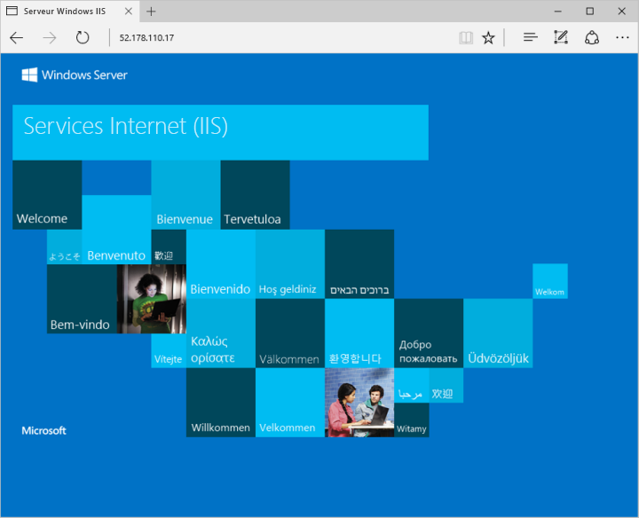

# <a name="create-a-windows-virtual-machine-with-powershell"></a><span data-ttu-id="17a01-103">Créer une machine virtuelle Windows avec PowerShell</span><span class="sxs-lookup"><span data-stu-id="17a01-103">Create a Windows virtual machine with PowerShell</span></span>

<span data-ttu-id="17a01-104">Le module Azure PowerShell est utilisé pour créer et gérer des ressources Azure à partir de la ligne de commande PowerShell ou dans des scripts.</span><span class="sxs-lookup"><span data-stu-id="17a01-104">The Azure PowerShell module is used to create and manage Azure resources from the PowerShell command line or in scripts.</span></span> <span data-ttu-id="17a01-105">Ce guide détaille l’utilisation de PowerShell pour la création d’une machine virtuelle Azure exécutant Windows Server 2016.</span><span class="sxs-lookup"><span data-stu-id="17a01-105">This guide details using PowerShell to create and Azure virtual machine running Windows Server 2016.</span></span> <span data-ttu-id="17a01-106">Une fois le déploiement terminé, connectez-vous au serveur et installez IIS.</span><span class="sxs-lookup"><span data-stu-id="17a01-106">Once deployment is complete, we connect to the server and install IIS.</span></span>  

<span data-ttu-id="17a01-107">Si vous n’avez pas d’abonnement Azure, créez un [compte gratuit](https://azure.microsoft.com/free/?WT.mc_id=A261C142F) avant de commencer.</span><span class="sxs-lookup"><span data-stu-id="17a01-107">If you don't have an Azure subscription, create a [free account](https://azure.microsoft.com/free/?WT.mc_id=A261C142F) before you begin.</span></span>

<span data-ttu-id="17a01-108">Ce démarrage rapide requiert le module Azure PowerShell version 3.6 ou ultérieure.</span><span class="sxs-lookup"><span data-stu-id="17a01-108">This quick start requires the Azure PowerShell module version 3.6 or later.</span></span> <span data-ttu-id="17a01-109">Exécutez ` Get-Module -ListAvailable AzureRM` pour trouver la version.</span><span class="sxs-lookup"><span data-stu-id="17a01-109">Run ` Get-Module -ListAvailable AzureRM` to find the version.</span></span> <span data-ttu-id="17a01-110">Si vous devez installer ou mettre à niveau, consultez [Installer le module Azure PowerShell](/powershell/azure/install-azurerm-ps).</span><span class="sxs-lookup"><span data-stu-id="17a01-110">If you need to install or upgrade, see [Install Azure PowerShell module](/powershell/azure/install-azurerm-ps).</span></span>

## <a name="log-in-to-azure"></a><span data-ttu-id="17a01-111">Connexion à Azure</span><span class="sxs-lookup"><span data-stu-id="17a01-111">Log in to Azure</span></span>

<span data-ttu-id="17a01-112">Connectez-vous à votre abonnement Azure avec la commande `Login-AzureRmAccount` et suivez les instructions à l’écran.</span><span class="sxs-lookup"><span data-stu-id="17a01-112">Log in to your Azure subscription with the `Login-AzureRmAccount` command and follow the on-screen directions.</span></span>

```powershell
Login-AzureRmAccount
```

## <a name="create-resource-group"></a><span data-ttu-id="17a01-113">Créer un groupe de ressources</span><span class="sxs-lookup"><span data-stu-id="17a01-113">Create resource group</span></span>

<span data-ttu-id="17a01-114">Créez un groupe de ressources Azure avec [New-AzureRmResourceGroup](/powershell/module/azurerm.resources/new-azurermresourcegroup).</span><span class="sxs-lookup"><span data-stu-id="17a01-114">Create an Azure resource group with [New-AzureRmResourceGroup](/powershell/module/azurerm.resources/new-azurermresourcegroup).</span></span> <span data-ttu-id="17a01-115">Un groupe de ressources est un conteneur logique dans lequel les ressources Azure sont déployées et gérées.</span><span class="sxs-lookup"><span data-stu-id="17a01-115">A resource group is a logical container into which Azure resources are deployed and managed.</span></span> 

```powershell
New-AzureRmResourceGroup -Name myResourceGroup -Location EastUS
```

## <a name="create-networking-resources"></a><span data-ttu-id="17a01-116">Création de ressources de mise en réseau</span><span class="sxs-lookup"><span data-stu-id="17a01-116">Create networking resources</span></span>

### <a name="create-a-virtual-network-subnet-and-a-public-ip-address"></a><span data-ttu-id="17a01-117">Créez un réseau virtuel, un sous-réseau et une adresse IP publique.</span><span class="sxs-lookup"><span data-stu-id="17a01-117">Create a virtual network, subnet, and a public IP address.</span></span> 
<span data-ttu-id="17a01-118">Ces ressources sont utilisées pour fournir une connectivité réseau à la machine virtuelle et la connecter à Internet.</span><span class="sxs-lookup"><span data-stu-id="17a01-118">These resources are used to provide network connectivity to the virtual machine and connect it to the internet.</span></span>

```powershell
# Create a subnet configuration
$subnetConfig = New-AzureRmVirtualNetworkSubnetConfig -Name mySubnet -AddressPrefix 192.168.1.0/24

# Create a virtual network
$vnet = New-AzureRmVirtualNetwork -ResourceGroupName myResourceGroup -Location EastUS `
    -Name MYvNET -AddressPrefix 192.168.0.0/16 -Subnet $subnetConfig

# Create a public IP address and specify a DNS name
$pip = New-AzureRmPublicIpAddress -ResourceGroupName myResourceGroup -Location EastUS `
    -AllocationMethod Static -IdleTimeoutInMinutes 4 -Name "mypublicdns$(Get-Random)"
```

### <a name="create-a-network-security-group-and-a-network-security-group-rule"></a><span data-ttu-id="17a01-119">Créez un groupe de sécurité réseau et une règle de groupe de sécurité réseau.</span><span class="sxs-lookup"><span data-stu-id="17a01-119">Create a network security group and a network security group rule.</span></span> 
<span data-ttu-id="17a01-120">Le groupe de sécurité réseau permet sécurise la machine virtuelle avec des règles entrantes et sortantes.</span><span class="sxs-lookup"><span data-stu-id="17a01-120">The network security group secures the virtual machine using inbound and outbound rules.</span></span> <span data-ttu-id="17a01-121">Dans ce cas, une règle entrante est créée pour le port 3389, qui autorise les connexions Bureau à distance entrantes.</span><span class="sxs-lookup"><span data-stu-id="17a01-121">In this case, an inbound rule is created for port 3389, which allows incoming remote desktop connections.</span></span> <span data-ttu-id="17a01-122">Nous souhaitons également créer une règle entrante pour le port 80, qui autorise le trafic web entrant.</span><span class="sxs-lookup"><span data-stu-id="17a01-122">We also want to create an inbound rule for port 80, which allows incoming web traffic.</span></span>

```powershell
# Create an inbound network security group rule for port 3389
$nsgRuleRDP = New-AzureRmNetworkSecurityRuleConfig -Name myNetworkSecurityGroupRuleRDP  -Protocol Tcp `
    -Direction Inbound -Priority 1000 -SourceAddressPrefix * -SourcePortRange * -DestinationAddressPrefix * `
    -DestinationPortRange 3389 -Access Allow

# Create an inbound network security group rule for port 80
$nsgRuleWeb = New-AzureRmNetworkSecurityRuleConfig -Name myNetworkSecurityGroupRuleWWW  -Protocol Tcp `
    -Direction Inbound -Priority 1001 -SourceAddressPrefix * -SourcePortRange * -DestinationAddressPrefix * `
    -DestinationPortRange 80 -Access Allow

# Create a network security group
$nsg = New-AzureRmNetworkSecurityGroup -ResourceGroupName myResourceGroup -Location EastUS `
    -Name myNetworkSecurityGroup -SecurityRules $nsgRuleRDP,$nsgRuleWeb
```

### <a name="create-a-network-card-for-the-virtual-machine"></a><span data-ttu-id="17a01-123">Créez une carte réseau pour la machine virtuelle.</span><span class="sxs-lookup"><span data-stu-id="17a01-123">Create a network card for the virtual machine.</span></span> 
<span data-ttu-id="17a01-124">Créez une carte réseau avec [New-AzureRmNetworkInterface](/powershell/module/azurerm.network/new-azurermnetworkinterface) pour la machine virtuelle.</span><span class="sxs-lookup"><span data-stu-id="17a01-124">Create a network card with [New-AzureRmNetworkInterface](/powershell/module/azurerm.network/new-azurermnetworkinterface) for the virtual machine.</span></span> <span data-ttu-id="17a01-125">La carte réseau connecte la machine virtuelle à un sous-réseau, un groupe de sécurité réseau et une adresse IP publique.</span><span class="sxs-lookup"><span data-stu-id="17a01-125">The network card connects the virtual machine to a subnet, network security group, and public IP address.</span></span>

```powershell
# Create a virtual network card and associate with public IP address and NSG
$nic = New-AzureRmNetworkInterface -Name myNic -ResourceGroupName myResourceGroup -Location EastUS `
    -SubnetId $vnet.Subnets[0].Id -PublicIpAddressId $pip.Id -NetworkSecurityGroupId $nsg.Id
```

## <a name="create-virtual-machine"></a><span data-ttu-id="17a01-126">Create virtual machine</span><span class="sxs-lookup"><span data-stu-id="17a01-126">Create virtual machine</span></span>

<span data-ttu-id="17a01-127">Créez une configuration de machine virtuelle.</span><span class="sxs-lookup"><span data-stu-id="17a01-127">Create a virtual machine configuration.</span></span> <span data-ttu-id="17a01-128">Cette configuration inclut les paramètres qui sont utilisés lors du déploiement de la machine virtuelle, comme une image de machine virtuelle, la taille et la configuration de l’authentification.</span><span class="sxs-lookup"><span data-stu-id="17a01-128">This configuration includes the settings that are used when deploying the virtual machine such as a virtual machine image, size, and authentication configuration.</span></span> <span data-ttu-id="17a01-129">Lors de l’exécution de cette étape, vous êtes invité à saisir vos informations d’identification.</span><span class="sxs-lookup"><span data-stu-id="17a01-129">When running this step, you are prompted for credentials.</span></span> <span data-ttu-id="17a01-130">Les valeurs que vous saisissez sont configurées comme le nom d’utilisateur et le mot de passe pour la machine virtuelle.</span><span class="sxs-lookup"><span data-stu-id="17a01-130">The values that you enter are configured as the user name and password for the virtual machine.</span></span>

```powershell
# Define a credential object
$cred = Get-Credential

# Create a virtual machine configuration
$vmConfig = New-AzureRmVMConfig -VMName myVM -VMSize Standard_DS2 | `
    Set-AzureRmVMOperatingSystem -Windows -ComputerName myVM -Credential $cred | `
    Set-AzureRmVMSourceImage -PublisherName MicrosoftWindowsServer -Offer WindowsServer `
    -Skus 2016-Datacenter -Version latest | Add-AzureRmVMNetworkInterface -Id $nic.Id
```

<span data-ttu-id="17a01-131">Créez la machine virtuelle avec [New-AzureRmVM](/powershell/module/azurerm.compute/new-azurermvm).</span><span class="sxs-lookup"><span data-stu-id="17a01-131">Create the virtual machine with [New-AzureRmVM](/powershell/module/azurerm.compute/new-azurermvm).</span></span>

```powershell
New-AzureRmVM -ResourceGroupName myResourceGroup -Location EastUS -VM $vmConfig
```

## <a name="connect-to-virtual-machine"></a><span data-ttu-id="17a01-132">Connexion à la machine virtuelle</span><span class="sxs-lookup"><span data-stu-id="17a01-132">Connect to virtual machine</span></span>

<span data-ttu-id="17a01-133">Une fois le déploiement terminé, créez une connexion Bureau à distance avec la machine virtuelle.</span><span class="sxs-lookup"><span data-stu-id="17a01-133">After the deployment has completed, create a remote desktop connection with the virtual machine.</span></span>

<span data-ttu-id="17a01-134">Utilisez la commande [Get-AzureRmPublicIpAddress](/powershell/module/azurerm.network/get-azurermpublicipaddress) pour renvoyer l’adresse IP publique de la machine virtuelle.</span><span class="sxs-lookup"><span data-stu-id="17a01-134">Use the [Get-AzureRmPublicIpAddress](/powershell/module/azurerm.network/get-azurermpublicipaddress) command to return the public IP address of the virtual machine.</span></span> <span data-ttu-id="17a01-135">Prenez note de cette adresse IP, afin de pouvoir vous y connecter ultérieurement avec votre navigateur de manière à tester la connectivité web.</span><span class="sxs-lookup"><span data-stu-id="17a01-135">Take note of this IP Address so you can connect to it with your browser to test web connectivity in a future step.</span></span>

```powershell
Get-AzureRmPublicIpAddress -ResourceGroupName myResourceGroup | Select IpAddress
```

<span data-ttu-id="17a01-136">Utilisez la commande suivante pour créer une session Bureau à distance avec la machine virtuelle.</span><span class="sxs-lookup"><span data-stu-id="17a01-136">Use the following command to create a remote desktop session with the virtual machine.</span></span> <span data-ttu-id="17a01-137">Remplacez l’adresse IP par l’adresse *publicIPAddress* de votre machine virtuelle.</span><span class="sxs-lookup"><span data-stu-id="17a01-137">Replace the IP address with the *publicIPAddress* of your virtual machine.</span></span> <span data-ttu-id="17a01-138">À l'invite, saisissez les informations d’identification que vous avez utilisées lors de la création de la machine virtuelle.</span><span class="sxs-lookup"><span data-stu-id="17a01-138">When prompted, enter the credentials used when creating the virtual machine.</span></span>

```bash 
mstsc /v:<publicIpAddress>
```

## <a name="install-iis-via-powershell"></a><span data-ttu-id="17a01-139">Installer IIS à l’aide de PowerShell</span><span class="sxs-lookup"><span data-stu-id="17a01-139">Install IIS via PowerShell</span></span>

<span data-ttu-id="17a01-140">Maintenant que vous êtes connecté à la machine virtuelle Azure, vous pouvez utiliser une seule ligne de PowerShell pour installer IIS et activer la règle de pare-feu local pour autoriser le trafic web.</span><span class="sxs-lookup"><span data-stu-id="17a01-140">Now that you have logged in to the Azure VM, you can use a single line of PowerShell to install IIS and enable the local firewall rule to allow web traffic.</span></span> <span data-ttu-id="17a01-141">Ouvrez une invite PowerShell et exécutez la commande suivante :</span><span class="sxs-lookup"><span data-stu-id="17a01-141">Open a PowerShell prompt and run the following command:</span></span>

```powershell
Install-WindowsFeature -name Web-Server -IncludeManagementTools
```

## <a name="view-the-iis-welcome-page"></a><span data-ttu-id="17a01-142">Afficher la page d’accueil IIS</span><span class="sxs-lookup"><span data-stu-id="17a01-142">View the IIS welcome page</span></span>

<span data-ttu-id="17a01-143">Une fois IIS installé et le port 80, ouvert sur votre machine virtuelle à partir d’Internet, vous pouvez utiliser un navigateur web pour afficher la page d’accueil IIS par défaut.</span><span class="sxs-lookup"><span data-stu-id="17a01-143">With IIS installed and port 80 now open on your VM from the Internet, you can use a web browser of your choice to view the default IIS welcome page.</span></span> <span data-ttu-id="17a01-144">Veillez à utiliser la *publicIpAddress* indiquée ci-dessus pour vous rendre sur la page par défaut.</span><span class="sxs-lookup"><span data-stu-id="17a01-144">Be sure to use the *publicIpAddress* you documented above to visit the default page.</span></span> 

 

## <a name="clean-up-resources"></a><span data-ttu-id="17a01-146">Supprimer des ressources</span><span class="sxs-lookup"><span data-stu-id="17a01-146">Clean up resources</span></span>

<span data-ttu-id="17a01-147">Lorsque vous n’en avez plus besoin, vous pouvez utiliser la commande [Remove-AzureRmResourceGroup](/powershell/module/azurerm.resources/remove-azurermresourcegroup) pour supprimer le groupe de ressources, la machine virtuelle et toutes les ressources associées.</span><span class="sxs-lookup"><span data-stu-id="17a01-147">When no longer needed, you can use the [Remove-AzureRmResourceGroup](/powershell/module/azurerm.resources/remove-azurermresourcegroup) command to remove the resource group, VM, and all related resources.</span></span>

```powershell
Remove-AzureRmResourceGroup -Name myResourceGroup
```

## <a name="next-steps"></a><span data-ttu-id="17a01-148">Étapes suivantes</span><span class="sxs-lookup"><span data-stu-id="17a01-148">Next steps</span></span>

<span data-ttu-id="17a01-149">Dans ce guide de démarrage rapide, vous avez déployé une machine virtuelle simple ainsi qu’une règle de groupe de sécurité réseau, et installé un serveur web.</span><span class="sxs-lookup"><span data-stu-id="17a01-149">In this quick start, you’ve deployed a simple virtual machine, a network security group rule, and installed a web server.</span></span> <span data-ttu-id="17a01-150">Pour en savoir plus sur les machines virtuelles Azure, suivez le didacticiel pour les machines virtuelles Windows.</span><span class="sxs-lookup"><span data-stu-id="17a01-150">To learn more about Azure virtual machines, continue to the tutorial for Windows VMs.</span></span>

> [!div class="nextstepaction"]
> [<span data-ttu-id="17a01-151">Didacticiels sur les machines virtuelles Azure Windows</span><span class="sxs-lookup"><span data-stu-id="17a01-151">Azure Windows virtual machine tutorials</span></span>](./tutorial-manage-vm.md)
