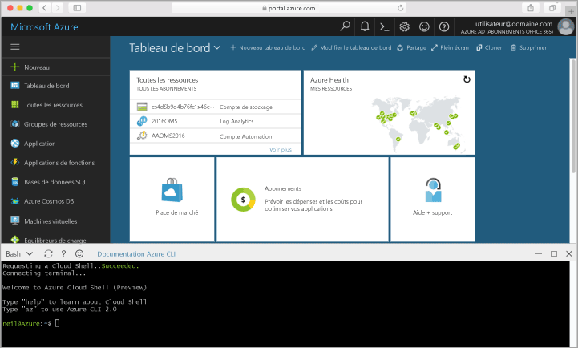

## Lancement d’Azure Cloud Shell

Bonjour Azure Cloud Shell est un interpréteur de commandes Bash gratuit que vous pouvez exécuter directement à l’intérieur hello portail Azure. Il a hello CLI d’Azure préinstallé et configuré toouse avec votre compte. Cliquez sur hello **Cloud Shell** bouton de menu hello dans le coin supérieur droit hello Hello [portail Azure](https://portal.azure.com).

bouton de Hello lance un shell interactif que vous pouvez utiliser toorun hello toutes les étapes de cette rubrique :

