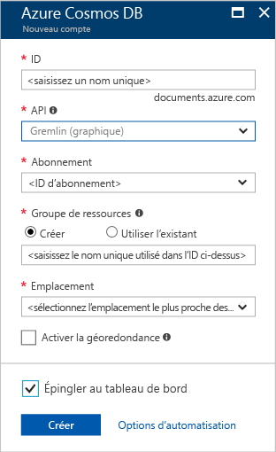

1. Dans une nouvelle fenêtre, connectez-vous au [portail Azure](https://portal.azure.com/).In a new window, sign in to the [Azure portal](https://portal.azure.com/).
2. Dans le volet de gauche, cliquez sur **Nouveau**et sur **Bases de données**, puis sous **Azure Cosmos DB**, cliquez sur **Créer**.In the left pane, click **New**, click **Databases**, and then under **Azure Cosmos DB**, click **Create**.
   
   

3. Dans le panneau **Nouveau compte**, indiquez la configuration souhaitée pour ce compte Azure Cosmos DB.In the **New account** blade, specify the configuration that you want for this Azure Cosmos DB account. 

    Grâce à Azure Cosmos DB, vous pouvez choisir l’un des quatre modèles de programmation : Gremlin (graphique), MongoDB, SQL (DocumentDB) et Table (clé-valeur). Chacun de ces modèles requiert actuellement un compte distinct.With Azure Cosmos DB, you can choose one of four programming models: Gremlin (graph), MongoDB, SQL (DocumentDB), and Table (key-value), each which currently require a separate account.
       
    Dans le cadre de cet article de démarrage rapide, nous utilisons l’API Graph pour notre programmation. Vous devez donc choisir **Gremlin (graphique)** lors du remplissage du formulaire.In this quick-start article, we program against the Graph API, so choose **Gremlin (graph)** as you fill out the form. Si vous disposez de données de document provenant d’une application du catalogue, de données clé/valeur (table) ou de données ayant fait l’objet d’une migration à partir d’une application MongoDB, notez qu’Azure Cosmos DB peut fournir une plateforme de service de base de données hautement disponible et distribuée dans le monde entier pour toutes vos applications essentielles.If you have document data from a catalog app, key/value (table) data, or data that's migrated from a MongoDB app, realize that Azure Cosmos DB can provide a highly available, globally distributed database service platform for all your mission-critical applications.

    Renseignez les champs du panneau **Nouveau compte** en vous appuyant sur les informations de la capture d’écran ci-après. Vos valeurs peuvent différer de celles figurant dans la capture d’écran.Complete the fields on the **New account** blade, using the information in the following screenshot as a guide - your values may be different than the values in the screenshot.
 
    

    ParamètreSetting|Valeur suggéréeSuggested value|DescriptionDescription
    ---|---|---
    IDID|*Valeur unique**Unique value*|Nom unique identifiant ce compte Azure Cosmos DB.A unique name that identifies this Azure Cosmos DB account. Étant donné que *documents.azure.com* est ajouté à l’ID que vous fournissez pour créer votre URI, utilisez un ID unique mais identifiable.Because *documents.azure.com* is appended to the ID that you provide to create your URI, use a unique but identifiable ID. L’ID ne peut contenir que des lettres minuscules, des chiffres et le caractère trait d’union (-), et doit comporter entre 3 et 50 caractères.The ID must contain only lowercase letters, numbers, and the hyphen (-) character, and it must contain from 3 to 50 characters.
    APIAPI|Gremlin (graphique)Gremlin (graph)|Nous utilisons [l’API Graph](../articles/cosmos-db/graph-introduction.md) plus loin dans cet article.We program against the [Graph API](../articles/cosmos-db/graph-introduction.md) later in this article.|
    AbonnementSubscription|*Votre abonnement**Your subscription*|Abonnement Azure que vous souhaitez utiliser pour ce compte Azure Cosmos DB.The Azure subscription that you want to use for this Azure Cosmos DB account. 
    Groupe de ressourcesResource Group|*La même valeur que l’ID**The same value as ID*|Le nouveau nom de groupe de ressources pour votre compte.The new resource group name for your account. Pour plus de simplicité, vous pouvez utiliser le même nom que votre ID.For simplicity, you can use the same name as your ID. 
    LieuLocation|*La région la plus proche de vos utilisateurs**The region closest to your users*|La zone géographique dans laquelle héberger votre compte Azure Cosmos DB.The geographic location in which to host your Azure Cosmos DB account. Choisissez l’emplacement le plus proche de vos utilisateurs afin de leur donner l’accès le plus rapide aux données.Choose the location closest to your users to give them the fastest access to the data.

4. Cliquez sur **Créer** pour créer le compte.Click **Create** to create the account.
5. Dans la barre d’outils supérieure, cliquez sur l’icône **Notifications**  pour surveiller le processus de déploiement.On the top toolbar, click the **Notifications** icon  to monitor the deployment process.

    

6.  Lorsque la fenêtre Notifications indique que le déploiement a réussi, fermez la fenêtre et ouvrez le nouveau compte à partir de la vignette **Toutes les ressources** du tableau de bord.When the Notifications window indicates the deployment succeeded, close the notification window and open the new account from the **All Resources** tile on the Dashboard. 

    