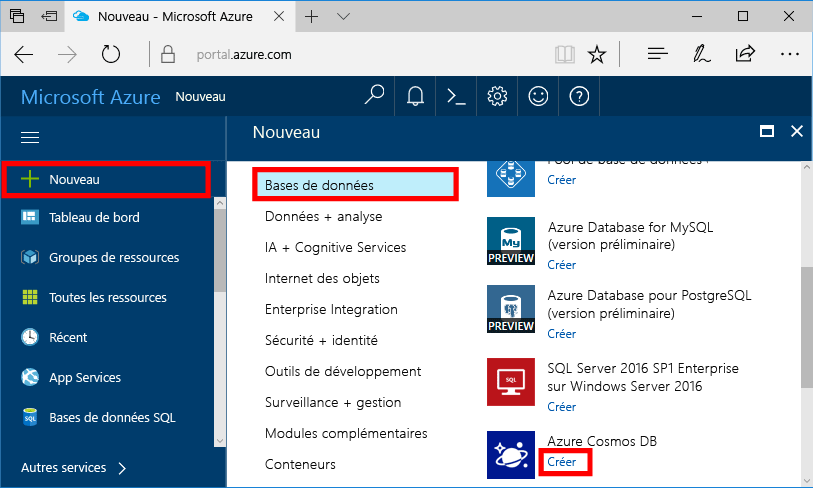
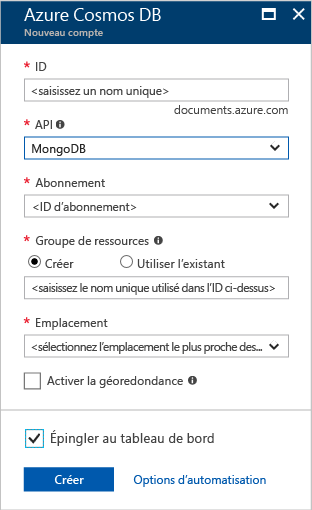
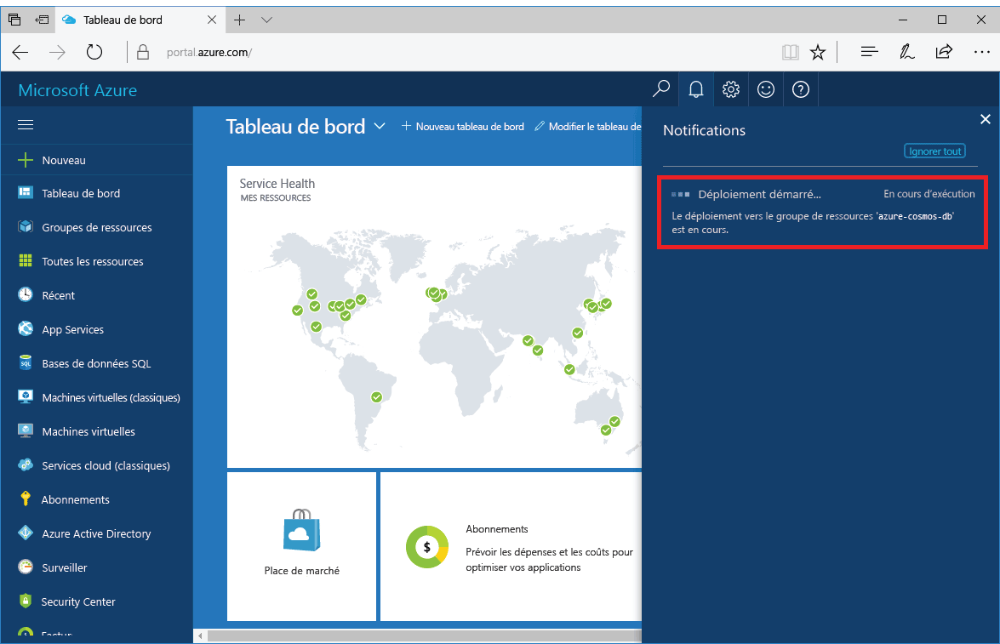
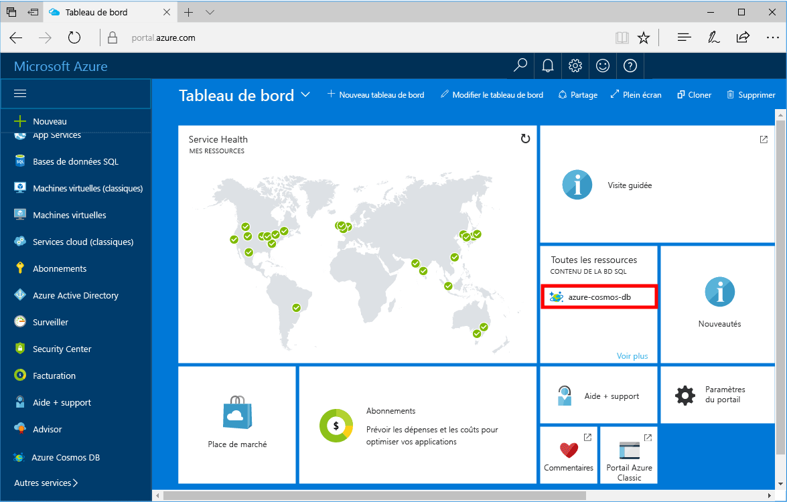

1. Dans une nouvelle fenêtre, connectez-vous toohello [portail Azure](https://portal.azure.com/).
2. Dans le menu de gauche hello, cliquez sur **nouveau**, cliquez sur **bases de données**, puis sous **base de données Azure Cosmos**, cliquez sur **créer**.
   
   

3. Bonjour **nouveau compte** panneau, spécifiez hello la configuration souhaitée pour le compte de base de données Azure Cosmos de hello. 

    Grâce à Azure Cosmos DB, vous pouvez choisir un des quatre modèles de programmation : Gremlin (graphique), MongoDB, SQL (DocumentDB) et Table (clé-valeur). 
       
    Dans ce démarrage rapide nous allons être programmer hello MongoDB API afin que vous allez choisir **MongoDB** pendant que vous remplissez le formulaire de hello. Cependant, si vous avez des données graphiques pour une application de réseau social, des données de document à partir d’une application du catalogue, ou des données clé/valeur (table), sachez qu’Azure Cosmos DB peut fournir une plate-forme de service de base de données hautement disponible et distribuée dans le monde entier pour toutes vos applications essentielles.

    Remplir hello **nouveau compte** panneau à l’aide d’informations hello dans la table de hello comme guide.
 
    
   
    Paramètre|Valeur suggérée|Description
    ---|---|---
    ID|*Valeur unique*|Un nom unique que vous choisissez compte de base de données Azure Cosmos tooidentify hello. *documents.Azure.com* est ajouté toohello ID vous fournir toocreate votre URI, par conséquent, utilisez un ID unique, mais identifiable ID de Hello peut contenir uniquement des lettres minuscules, des chiffres et hello '-' caractère et doit être comprise entre 3 et 50 caractères.
    API|MongoDB|Nous allons programmer hello [MongoDB API](../articles/documentdb/documentdb-protocol-mongodb.md) plus loin dans cet article.|
    Abonnement|*Votre abonnement*|Bonjour abonnement Azure que vous souhaitez toouse pour le compte de base de données Azure Cosmos hello. 
    Groupe de ressources|*Hello même valeur que l’ID*|Hello nouveau nom groupe de ressources pour votre compte. Par souci de simplicité, vous pouvez utiliser hello même nom que votre code. 
    Lieu|*utilisateurs tooyour le plus proche Hello région*|Bonjour à l’emplacement géographique dans le toohost votre compte de base de données Azure Cosmos. Choisissez les emplacement hello plus proche tooyour utilisateurs toogive les hello plus rapide toohello accéder à des données.

4. Cliquez sur **créer** compte de hello toocreate.
5. Dans la barre d’outils de hello, cliquez sur **Notifications** processus de déploiement toomonitor hello.

    

6.  Lorsque hello déploiement est terminé, ouvrez hello nouveau compte hello toutes les ressources de mosaïque. 

    
