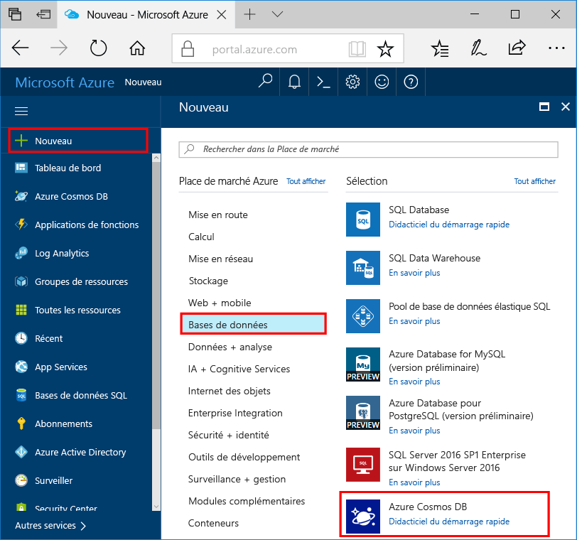

1. Dans une nouvelle fenêtre, connectez-vous toohello [portail Azure](https://portal.azure.com/).In a new window, sign in toohello [Azure portal](https://portal.azure.com/).
2. Dans le volet gauche de hello, cliquez sur **nouveau**, cliquez sur **bases de données**, puis sous **base de données Azure Cosmos**, cliquez sur **créer**.In hello left pane, click **New**, click **Databases**, and then under **Azure Cosmos DB**, click **Create**.
   
   

3. Sur hello **nouveau compte** panneau, spécifiez la configuration hello souhaitées pour ce compte de base de données Azure Cosmos.On hello **New account** blade, specify hello configuration that you want for this Azure Cosmos DB account. 

    Grâce à Azure Cosmos DB, vous pouvez choisir l’un des quatre modèles de programmation : Gremlin (graphique), MongoDB, SQL (DocumentDB) et Table (clé-valeur). Chacun de ces modèles requiert actuellement un compte distinct.With Azure Cosmos DB, you can choose one of four programming models: Gremlin (graph), MongoDB, SQL (DocumentDB), and Table (key-value), each which currently require a separate account.
    
    Dans cet article de démarrage rapide nous programmer hello API DocumentDB, par conséquent, choisissez **SQL (DocumentDB)** pendant que vous remplissez le formulaire de hello.In this quick-start article we program against hello DocumentDB API, so choose **SQL (DocumentDB)** as you fill out hello form. Si vous disposez de données graphiques pour une application de réseau social, de données clé/valeur (table) ou de données ayant fait l’objet d’une migration à partir d’une application MongoDB, notez qu’Azure Cosmos DB peut fournir une plateforme de service de base de données hautement disponible et distribuée dans le monde entier pour toutes vos applications stratégiques.If you have graph data for a social media app, or key/value (table) data, or data migrated from a MongoDB app, realize that Azure Cosmos DB can provide a highly available, globally distributed database service platform for all your mission-critical applications.

    Renseignez les champs hello sur hello **nouveau compte** panneau, à l’aide des informations hello Bonjour suivant comme guide - capture d’écran de vos valeurs peut-être être différente de valeurs hello dans la capture d’écran de hello.Complete hello fields on hello **New account** blade, using hello information in hello following screenshot as a guide- your values may be different than hello values in hello screenshot.
 
    

    ParamètreSetting|Valeur suggéréeSuggested value|DescriptionDescription
    ---|---|---
    IDID|*Valeur unique**Unique value*|Nom unique identifiant ce compte Azure Cosmos DB.A unique name that identifies this Azure Cosmos DB account. Étant donné que *documents.azure.com* est ajouté toohello ID que vous fournissez toocreate votre URI, utilisation unique mais identifiables ID.Because *documents.azure.com* is appended toohello ID that you provide toocreate your URI, use a unique but identifiable ID. ID de Hello peut contenir uniquement des lettres minuscules, des chiffres et des caractères de trait d’union (-) hello, et il doit contenir 3 caractères too50.hello ID can contain only lowercase letters, numbers, and hello hyphen (-) character, and it must contain 3 too50 characters.
    APIAPI|SQL (DocumentDB)SQL (DocumentDB)|Programmer avec hello [API DocumentDB](../articles/documentdb/documentdb-introduction.md) plus loin dans cet article.We program against hello [DocumentDB API](../articles/documentdb/documentdb-introduction.md) later in this article.|
    AbonnementSubscription|*Votre abonnement**Your subscription*|Hello abonnement Azure que vous souhaitez toouse pour ce compte de base de données Azure Cosmos.hello Azure subscription that you want toouse for this Azure Cosmos DB account. 
    Groupe de ressourcesResource Group|*Hello même valeur que l’ID**hello same value as ID*|nom de groupe de ressources de nouveau Hello pour votre compte.hello new resource-group name for your account. Par souci de simplicité, vous pouvez utiliser hello même nom que votre code.For simplicity, you can use hello same name as your ID. 
    LieuLocation|*utilisateurs tooyour le plus proche Hello région**hello region closest tooyour users*|Bonjour à l’emplacement géographique dans le toohost votre compte de base de données Azure Cosmos.hello geographic location in which toohost your Azure Cosmos DB account. Choisissez un emplacement hello qui est le plus proche toogive d’utilisateurs tooyour les hello plus rapide toohello accéder à des données.Choose hello location that's closest tooyour users toogive them hello fastest access toohello data.
4. Cliquez sur **créer** compte de hello toocreate.Click **Create** toocreate hello account.
5. Sur la barre d’outils supérieure hello, cliquez sur hello **Notifications** icône  processus de déploiement toomonitor hello.On hello top toolbar, click hello **Notifications** icon  toomonitor hello deployment process.

    

6.  Lorsque la fenêtre de Notifications hello indique fenêtre de notification hello déploiement hello a réussi, fermez et ouvrez hello nouveau compte hello **toutes les ressources** vignette sur hello du tableau de bord.When hello Notifications window indicates hello deployment succeeded, close hello notification window and open hello new account from hello **All Resources** tile on hello Dashboard. 

    
 
