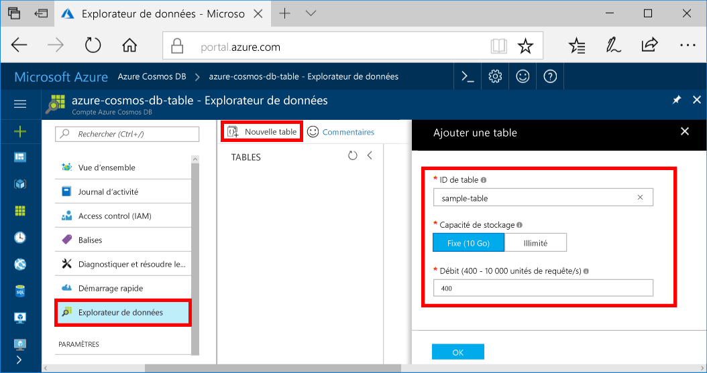

Vous pouvez maintenant utiliser l’Explorateur de données toocreate une table et ajouter des données tooyour base de données. 

1. Bonjour portail Azure, dans le menu de navigation hello, cliquez sur **Explorateur de données (version préliminaire)**. 
2. Dans le panneau de l’Explorateur de données hello, cliquez sur **nouvelle Table**, puis renseignez page hello à l’aide de hello informations suivantes.

    

    Paramètre|Valeur suggérée|Description
    ---|---|---
    ID de la table|sample-database|ID de Hello pour votre nouvelle table. Les noms de table ont hello même caractère spécifications en tant qu’ID de base de données. Les noms de base de données doivent inclure entre 1 et 255 caractères et ne peuvent pas contenir `/ \ # ?` ni d’espace de fin.
    Capacité de stockage| 10 Go|Laissez la valeur par défaut de hello. Il s’agit de la capacité de stockage hello de base de données hello.
    Throughput|400 unités de requête|Laissez la valeur par défaut de hello. Vous pouvez monter hello [débit](../articles/cosmos-db/request-units.md) ultérieurement si vous souhaitez une latence tooreduce.

3. Une fois le formulaire de hello est rempli, cliquez sur **OK**.
