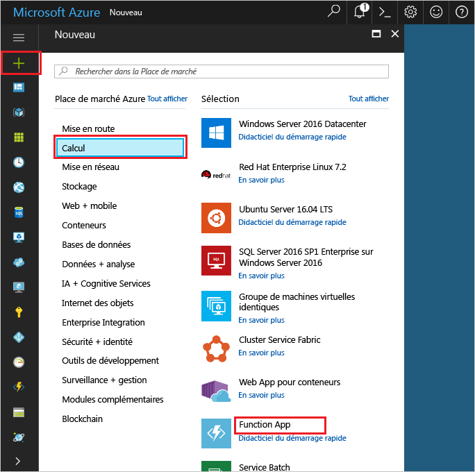

1. Cliquez sur hello **nouveau** bouton se trouve sur le coin supérieur gauche hello Hello portail Azure.Click hello **New** button found on hello upper left-hand corner of hello Azure portal.

1. Cliquez sur **Calcul** > **Function App**, sélectionnez votre **Abonnement**.Click **Compute** > **Function App**, select your **Subscription**. Ensuite, utilisez les paramètres de l’application hello fonction comme spécifié dans la table de hello.Then, use hello function app settings as specified in hello table.

    

    | ParamètreSetting      | Valeur suggéréeSuggested value  | DescriptionDescription                                        |
    | ------------ |  ------- | -------------------------------------------------- |
    | **Nom de l’application****App name** | Nom globalement uniqueGlobally unique name | Nom qui identifie votre nouvelle Function App.Name that identifies your new function app. | 
    | **[Groupe de ressources](../articles/azure-resource-manager/resource-group-overview.md)****[Resource Group](../articles/azure-resource-manager/resource-group-overview.md)** |  myResourceGroupmyResourceGroup | Nom de votre application de la fonction pour hello nouveau groupe de ressources dans le toocreate.Name for hello new resource group in which toocreate your function app. | 
    | **[Plan d’hébergement](../articles/azure-functions/functions-scale.md)****[Hosting plan](../articles/azure-functions/functions-scale.md)** |   Plan de consommationConsumption plan | Plan d’hébergement qui définit comment les ressources sont allouées tooyour fonction app.Hosting plan that defines how resources are allocated tooyour function app. Dans la valeur par défaut hello **consommation Plan**, les ressources sont ajoutées dynamiquement comme requis par vos fonctions.In hello default **Consumption Plan**, resources are added dynamically as required by your functions. Vous payez uniquement pour hello exécution de vos fonctions.You only pay for hello time your functions run.   |
    | **Emplacement****Location** | Europe de l’OuestWest Europe | Choisissez un emplacement près de chez vous ou près d’autres services auxquels vos fonctions accéderont.Choose a location near you or near other services your functions will access. |
    | **[Compte de stockage](../articles/storage/common/storage-create-storage-account.md#create-a-storage-account)****[Storage account](../articles/storage/common/storage-create-storage-account.md#create-a-storage-account)** |  Nom globalement uniqueGlobally unique name |  Nom du nouveau compte de stockage hello utilisé par votre application de la fonction.Name of hello new storage account used by your function app. Les noms des comptes de stockage doivent comporter entre 3 et 24 caractères, uniquement des lettres minuscules et des chiffres.Storage account names must be between 3 and 24 characters in length and may contain numbers and lowercase letters only. Vous pouvez également utiliser un compte existant.You can also use an existing account. |

1. Cliquez sur **créer** tooprovision et déployer la nouvelle application de fonction hello.Click **Create** tooprovision and deploy hello new function app.
