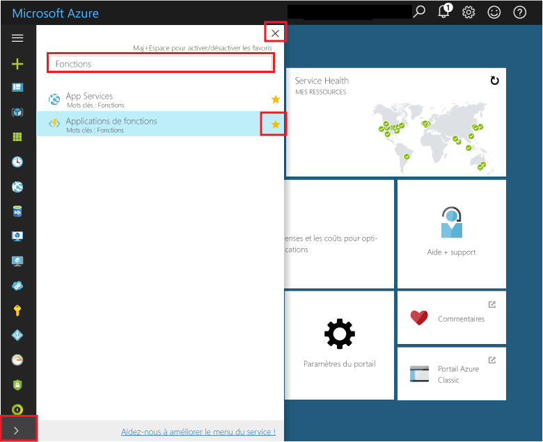
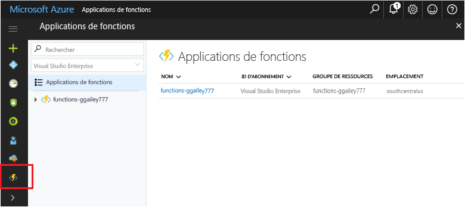

## Ajouter aux Favoris de portail tooyour les applications (fonction)Add Function Apps tooyour portal favorites 

Si vous n’avez pas déjà fait, ajoutez les Favoris de tooyour de fonction applications Bonjour portail Azure.If you haven't already done so, add Function Apps tooyour favorites in hello Azure portal. Il est ainsi plus facile toofind vos applications de fonction.This makes it easier toofind your function apps. Si vous avez déjà fait, ignorer la section suivante de toohello.If you have already done this, skip toohello next section. 

1. Connectez-vous à toohello [portail Azure](https://portal.azure.com/).Log in toohello [Azure portal](https://portal.azure.com/).

2. Cliquez sur flèche hello à tooexpand de hello inférieur gauche de tous les services, type `Functions` Bonjour **filtre** champ, puis cliquez sur les étoiles hello ensuite trop**fonction applications**.Click hello arrow at hello bottom left tooexpand all services, type `Functions` in hello **Filter** field, and then click hello star next too**Function Apps**.  
 
    

    Cela ajoute un menu de toohello l’icône fonctions hello sur gauche hello du portail de hello.This adds hello Functions icon toohello menu on hello left of hello portal.

3. Fermer le menu de hello, puis faites défiler la liste icône de fonctions toohello bas toosee hello.Close hello menu, then scroll down toohello bottom toosee hello Functions icon. Cliquez sur cette icône de toosee une liste de toutes vos applications de fonction.Click this icon toosee a list of all your function apps. Cliquez sur votre toowork d’application de fonction avec les fonctions de cette application.Click your function app toowork with functions in this app. 
 
    
 
     