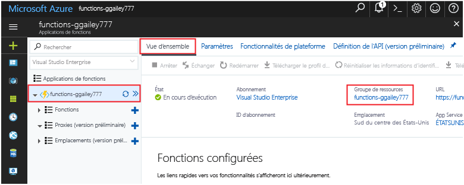

Les autres démarrages rapides de cette collection reposent sur ce démarrage rapide. Si vous prévoyez toocontinue toowork Démarrages rapides suivants ou avec des didacticiels de hello, ne pas nettoyer les ressources hello créés dans cette rapide démarrent. 

Si vous n’envisagez pas de toocontinue, cliquez sur hello **groupe de ressources** pour l’application de fonction hello dans le portail de hello, puis cliquez sur **supprimer**. 

