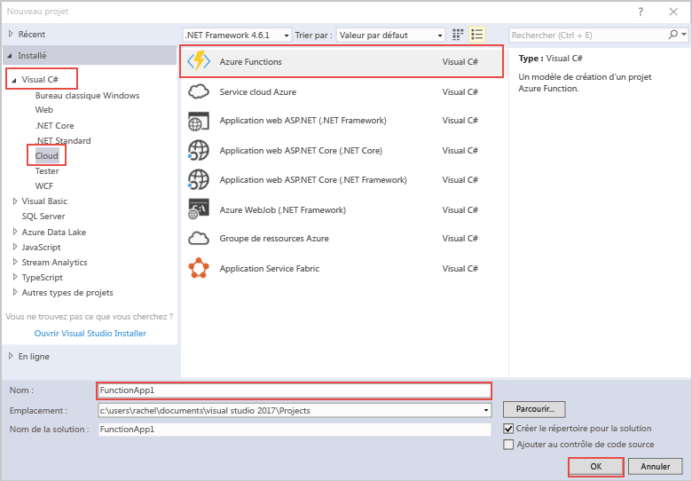

modèle de projet Azure fonctions Hello dans Visual Studio crée un projet d’application de fonction tooa publiée dans Azure. Une Function App vous permet de regrouper les fonctions en une unité logique pour faciliter la gestion, le déploiement et le partage des ressources.   

1. Cliquez sur le droit de la souris sur le nœud du projet hello dans **l’Explorateur de solutions**, puis choisissez **ajouter** > **un nouvel élément**. Choisissez **Azure fonction** à partir de la boîte de dialogue hello.

2. Bonjour **nouveau projet** boîte de dialogue, développez **Visual C#** > **Cloud** nœud, sélectionnez **Azure fonctions**, tapez un **Nom** pour votre projet, puis cliquez sur **OK**. nom de l’application Hello fonction doit être valide en tant qu’un espace de noms c#, afin de ne pas utiliser d’autres caractères non alphanumériques, des traits d’union ou des traits de soulignement. 

    
