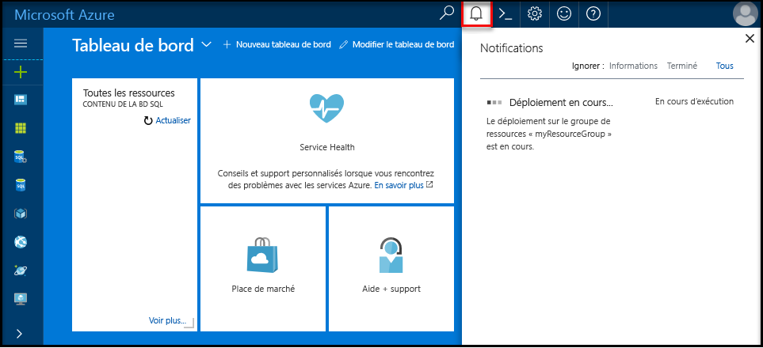

## Ouvrez une session dans toohello portail AzureLog in toohello Azure portal

Connectez-vous à toohello [portail Azure](https://portal.azure.com/).Log in toohello [Azure portal](https://portal.azure.com/).

## Créer une base de données SQL vide à l’aide de hello portail AzureCreate a blank SQL database using hello Azure portal

Une base de données SQL Azure est créée avec un ensemble défini de [ressources de calcul et de stockage](../articles/sql-database/sql-database-service-tiers.md).An Azure SQL database is created with a defined set of [compute and storage resources](../articles/sql-database/sql-database-service-tiers.md). base de données Hello est créé dans un [groupe de ressources Azure](../articles/azure-resource-manager/resource-group-overview.md) et dans un [serveur logique de base de données SQL Azure](../articles/sql-database/sql-database-features.md).hello database is created within an [Azure resource group](../articles/azure-resource-manager/resource-group-overview.md) and in an [Azure SQL Database logical server](../articles/sql-database/sql-database-features.md). 

Suivez ces étapes de toocreate une base de données SQL vide.Follow these steps toocreate a blank SQL database. 

1. Cliquez sur hello **nouveau** bouton se trouve sur le coin supérieur gauche hello Hello portail Azure.Click hello **New** button found on hello upper left-hand corner of hello Azure portal.

2. Sélectionnez **bases de données** de hello **nouveau** page, puis sélectionnez **base de données SQL** de hello **bases de données** page.Select **Databases** from hello **New** page, and select **SQL Database** from hello **Databases** page. 

   

3. Rempliront hello de base de données SQL avec hello suivant d’informations, comme indiqué dans le hello précédant l’image :Fill out hello SQL Database form with hello following information, as shown on hello preceding image:   

   | ParamètreSetting | Valeur suggéréeSuggested value | DescriptionDescription |
   | --------| --------------- | ----------- | 
   | **Nom de la base de données****Database name** | mySampleDatabasemySampleDatabase | Pour les noms de base de données valides, consultez [Database Identifiers](https://docs.microsoft.com/sql/relational-databases/databases/database-identifiers) (Identificateurs de base de données).For valid database names, see [Database Identifiers](https://docs.microsoft.com/sql/relational-databases/databases/database-identifiers). | 
   | **Abonnement****Subscription** | Votre abonnementYour subscription  | Pour plus d’informations sur vos abonnements, consultez [Abonnements](https://account.windowsazure.com/Subscriptions).For details about your subscriptions, see [Subscriptions](https://account.windowsazure.com/Subscriptions). |
   | **Groupe de ressources****Resource group** | myResourceGroupmyResourceGroup | Pour les noms de groupe de ressources valides, consultez [Naming conventions](https://docs.microsoft.com/azure/architecture/best-practices/naming-conventions) (Conventions d’affectation de nom).For valid resource group names, see [Naming rules and restrictions](https://docs.microsoft.com/azure/architecture/best-practices/naming-conventions). |
   | **Sélectionner une source****Select source** | Base de données videBlank database | Indique qu’une base de données vide doit être créée.Specifies that a blank database should be created. |
   ||||

4. Cliquez sur **Server** toocreate et configurer un nouveau serveur pour votre nouvelle base de données.Click **Server** toocreate and configure a new server for your new database. Remplir hello **nouveau formulaire serveur** avec hello informations suivantes :Fill out hello **New server form** with hello following information: 

   | ParamètreSetting | Valeur suggéréeSuggested value | DescriptionDescription |
   | --------| --------------- | ----------- | 
   | **Nom du serveur****Server name** | Nom globalement unique.Any globally unique name. | Pour les noms de serveur valides, consultez [Naming conventions](https://docs.microsoft.com/azure/architecture/best-practices/naming-conventions) (Conventions d’affectation de nom).For valid server names, see [Naming rules and restrictions](https://docs.microsoft.com/azure/architecture/best-practices/naming-conventions). | 
   | **Connexion d’administrateur du serveur****Server admin login** | Nom valide.Any valid name. | Pour les noms de connexion valides, consultez [Database Identifiers](https://docs.microsoft.com/sql/relational-databases/databases/database-identifiers) (Identificateurs de base de données).For valid login names, see [Database Identifiers](https://docs.microsoft.com/sql/relational-databases/databases/database-identifiers).|
   | **Mot de passe****Password** | Mot de passe valide.Any valid password. | Votre mot de passe doit comporter au moins huit caractères et contenir des caractères appartenant à trois des hello suivant des catégories : les caractères majuscules, caractères en minuscules, des chiffres et des caractères non alphanumériques.Your password must have at least eight characters and must contain characters from three of hello following categories: upper case characters, lower case characters, numbers, and non-alphanumeric characters. |
   | **Emplacement****Location** | Emplacement valide.Any valid location. | Pour plus d’informations sur les régions, consultez [Régions Azure](https://azure.microsoft.com/regions/).For information about regions, see [Azure Regions](https://azure.microsoft.com/regions/). |
   ||||

   

5. Cliquez sur **Sélectionner**.Click **Select**.

6. Cliquez sur **niveau tarifaire** toospecify hello performances et la couche de niveau de service pour votre nouvelle base de données.Click **Pricing tier** toospecify hello service tier and performance level for your new database. Pour ce didacticiel, sélectionnez **20 DTU** et **250** Go de stockage.For this tutorial, select **20 DTUs** and **250** GB of storage.

   

7. Cliquez sur **Apply**.Click **Apply**.  

8. Sélectionnez un **classement** pour la base de données vide hello (pour ce didacticiel, utiliser la valeur par défaut hello).Select a **collation** for hello blank database (for this tutorial, use hello default value). Pour en savoir plus sur les classements, voir [Classements](https://docs.microsoft.com/sql/t-sql/statements/collations)For more information about collations, see [Collations](https://docs.microsoft.com/sql/t-sql/statements/collations)

9. Cliquez sur **créer** base de données tooprovision hello.Click **Create** tooprovision hello database. Approvisionnement prend sur un toocomplete une minute et demie.Provisioning takes about a minute and a half toocomplete. 

10. Dans la barre d’outils de hello, cliquez sur **Notifications** processus de déploiement toomonitor hello.On hello toolbar, click **Notifications** toomonitor hello deployment process.

   

## Créer une règle de pare-feu de niveau serveur à l’aide de hello portail AzureCreate a server-level firewall rule using hello Azure portal

Hello service de base de données SQL crée un pare-feu au niveau serveur hello.hello SQL Database service creates a firewall at hello server-level. Initialement le pare-feu hello empêche les outils externes et les applications de se connecter toohello server ou tooany des bases de données sur le serveur de hello.Initially hello firewall prevents external tools and applications from connecting toohello server, or tooany databases on hello server. Les connexions sont autorisées après avoir créé une règle de pare-feu tooopen des adresses IP spécifiques.Connections are allowed after a firewall rule is created tooopen specific IP addresses. Suivez ces étapes toocreate un [règle de pare-feu de niveau serveur de base de données SQL](../articles/sql-database/sql-database-firewall-configure.md) pour l’adresse IP de votre client et tooenable une connectivité externe via le pare-feu de base de données SQL hello pour votre adresse IP uniquement.Follow these steps toocreate a [SQL Database server-level firewall rule](../articles/sql-database/sql-database-firewall-configure.md) for your client's IP address, and tooenable external connectivity through hello SQL Database firewall for your IP address only. 

> [!NOTE]
> Azure SQL Database communique par le biais du port 1433.Azure SQL Database communicates over port 1433. Vous pouvez vous connecter tooSQL de base de données uniquement après que le pare-feu de votre réseau hello autorise le trafic sortant via le port 1433.You can connect tooSQL Database only after hello firewall of your network allows outbound traffic through port 1433.

1. Une fois le déploiement de hello terminé, cliquez sur **bases de données SQL** de menu à gauche hello, puis cliquez sur **mySampleDatabase** sur hello **bases de données SQL** page.After hello deployment completes, click **SQL databases** from hello left-hand menu and then click **mySampleDatabase** on hello **SQL databases** page. nom de serveur complet Hello page Vue d’ensemble de votre base de données ouvre, affichant vous hello entièrement (tel que **mynewserver20170313.database.windows.net**) et fournit des options de configuration supplémentaire.hello overview page for your database opens, showing you hello fully qualified server name (such as **mynewserver20170313.database.windows.net**) and provides options for further configuration. Copiez ce nom de serveur complet pour une utilisation ultérieure.Copy this fully qualified server name for use later.

   > [!IMPORTANT]
   > Vous avez besoin de ce serveur complet nom tooconnect tooyour ses bases de données et dans les Démarrages rapides suivants.You need this fully qualified server name tooconnect tooyour server and its databases in subsequent quick starts.
   > 

    

2. Cliquez sur **définir serveur pare-feu** barre d’outils hello comme indiqué dans l’image précédente de hello.Click **Set server firewall** on hello toolbar as shown in hello previous image. Hello **des paramètres de pare-feu** page serveur de base de données SQL hello s’ouvre.hello **Firewall settings** page for hello SQL Database server opens. 

    

3. Cliquez sur **ajouter l’adresse IP du client** sur tooadd de barre d’outils hello votre adresse IP actuelle d’adresses tooa nouvelle règle de pare-feu.Click **Add client IP** on hello toolbar tooadd your current IP address tooa new firewall rule. Une règle de pare-feu peut ouvrir le port 1433 pour une seule adresse IP ou une plage d’adresses IP.A firewall rule can open port 1433 for a single IP address or a range of IP addresses.

4. Cliquez sur **Enregistrer**.Click **Save**. Une règle de pare-feu de niveau serveur est créée pour votre adresse IP actuelle, ouvrir le port 1433 sur le serveur logique de hello.A server-level firewall rule is created for your current IP address opening port 1433 on hello logical server.

    

4. Cliquez sur **OK** , puis fermez hello **des paramètres de pare-feu** page.Click **OK** and then close hello **Firewall settings** page.

Vous pouvez désormais connecter le serveur de base de données SQL Azure toohello et ses bases de données à l’aide d’un outil tel que SQL Server Management Studio (SSMS).You can now connect toohello Azure SQL Database server and its databases by using a tool such as SQL Server Management Studio (SSMS). connexion de Hello est à partir de cette adresse IP, et il utilise le compte d’administrateur de serveur hello créé précédemment.hello connection is from this IP address, and it uses hello server admin account created previously.

> [!IMPORTANT]
> Par défaut, l’accès via le pare-feu de base de données SQL hello est activé pour tous les services Azure.By default, access through hello SQL Database firewall is enabled for all Azure services. Cliquez sur **OFF** sur toodisable de cette page pour tous les services Azure.Click **OFF** on this page toodisable for all Azure services.

## Obtenir les valeurs de chaîne de connexion à l’aide de hello portail AzureGet connection string values using hello Azure portal

Obtenir le nom du serveur complet hello pour votre serveur de base de données SQL Azure Bonjour portail Azure.Get hello fully qualified server name for your Azure SQL Database server in hello Azure portal. Vous utilisez hello complet nom tooconnect tooyour serveur à l’aide de SQL Server Management Studio.You use hello fully qualified server name tooconnect tooyour server using SQL Server Management Studio.

1. Connectez-vous à toohello [portail Azure](https://portal.azure.com/).Log in toohello [Azure portal](https://portal.azure.com/).

2. Sélectionnez **bases de données SQL** hello menu de gauche, cliquez sur votre base de données sur hello **bases de données SQL** page.Select **SQL Databases** from hello left-hand menu, and click your database on hello **SQL databases** page. 

3. Bonjour **Essentials** volet Bonjour page du portail Azure pour votre base de données, recherchez et copiez hello **nom du serveur**.In hello **Essentials** pane in hello Azure portal page for your database, locate and then copy hello **Server name**.

    
